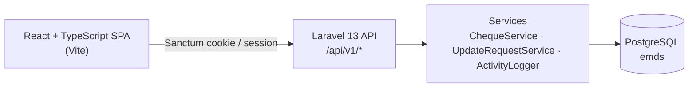
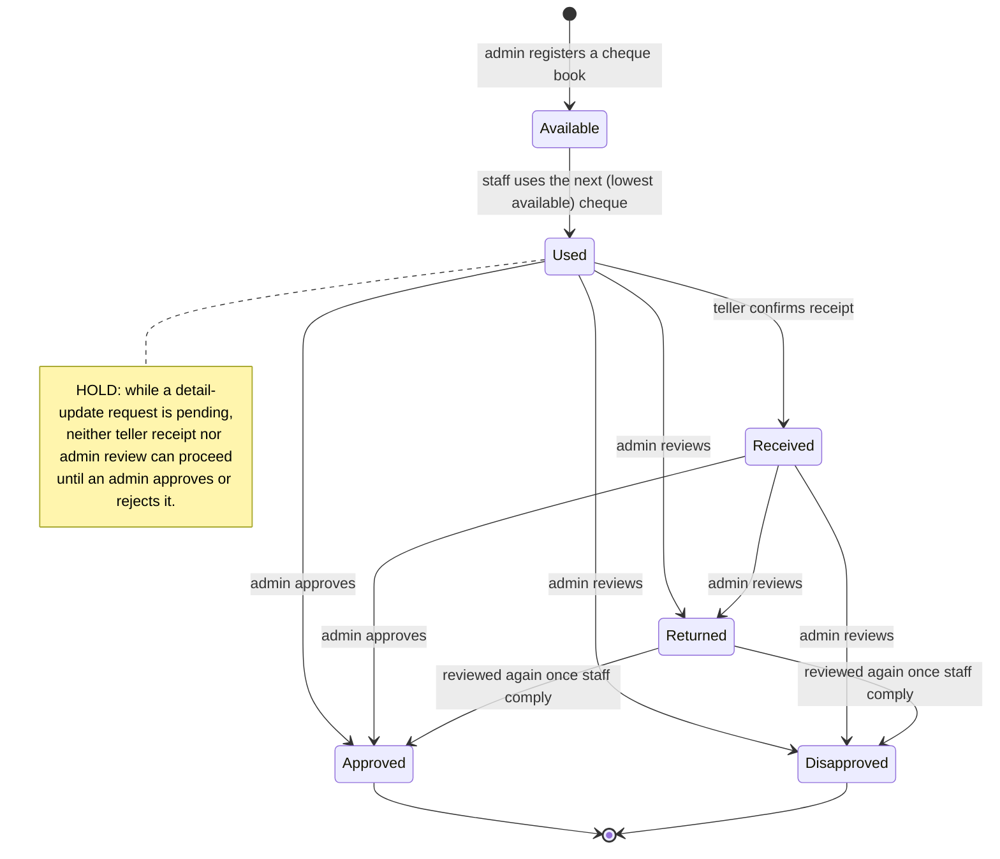
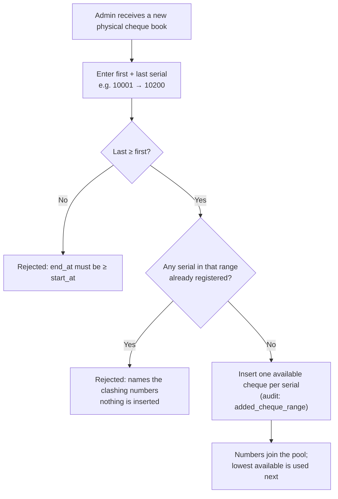
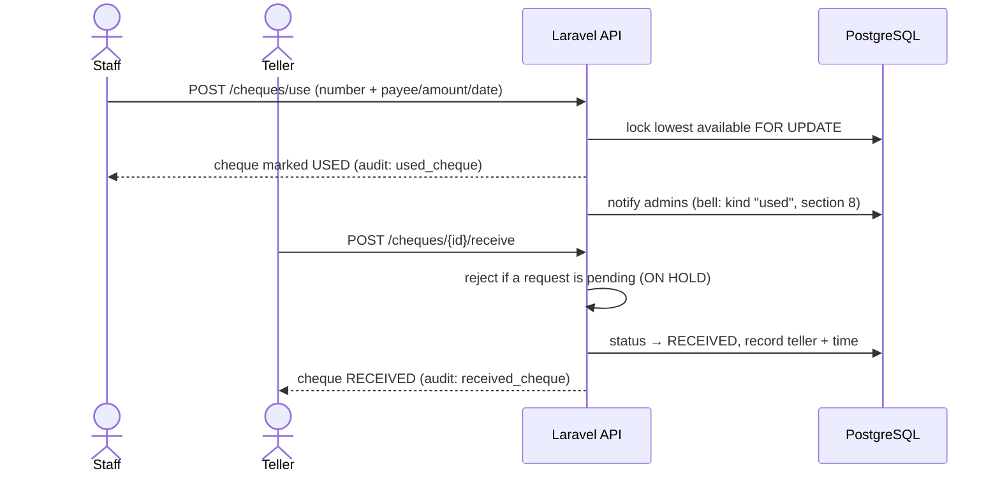
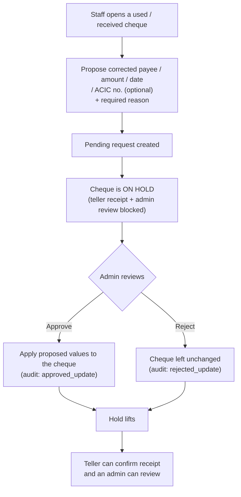
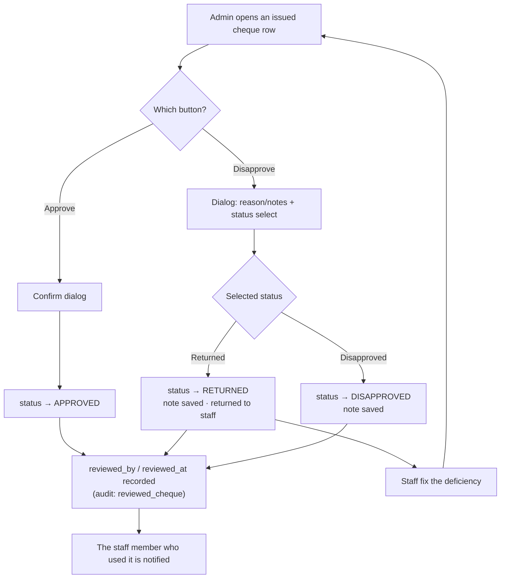
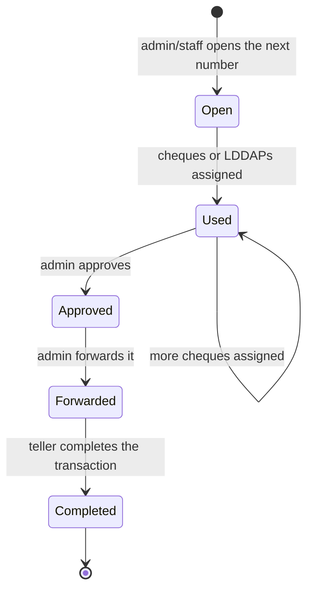
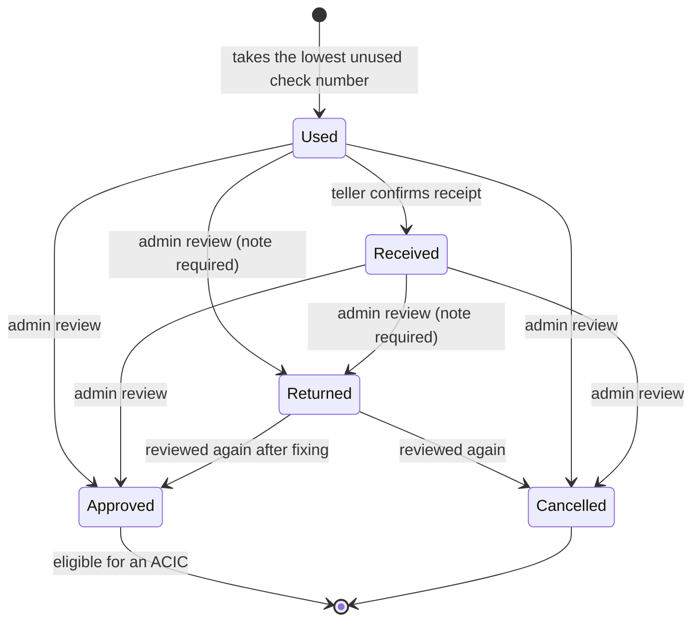
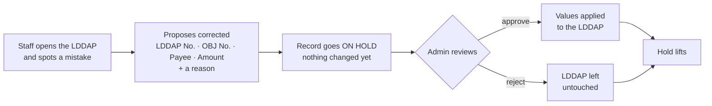
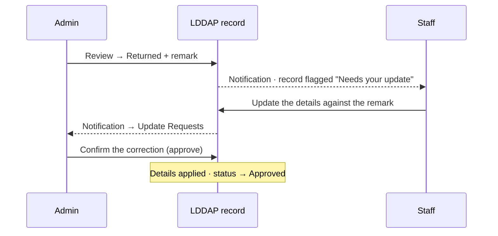

# E-MDS — System Documentation

> **Keep this current.** Whenever the system's behaviour changes (roles, cheque lifecycle,
> workflows, routes, or data model), update this document and its flow-charts in the **same change**.
> See [Maintaining this document](#maintaining-this-document).

_Last reviewed against the code: 2026-09-09._

---

## 1. What E-MDS is

E-MDS is a **cheque number monitoring & tracking system**. It enforces strict sequential
usage of a business's cheque numbers and keeps a full audit trail. It is used by
finance/accounting staff, bank tellers, and administrators.

**Core guarantees**

- Cheque numbers are registered per **physical cheque book**, by the first and last serial
  printed on it. **No number is ever registered twice** — an overlapping range is rejected.
- Books need not adjoin. A book running 10001–10200 can follow one running 1–500; the numbers
  in between were never issued by the bank and so never existed here.
- Only the **lowest available** cheque may be used next; skipping is rejected **server-side**.
- **LDDAP-ADA documents** draw on their **own independent check series** — unrelated to cheque
  numbers and to ACIC numbers — one document to one check number, always the lowest unused one.
  Completed ones are grouped onto an **ACIC**.
- Every login/logout, cheque use, receipt confirmation, and admin action is written to an
  **append-only audit log**.

---

## 2. Architecture



| Layer | Technology |
|---|---|
| Backend | Laravel 13, PHP 8.3+ |
| Auth | Laravel Sanctum (same-origin SPA cookie/session) |
| Frontend | React 19 + TypeScript, built with Vite, served by Laravel |
| Styling | Tailwind CSS v4 |
| Database | PostgreSQL |

**Where the logic lives**

- `app/Enums/` — `UserRole`, `ChequeStatus`, `ChequeAction`, `RequestStatus`, `AcicStatus`
- `app/Services/ChequeService.php` — sequential usage, row locking, receipt confirmation, ranges
- `app/Services/UpdateRequestService.php` — the detail-correction request/approval workflow
- `app/Services/AcicService.php` — the ACIC sequence, cheque linking, and forwarding
- `app/Services/ActivityLogger.php` — append-only audit log
- `app/Http/Controllers/` — thin controllers; validation lives in `app/Http/Requests/`
- `routes/api.php` — all endpoints under `/api/v1`

---

## 3. Roles & permissions

| Capability | Admin | Staff | Teller |
|---|:---:|:---:|:---:|
| Sign in / view cheques & dashboard | ✓ | ✓ | ✓ |
| Use the next cheque | ✓ | ✓ | ✓ |
| Confirm a used cheque as **received** | | | ✓ |
| Request a **detail correction** (with reason) | | ✓ | |
| Approve / reject correction requests | ✓ | | |
| **Review** an issued cheque (approve / return / disapprove) | ✓ | | |
| Register a cheque book (serial range) | ✓ | | |
| Register the **LDDAP check series** (range) | ✓ | | |
| Propose an **LDDAP correction** (with reason) | | ✓ | |
| Approve / reject LDDAP corrections | ✓ | | |
| **Correct an LDDAP directly** (reason required) | ✓ | | |
| **Use a check number** for LDDAP records | ✓ | ✓ | |
| Confirm an LDDAP as **received** | | | ✓ |
| **Review** an LDDAP (approved / returned / cancelled) | ✓ | | |
| Assign approved LDDAPs to an ACIC | ✓ | ✓ | |
| Open an ACIC / assign cheques to it | ✓ | ✓ | |
| **Forward** an ACIC | ✓ | | |
| **Complete** a forwarded ACIC | | | ✓ |
| Manage users | ✓ | | |
| View the audit log | ✓ | | |

Roles are defined in `app/Enums/UserRole.php` and enforced by the `admin` and `teller`
middleware plus per-request authorization (e.g. staff-only requests).

---

## 4. Cheque lifecycle

A cheque moves through exactly one status at a time: **available → used → received**, then a
final **admin review** outcome. **Approved** and **Disapproved** settle the cheque;
**Returned** hands it back to the staff member to fix what the reviewer noted, after
which it can be reviewed again.



- **Available → Used** — `ChequeService::useNext()` locks the lowest available row `FOR UPDATE`
  inside a transaction and rejects any number that isn't the genuine next one (concurrency-safe,
  skip-proof).
- **Used → Received** — `ChequeService::confirmReceipt()`; teller-only. Blocked while the cheque
  is on hold (see §6).
- **Used / Received → Approved | Returned | Disapproved** — `ChequeService::review()`;
  admin-only (see §6a). **Approved and Disapproved are final** and cannot be revisited;
  **Returned is not** — the cheque returns to the staff member and can be reviewed
  again afterwards. A reviewed cheque can no longer be confirmed as received.
- Receipt is recorded by its own `received_at` / `received_by` columns rather than by the status,
  so confirming receipt is never lost when a review moves the cheque on to its final status.

---

## 4a. Workflow — registering a cheque book

Before any cheque can be used it must exist. An **admin** registers a newly issued physical cheque
book by entering the **first and last serial printed on it** (e.g. 10001 to 10200); the system
creates one `available` row per serial.



**Rules enforced server-side** (`ChequeService::addRange()`)

- `end_at` must be **greater than or equal to** `start_at`; a single-cheque book is allowed.
- **Overlap is rejected.** Any serial in the range that already exists fails the whole request —
  the error names the clashing numbers, and nothing is inserted.
- The check and the insert share one **locked transaction**, so two admins registering overlapping
  books at the same time cannot both succeed.
- A range wider than **100,000** serials is rejected as a likely typo.
- Books **need not adjoin**. Registering 10001–10200 when the highest existing number is 500 is
  valid; 501–10000 never existed. Sequential *usage* is unaffected — `useNext()` still issues the
  lowest available number across every registered book.

---

## 5. Workflow — using & receiving a cheque



---

## 6. Workflow — detail correction (request → approval) & the hold

If a used/received cheque's details are wrong, **staff propose the corrected values with a
reason**. Nothing changes until an **admin approves**. While a request is pending the cheque is
**on hold**: neither teller receipt nor admin review (§6a) can proceed.



**Rules enforced server-side** (`UpdateRequestService`)

- Only **used or received** cheques can be requested (available ones have no details).
- **ACIC no. is optional.** It is not captured on the use-cheque form; it is recorded later
  through a detail-update request.
- Only **staff** can create a request; only **admin** can approve/reject.
- A cheque may have **one pending request at a time**.
- A no-op request (proposed values identical to current) is rejected.
- A request that's already approved/rejected cannot be reviewed again.
- Approval applies the **staff-proposed** values exactly; rejection changes nothing.
- The cheque modal shows the full **request history** with each outcome (who, when, note).
- Creating a request notifies **admins**; approving/rejecting notifies the **requester** (section 8).

---

## 6a. Workflow — admin review (approve / disapprove)

Once a cheque has been issued, an **admin** signs off on it from the Action column of the cheques
table. Two entry points, one decision:

- **Approve** — a confirmation dialog only. On confirm the cheque becomes **approved**; no note
  is required.
- **Disapprove** — opens a dialog with a required **reason / notes** field and a **status** select
  offering **Returned** or **Disapproved**. On confirm the chosen outcome and the note are
  saved.
  - **Returned** hands the cheque back to the staff member to fix what the note describes.
    It is **not final** — once they comply, an admin reviews it again and can approve it.
  - **Disapproved** rejects the cheque outright and is **final**.



**Rules enforced server-side** (`ChequeService::review()`)

- Only **issued** cheques (used or received) can be reviewed — an available one has nothing to
  check.
- A cheque **on hold** (pending correction request) cannot be reviewed until the request is
  resolved, the same rule that blocks teller receipt.
- **Approved and Disapproved are terminal** — they cannot be reviewed again. A cheque sitting
  at **Returned** stays reviewable, which is the whole point of that outcome.
- The note is **required** for Returned and Disapproved, and not asked for on a plain
  approval. Reviewing again **overwrites** `review_note`, `reviewed_by` and `reviewed_at` —
  the superseded note remains in the audit log.
- The outcome, reviewer and note are stored on the cheque (`status`, `reviewed_by`, `reviewed_at`,
  `review_note`) and appended to the audit log as `reviewed_cheque`.
- **Returned** is stored as the status value `complies` (and filtered as
  `GET /cheques?status=complies`); "Returned" is its display label everywhere in the UI —
  with one exception, below. The value was named before the label was, and is deliberately left
  alone: it is in the API, the tab query string and the database.
- **Once complied with, the Status badge reads differently on each side.** The stored status is
  still `complies` — only the admin's approval of the correction moves it on — but leaving the
  row reading "Returned" would suggest the staff member still owes work they have already
  done. So while a correction is pending (`has_pending_update`), `StatusBadge` relabels it:
  **staff see On Hold**, **admins (and tellers) see Complied**, and the badge drops its coral
  "act on me" styling for cyan. The label is the only thing that changes — the status value, the
  **Returned** tab it is filtered under, and the hold itself all stay as they are. The
  LDDAP table does the same through `LddapStatusBadge` (section 6c).
- Because the badge now carries the hold on a Returned cheque, `ChequeDetailModal` drops
  its separate **On hold** chip for that status; the chip still appears on a Used or Received
  cheque, where the badge says nothing about it.
- The staff member who used the cheque is notified of the outcome (section 8) — and on a
  Returned outcome that notification is also the hand-back: they are the only one who can act on
  it afterwards. Returned arrives as a `request`-kind notification, since it is an action item rather than a verdict.

**Searching the list**

`GET /cheques` accepts a `search` term (max 100 chars) that matches **either the cheque number or
the ACIC no.**, as a case-insensitive substring — so `1000` finds #10001–#10005, and `acic-2026`
finds every cheque on that ACIC. It combines with `status` (both must match) and with pagination.
`%` and `_` in the term are escaped and matched literally rather than acting as wildcards.

On the cheques page the box sits above the table, debounced by 300 ms, and resets to page 1 on
every new term so a match is never stranded on a later page.

---

## 6b. ACIC records

An **ACIC** (Advice of Checks Issued & Cancelled) groups approved cheques for onward transmittal.
The ACIC page lists every record with **ACIC No., Status, Used By, Created Date, Forward Date**
and **Received By**.



**The number sequence**

- ACIC numbers are a **gap-free running sequence generated by the system** — 1, 2, 3… — never
  entered by hand and never skipped.
- `AcicService::create()` reads the current maximum `FOR UPDATE` inside a transaction, so two
  concurrent opens can never take the same number.
- The next number continues from the **highest ever used**, so deleting a record cannot cause a
  later one to reuse its number.

#### The ACIC number series

ACIC numbers are **registered in blocks**, not invented by the system — the office is issued them,
the way it is issued cheque books and LDDAP check numbers. `acic_numbers` holds one row per
number (`available` | `used`); the series is independent of the cheque and LDDAP check registers
and may overlap either without conflict.

- **No number is ever registered twice.** `AcicService::addRange()` rejects any overlap with what
  is already on file — straddling, enclosed or a single number — checked under a lock so a
  concurrent registration cannot slip one in behind it. `POST /acics/add-range`, admin only, from
  **ACIC Series** in the sidebar.
- **An ACIC always takes the lowest unused number.** `create()` claims that row `FOR UPDATE` and
  marks it used, so two concurrent creates can never take the same number.
- **A block registered below numbers already in use is drawn on first.** Register 500–505, open
  #500, then register 10–12, and the next three ACICs are #10, #11, #12 — only then #501. This is
  the whole point of a registered series over a counter.
- **Adjoining blocks continue the run.** Numbers are rows, not "series" objects, so registering
  13–15 after 10–12 simply hands out 10, 11, 12, 13, 14, 15 unbroken — nothing separate is
  created. Blocks that do **not** adjoin leave the numbers between them unregistered, and those
  are never issued.
- When the series is exhausted `GET /acics/next` returns null, the page says so, and opening an
  ACIC is refused until an admin registers more. `GET /acics/series` reports
  registered / available / used.

The ACIC page opens with the next number stated once, then **two panels** under it — **Cheque
ACIC** and **LDDAP ACIC** — one per record type, each carrying its own assign button. They are
entry points, not two sequences: both take the same next number, and whichever is assigned first
claims it. The table's **Category** column then reads back what each ACIC actually holds —
**Cheque ACIC**, **LDDAP ACIC**, **Mixed** when it carries both, or *Empty* when it has been
opened but not filled — with the counts underneath. It is derived from `cheque_count` and
`lddap_count` on `AcicResource`, so it always reflects membership rather than how the ACIC was
opened.

The table's tabs filter on both dimensions: **All · Cheque ACIC · LDDAP ACIC · Forwarded ·
Completed**. The first three go to `GET /acics?category=cheques|lddaps` (a `has()` on the
relation), the last two to `?status=`; the two parameters combine server-side, though the tab row
lights only one at a time. A **Mixed** ACIC is listed under *both* category tabs, and an ACIC
opened but not yet filled under neither.

**Assign LDDAP to ACIC** on the LDDAP page works the same way through `LddapAssignModal`: it
targets the **next number in the sequence**, opened on submit, and lists only approved LDDAPs not
already on an ACIC. Unlike the cheque dialog it stays **multi-select** — many LDDAPs may share one
ACIC — and shows the running total of the selection. It no longer offers a picker of existing
ACICs.

**Assign cheque to ACIC** is the ACIC page's primary button. It opens `AcicUseModal` on the
**next number in the sequence**, restricted to a **single** approved cheque (radio, not
checkboxes). The ACIC itself is only opened when the dialog is submitted — cancelling out leaves
no empty number behind — after which `POST /acics` and `POST /acics/{acic}/cheques` run back to
back. The per-row **Use ACIC** action is unchanged and still assigns many cheques at once to an
ACIC that already exists.

#### Approval, re-assignment, forwarding and printing

The ACIC table's Action column carries only **View** — plus **Complete** for a teller on a
forwarded ACIC. Every other action moved into the **View ACIC** dialog, below the record it acts
on, and what is offered follows the status:

| Status | Who | Offered in the View dialog |
|---|---|---|
| Open / **Used**, still empty or Mixed | Admin/Staff | **Add cheque**, **Add LDDAP** — more records onto *this* ACIC |
| Open / **Used**, **LDDAP ACIC** | Admin/Staff | **Add LDDAP** only |
| Open / **Used**, **Cheque ACIC** | — | neither Add action |
| Used | Admin | **Approve** — signs the ACIC off (`POST /acics/{acic}/approve`) |
| Used | Admin/Staff | **Re-assign** |
| **Approved** | — | **Print** |
| **Approved** | Admin | **Forward** (the only place it is offered), **Re-assign** |
| Forwarded / Completed | — | nothing; membership is fixed once it has left the office |

- **The category governs what an ACIC may still take on**, derived in the View dialog exactly as
  the table's Category column derives it:

  | Category | Add cheque | Add LDDAP |
  |---|---|---|
  | **Cheque ACIC** (cheques, no LDDAPs) | — | — |
  | **LDDAP ACIC** (LDDAPs, no cheques) | — | ✓ |
  | **Mixed**, or still empty | ✓ | ✓ |

  A Cheque ACIC is closed to further additions — what is on it is what it is for — while an LDDAP
  ACIC keeps taking LDDAPs but never cheques. **Re-assign** and **Approve** are unaffected in
  every case, so membership can still be swapped and the ACIC can still be signed off.
- **Used says nothing about capacity.** It only records that the ACIC already carries something.
  Many cheques and LDDAPs share one ACIC number, so a Used ACIC keeps accepting more — **Add
  cheque** and **Add LDDAP** in the View dialog put them on *that* ACIC rather than opening a new
  number, and everything on it stays grouped in its one table. `AcicStatus::acceptsRecords()`
  (Open or Used) is the gate, and it is **sign-off**, not Used, that closes membership: an
  Approved ACIC changes only through an explicit **Re-assign**.
- **Approve** moves `used → approved`. Only a Used ACIC can be approved, and only one that
  actually carries something — approving an empty number would sign off nothing. It is
  **admin-only**, like every other sign-off in the system.
- **Forwarding now follows the sign-off.** `AcicService::forward()` refuses an ACIC that has not
  been approved, so what leaves the office is what was approved.
- **Re-assign** (`POST /acics/{acic}/reassign`, admin **and** staff) swaps one record on the ACIC
  for another of the same kind. The record coming off has its `acic_id` cleared and is
  **released back to the pool** — it reappears under `linkable-cheques` / `lddaps/linkable` and
  can go on a later ACIC; the one going on must be approved and not already on another ACIC.
  Both halves run in one locked transaction, so the ACIC is never briefly short of what it
  carries and a released number can never be claimed twice. Allowed while the ACIC is Used or
  Approved, refused once Forwarded.
- **Print** renders the ACIC form to the **pre-agreed sheet the depository bank accepts**, not a
  generic listing. The layout is fixed: a three-column header (bank block · agency block ·
  ACIC NO./ORG CODE/FUNDING SOURCE/AREA CODE/ALLOCATION NO), the centred title **ADVICE OF CHECKS
  ISSUED AND CANCELLED**, the account number, a ruled table with a shaded head (CHECK NO · DATE OF
  ISSUE · PAYEE · AMOUNT · OBJ CODE · REMARKS), the totals and **AMOUNT IN WORDS** line, a clear
  band for the bank's stamp, and the foot — the bordered CANCELLED CHECKS box beside the
  CERTIFIED CORRECT / VERIFIED / RECEIVED / APPROVED / POSTED / DELIVERED signature grid, with the
  transmittal filename and *FOR LBP USE ONLY*. Arial 9.5pt throughout. It lives in the
  `.acic-print` block and the `@media print` rules in `resources/css/app.css`, which hide the rest
  of the page.
  - **One ACIC, one table.** Every record on the ACIC — however many LDDAPs, however many cheques
    — is a row in the single check table, never a table apiece. The View dialog shows the same
    thing on screen (**Records on this ACIC**), so what is read matches what is printed.
  - The form is **portalled to `<body>`** rather than printed from inside the dialog. The dialog
    is a `position: fixed` overlay wrapping an `overflow-y-auto` card, and a fixed, clipped
    ancestor makes browsers clip the sheet to one viewport-sized page and repeat it on the next —
    which split a single ACIC's table into what looked like several. As a top-level element the
    form is in the normal print flow, and `@media print` simply hides `body > *:not(.acic-print)`.
  - Pagination is explicit: the table may break **between rows** (`break-inside: avoid` on `tr`),
    repeats its header (`thead { display: table-header-group }`), and the header block, totals,
    signature foot and filename line are each kept whole.
  - An **LDDAP** row prints its check number, check date, **LDDAP number as the payee** and OBJ
    number — as the reference sheet does. A cheque row prints its number, cheque date and payee,
    and leaves OBJ blank.
  - **AMOUNT IN WORDS** is spelled by `App\Support\AmountInWords`, matching the form's
    conventions: hyphenated compound tens, no "and" between hundreds and tens, and a
    `… PESOS AND … CENTAVOS` tail only when there are centavos.
  - The form's **ACIC NO.** is `YY-MM-SEQ` (e.g. `25-10-248`), derived from the ACIC's creation
    date and its sequence number — not the bare integer shown elsewhere in the UI.
  - Everything that belongs to the office rather than to one ACIC — bank and agency blocks, org /
    funding / area / allocation codes, account number, signatories, filename prefix — lives in
    **`config/acic.php`**, each value overridable from `.env` (see `.env.example`). The defaults
    are the values on the reference sheet.

**Use ACIC — linking cheques** (`AcicService::assignCheques()`)

- Only cheques with status **approved** can be put on an ACIC — the terminal positive review
  outcome, i.e. a fully signed-off cheque.
- A cheque belongs to **at most one ACIC** (`cheques.acic_id`). Assigning one that already sits on
  a different ACIC is rejected, and the error names the offending cheque numbers.
- **Many cheques to one ACIC** is the normal case; the picker is multi-select.
- A batch is **all-or-nothing** — one ineligible cheque fails the whole request, so nothing is ever
  half-assigned. Everything is validated under a row lock.
- Re-assigning a cheque already on *this* ACIC is a harmless no-op.
- The first assignment moves the record Open → **Used** and stamps **Used By** / used at.

**Forward** (`AcicService::forward()`)

- **Admin only.** Records the **Forward Date** and who received it, and moves the record to
  **Forwarded**, which is terminal.
- An ACIC with no cheques on it cannot be forwarded, and a forwarded ACIC accepts no further
  cheques and cannot be forwarded again.
- The recipient is normally the **teller**, and must then be an **active** user (`received_by`).
  When the ACIC is handed to someone with **no account** — another agency's teller, a courier —
  the modal's "Someone else…" option records the typed-in name of whoever accepted it
  (`received_name`) instead. Exactly **one** of the two is stored; supplying both is rejected.
- `AcicResource` exposes `forwarded_to`, which resolves to whichever of the two applies, so the
  ACIC and LDDAP tables render one "Forward To" column without caring which kind it is.

**Complete — the teller step** (`AcicService::complete()`)

- **Teller only**, matching the existing rule that confirming receipt is strictly the teller's job.
  Admin and staff see the status but cannot complete.
- Only a **Forwarded** ACIC can be completed; an Open or Used one is refused, and a completed one
  cannot be completed again or take further cheques. **Completed is terminal.**
- Records **completed at** and **completed by**.
- **Cheque synchronisation.** Completing stamps the teller's receipt (`received_by` /
  `received_at`) on every cheque on the ACIC that does not already carry one, in the same
  transaction — so the cheque records never lag behind the ACIC that represents them. An existing
  receipt is left alone: it belongs to whoever actually made it.

**Status tabs**

The ACIC page has **All / Forwarded / Completed** tabs, served by `GET /acics?status=`:

- **All** — every record whatever its status, including Open and Used.
- **Forwarded** — only records awaiting teller action. This is the teller's work queue.
- **Completed** — records the teller has finished. A record leaves the Forwarded tab and appears
  here the moment it is completed.

Cheques carry `acic_id` rather than a free-text ACIC number, so the cheques table's "ACIC no."
column and its search read through the link, and `ChequeResource` also reports `acic_status` so a
cheque row can never disagree with the ACIC it sits on.

---

## 6c. LDDAP-ADA records

An **LDDAP-ADA** (Listing of Due and Demandable Accounts Payable — Advice to Debit Account) is a
disbursement document. The LDDAP page lists every record with **Check No., Status, LDDAP No.,
Amount, OBJ No., Used By, ACIC No.** and **Forward To / Date**.

### The LDDAP check series is independent

The **Check No.** on this page comes from `lddap_checks`, a register that shares **nothing** with
`cheques.cheque_number` or with `acics.acic_number`:

- The three sequences advance separately. LDDAP check #500 and cheque #500 are different things
  and may both exist; using an LDDAP check number consumes **no cheque**, and opening an ACIC
  does not move the LDDAP series.
- An admin registers blocks of the series on **LDDAP Series** (`POST /lddaps/add-range`), the way
  cheque books are registered. **No number is ever registered twice** — an overlapping block is
  rejected inside a locked transaction.
- Blocks need not adjoin; the numbers between two blocks never existed.
- `check_no` is a **big integer**: real LDDAP-ADA numbers run to ten digits (e.g. 9910031148),
  well past the 2,147,483,647 ceiling of a 4-byte integer. Anything above
  `LddapService::MAX_CHECK_NO` is refused in validation rather than at the database.

### How the next number is chosen

- The next number is always the **lowest unused** number in the series — never a random one, and
  never one out of order.
- Numbers are handed out in **strict ascending order** within a batch: N LDDAP rows take the N
  lowest unused numbers, matched in row order, so the preview beside each row in the modal is
  exactly what the server assigns.
- **A number is never skipped.** The caller must name the number the batch expects to start at
  (`start_at`); a client working from a stale preview is rejected rather than jumping ahead.
- **A block registered later, below numbers already in use, is used first.** Register 500–505,
  use 500 and 501, then register 1–3: the next numbers handed out are 1, 2, 3 and only then 502.
- Selection happens under a `FOR UPDATE` lock, so two concurrent batches can never claim the same
  numbers, and `lddaps.lddap_check_id` is **unique**, so a number can never be held twice
  whatever happens above it.
- A batch is **all-or-nothing** and capped at `LddapService::MAX_BATCH` (20) rows. One bad row —
  a duplicate LDDAP number, an exhausted series — fails the whole request and releases nothing.
- **`lddap_no` is unique**: the same document can never be registered against two check numbers,
  and a repeat inside one batch is caught up front with a per-row error.
- The **check date is not asked for**. An LDDAP is registered on the day its number is used, so
  the date is stamped server-side alongside `used_at`.

### Lifecycle

The LDDAP has **no cheque to inherit a status from**, so it carries its own, mirroring the cheque
lifecycle step for step.



- **Teller** confirms receipt (`POST /lddaps/{lddap}/receive`), exactly as for cheques.
- **Admin** records the outcome (`POST /lddaps/{lddap}/review`): **Approved**, **Returned**
  or **Cancelled**, all three offered in one dialog. Approved and Cancelled are final — a record in either state
  cannot be reviewed again. Returned requires a note and hands the record back to the
  staff member, who can have it reviewed again.
- Only **Approved** records may go on an ACIC.
- The review modal shows the full record being signed off — check number, amount, OBJ number,
  payee, check date, who used it and its current status — and, when re-reviewing a record sent
  back to the staff member, the note saying what had to be fixed.

### Linking to an ACIC

- Only **Approved** LDDAPs can be linked; the picker offers nothing else and the server
  re-checks under a lock, naming the offending **LDDAP numbers**.
- **Many approved LDDAPs to one ACIC** is the normal case; the picker is multi-select and can
  open the next ACIC in the sequence without leaving the modal.
- Membership lives on `lddaps.acic_id`. An LDDAP already on **another** ACIC is refused — the
  duplicate guard — while re-assigning to the *same* ACIC is a harmless no-op.
- The LDDAP rows **stay in the LDDAP table**; linking only fills in their ACIC columns.
- An ACIC can carry **cheques, LDDAPs, or both**. Forwarding needs at least one of either, and
  completing it stamps the teller's receipt on every record it carries that lacks one.

### Correcting the details

Staff cannot edit an LDDAP directly. They **propose** a correction with a reason, and an admin
reviews and applies it — the same request/approve flow the cheque register uses
(`LddapUpdateRequestService`).



- **Correctable fields:** LDDAP No., OBJ No., Payee and Amount. The **check number is never
  among them** — it is assigned by the series, and an approval leaves `lddap_check_id` alone.
- **Staff only** may propose; **admin only** may approve or reject. Anyone authenticated can read
  a record's request history with its outcomes.
- **One pending request per LDDAP.** A proposal identical to the current values is rejected as a
  no-op, and a reason of at least 5 characters is required.
- **`lddap_no` stays unique.** A correction that would collide with another record is refused
  when raised *and* re-checked under a lock at approval time, since another record may have taken
  the number in between. That approval fails and the request stays pending.
#### The return loop

**Returned is the one outcome that hands work back.** It returns the record to the staff
member who used the number, together with the admin's remark saying what has to change.



- **It goes back to one person: the staff member who used the check number.** They are the one
  **notified** (`LDDAP {no} returned to you` — *"…it needs your attention before it can be signed
  off"*, plus the remark), and the record is theirs alone to correct. Another staff member sees
  the row and the record but no **Action** button, just `Returned to {name}`; the server enforces
  the same rule, so a hand-rolled request is refused by name.
- The record shows **Returned** in the table's Status column. The remark itself is in the detail
  modal, which leads with it.
- They open it and **update the details** — the same correction form, framed around the remark.
- Submitting **notifies every active admin** and links straight to **Update Requests**, where the
  admin checks and confirms it.
- **Once complied with, the Status badge reads differently on each side.** The stored status is
  still `compliance` — only the admin's approval moves it on — but leaving the row reading
  "Returned" would suggest the staff member still owes work they have already done. So while a
  correction is pending (`has_pending_update`), `LddapStatusBadge` relabels it: **staff see
  On Hold**, **admins (and tellers) see Complied**, and the badge drops its coral "act on me"
  styling for cyan. The label is the only thing that changes — the status value, the
  **Returned** tab it is filtered under, and the hold itself all stay as they are.
- That badge is the **only** place the hold is shown on the LDDAP table. The LDDAP No. column
  carries no status chip of its own: the number is a link to the record, nothing more.
- **Approving the correction is the sign-off.** On a Returned record, the admin's
  approval applies the details *and* moves it straight to **Approved**, stamping them as the
  reviewer — the deficiency the remark described has been fixed and accepted, so no second review
  is needed and the record is immediately eligible for an ACIC. Approving a correction on a
  record that was *not* Returned changes the details only, leaving its status alone.

#### Admin direct correction

An admin does not have to send a record back to change it: `PATCH /lddaps/{lddap}` applies the
correction **immediately**. It is reachable from two places, both admin-only: the detail modal
(from the LDDAP number) and **Edit details** inside `LddapReviewModal`, so a mistake spotted
mid-review is fixed without closing the dialog and starting over. The review dialog scrolls, and
after a correction it stays open showing the new values — the outcome is recorded against what is
on screen — while the table refreshes behind it.

- **The reason is mandatory.** A change with no second pair of eyes has to say why it was made.
- It is written into the **same correction history**, flagged `applied_directly`, so a record has
  one history whether the change came from a staff request or straight from an admin. The audit
  log records the `field 'old' → 'new'` summary alongside the reason.
- The staff member who used the number is **notified** that their record changed.
- It is **refused while a request is pending** — the admin resolves that request rather than
  editing around it.
- The check number is never editable, here or anywhere else.

- **The hold.** While a request is pending the record cannot be confirmed as received by the
  teller or reviewed by the admin — nobody signs off on details still in dispute. The hold lifts
  the moment the request is approved or rejected. The LDDAP table flags held rows, and
  `LddapResource` reports `has_pending_update`.
- The admin's review and **Edit** row actions stay visible on a held record; the server refuses
  them with an explanation naming the pending request, rather than the button silently
  disappearing. Held rows are marked in the **Status** column, not beside the LDDAP number.
- Approving writes a `field 'old' → 'new'` summary to the audit log and notifies the requester;
  raising a request notifies every active admin.

The admin queue lives on **Update Requests**, which has a **Cheques / LDDAP** tab with a pending
count on each.

### Actions by status

The LDDAP table's action column is driven by the record's status, exactly as the cheque table's
is (see [6d](#6d-cheque-table--actions-by-status)) — each row offers only the step that is
actually next.

| Status | Who | Action |
|---|---|---|
| **Used** / Received | Admin | **Review** — the single entry point; nothing else is shown |
| **Returned** | Staff *(the one it was returned to)* | **Action** — opens the dialog for editing the details |
| Returned | Any other staff | `Returned to {name}` — read-only; the correction is theirs |
| Returned (complied) | Staff | Status reads *On Hold*; row reads `Update awaiting admin approval` |
| Returned (complied) | Admin | Status reads *Complied*; the correction is approved from **Update Requests** |
| Returned | Admin | **Review** — the full dialog, so a stalled record can still be moved |
| **Approved** | Admin/Staff | **Assign** — put it on an ACIC |
| Approved (already linked) | — | `On ACIC #n` — forwarding is the ACIC's own step |
| Cancelled | — | `Reviewed <date>` |

- The LDDAP number in the first column is itself the link to the full record, so there is no
  separate View action.
- For staff, **Action** opens `LddapDetailModal` in mode `action`: the outcome section (the
  reviewed-by and review-note rows) is **hidden** — deciding the outcome is not their call — the
  dialog leads with the admin's remark instead, and the correction CTA reads **Edit Details**.
  Submitting raises an ordinary update request: it goes to the admin for approval, and the LDDAP
  **stays Returned** until they approve it. That approval is the sign-off — it applies the
  details and moves the record straight to **Approved**, ready to be assigned to an ACIC. While
  the request is pending the row reads *Update awaiting admin approval*.
- **Assign** is what an approved LDDAP not yet on an ACIC offers to admin and staff alike
  (`LddapAssignModal`); it is the next step after sign-off.
- **Teller receipt** is confirmed inside the detail modal rather than from the row, matching how
  the cheque register does it.
- An admin's **direct correction** also lives in the detail modal, reached from the LDDAP number.

### Forwarding

Forwarding happens on the **ACIC**, not on the individual LDDAP — see
[6b · Forward](#6b-acic-records). Every LDDAP on that ACIC shows the same Forward To / Date in
its row, but the action itself is taken only from the ACIC page's **View** dialog, on an
approved ACIC. The LDDAP table reports where the record sits; it does not act on the ACIC.

---

## 6d. Cheque table — actions by status

The cheque table's action column is driven entirely by the cheque's status, so each row offers
only the step that is actually next.

| Status | Who | Action |
|---|---|---|
| Available (next in line) | Admin/Staff | **Use** — record the details and put the number into use |
| Available (next in line) | Teller | `Use from the panel above ↑` |
| Available (not next) | — | **Locked** — only the lowest available number may be used |
| **Used** / Received | Admin | **Review** — the single entry point; nothing else is shown |
| **Returned** | Staff *(the one it was returned to)* | **Action** — opens the dialog for editing the details |
| Returned | Any other staff | `Returned to {name}` — read-only; the correction is theirs |
| Returned (complied) | Staff | Status reads *On Hold*; row reads `Update awaiting admin approval` |
| Returned (complied) | Admin | Status reads *Complied*; the correction is approved from **Update Requests** |
| Returned | Admin | **Review** — to finish the cycle once the update is approved |
| **Approved** | Admin/Staff | **Assign** — put it on an ACIC |
| Approved (already linked) | — | `On ACIC #n` |
| Disapproved | — | `Reviewed <date>` |

**Review** (`ChequeReviewModal`, mode `review`) offers all three outcomes in one dialog —
Approved, Returned, Disapproved. A straight approval needs no note; the other two require
one, matching `ReviewChequeRequest`. The older `approve` / `disapprove` modes still exist for
callers that want a narrowed dialog.

**Action** (`ChequeDetailModal`, mode `action`) is the return path, and is **the** staff
member's to take — the one who used the number:

- **A returned cheque goes back to exactly one person.** `ChequeService::review()` notifies them
  (`Cheque #n returned to you` — *"…it needs your attention before it can be signed off"*, plus
  the note), and only they may correct it. Another staff member sees `Returned to {name}` in the
  Action column and gets no correction form in the detail modal;
  `UpdateRequestService::create()` refuses their request by name, so the UI and the server agree.
  The restriction is specific to a returned cheque — proposing an ordinary correction on a used
  cheque stays open to any staff member.
- The **review outcome section is hidden** — deciding the outcome is not their call. In its place
  the dialog leads with the admin's note, which is the instruction they have to act on.
- The correction CTA reads **Edit Details** rather than "Request an update".
- Submitting raises an ordinary update request: it goes to the admin for approval, and the cheque
  **stays Returned** until they approve it. That approval is the sign-off — it applies the
  details and moves the cheque straight to **Approved**, ready to be assigned to an ACIC.
- While that request is pending the row reads *Update awaiting admin approval*, and the cheque is
  on hold for teller receipt and for review as usual.

**Use** on an *available* cheque (`ChequeUseModal`) is the row entry point for a cheque that has
just been registered, offered to **admin and staff** — the two roles that put numbers into use:

- It appears only on the **next-in-line** cheque. The lowest-available rule is the point of the
  system, so a row that cannot legally be used next offers **Locked**, not a button that the
  server would refuse. Right after a first range is added, that next-in-line cheque *is* the
  newly added one; when a new book is registered above numbers still available in an older one,
  the older number is used first and gets the button.
- It captures the same details as the next-in-line panel (payee, amount, cheque date) and writes
  through the same `POST /cheques/use`, so the number is still re-checked against the real
  next-available row **under a lock**. The dialog is a second way in, never a way around the
  sequence.
- A **teller** gets no button; their next-in-line row still points at the panel above.

**Assign** is the next step after sign-off. It opens `AcicUseModal` — the same dialog as the ACIC
page's **Assign cheque to ACIC** button — with the clicked cheque preselected: **one** approved
cheque, onto the **next number in the sequence**, which is opened only on submit. It writes
through `POST /acics` then `POST /acics/{acic}/cheques`, the same locked paths the ACIC page uses,
so the eligibility and duplicate rules in [6b](#6b-acic-records) apply unchanged. Only approved
cheques not already on an ACIC are listed.

---

## 7. Audit log

Every significant action appends an immutable row to `cheque_logs` via `ActivityLogger`.
Actions (`app/Enums/ChequeAction.php`): `login`, `logout`, `used_cheque`, `received_cheque`,
`reviewed_cheque`, `requested_update`, `approved_update`, `rejected_update`, `added_cheque_range`,
`created_acic`, `used_acic`, `forwarded_acic`, `completed_acic`, `created_user`, `updated_user`,
`deleted_user`.
Admins view and filter the log at `GET /api/v1/logs`.

---

## 8. Notifications

Workflow events raise **in-app notifications**, stored per-user in the `notifications` table
(Laravel database notifications) and surfaced in a **bell dropdown** in the header. Each carries a
`kind` that drives its coloured dot, a title, a message, and an optional deep-link. The bell shows
an unread badge; the SPA polls every 30s. Opening an item marks it read and navigates to its link.

| Event | Raised in | Recipients | `kind` | Links to |
|---|---|---|---|---|
| Cheque used | `ChequeService::useNext` | Active admins (except the actor) | `used` | `/admin/logs` |
| Update requested | `UpdateRequestService::create` | Active admins (except the actor) | `request` | `/admin/update-requests` |
| Request approved | `UpdateRequestService::approve` | The requester | `approved` | `/cheques` |
| Request rejected | `UpdateRequestService::reject` | The requester | `rejected` | `/cheques` |

Notifications are a **convenience layer only** — the authoritative record of every action remains
the append-only audit log (section 7). Delivery is best-effort and does not affect the outcome of
the action that raised it.

---

## 9. API reference (`/api/v1`)

| Method & path | Access | Purpose |
|---|---|---|
| `POST /login` | Public | Sign in |
| `POST /logout` | Auth | Sign out |
| `GET /me` | Auth | Current user |
| `GET /cheques` | Auth | List cheques (filter by `status` and `search`; includes hold flag) |
| `GET /cheques/summary` | Auth | Dashboard counts + next cheque |
| `GET /cheques/next` | Auth | The next usable cheque |
| `POST /cheques/use` | Auth | Use the next cheque |
| `POST /cheques/{cheque}/receive` | **Teller** | Confirm receipt (blocked if on hold) |
| `POST /cheques/{cheque}/update-requests` | **Staff** | Propose a detail correction |
| `GET /cheques/{cheque}/update-requests` | Auth | A cheque's request history + outcomes |
| `POST /cheques/add-range` | **Admin** | Register a book by `start_at` / `end_at` serial |
| `POST /cheques/{cheque}/review` | **Admin** | Record the review outcome (blocked if on hold) |
| `GET /lddaps` | Auth | List LDDAP records (filter by `status` and `search`) |
| `GET /lddaps/next-numbers` | Auth | The next `count` check numbers in the LDDAP series |
| `GET /lddaps/series` | Auth | LDDAP check series counts (registered / unused / used) |
| `GET /lddaps/linkable` | Auth | Completed LDDAPs not yet on an ACIC |
| `POST /lddaps/use-cheque` | **Admin/Staff** | Register LDDAPs, one check number each |
| `POST /lddaps/add-range` | **Admin** | Register a block of the LDDAP check series |
| `POST /lddaps/{lddap}/receive` | **Teller** | Confirm an LDDAP as received |
| `POST /lddaps/{lddap}/review` | **Admin** | Record the review outcome |
| `POST /lddaps/{lddap}/update-requests` | **Staff** | Propose a detail correction |
| `PATCH /lddaps/{lddap}` | **Admin** | Correct the details directly (reason required) |
| `GET /lddaps/{lddap}/update-requests` | Auth | An LDDAP's request history + outcomes |
| `GET /lddap-update-requests` | **Admin** | Pending LDDAP correction requests |
| `POST /lddap-update-requests/{id}/approve` | **Admin** | Approve (apply proposed values) |
| `POST /lddap-update-requests/{id}/reject` | **Admin** | Reject (no change) |
| `POST /acics/{acic}/lddaps` | **Admin/Staff** | Assign approved LDDAPs to an ACIC |
| `GET /acics` | Auth | List ACIC records (filter by `status`) |
| `GET /acics/next` | Auth | The number the next ACIC will take |
| `GET /acics/linkable-cheques` | Auth | Approved cheques not yet on an ACIC |
| `GET /acics/{acic}` | Auth | One ACIC with its cheques |
| `POST /acics` | **Admin/Staff** | Open the next ACIC |
| `POST /acics/{acic}/cheques` | **Admin/Staff** | Assign approved cheques to it |
| `POST /acics/{acic}/forward` | **Admin** | Forward it (date + `received_by` user *or* `received_name`) |
| `POST /acics/{acic}/complete` | **Teller** | Complete it; stamps receipt on its cheques |
| `GET /update-requests` | **Admin** | Pending correction requests |
| `POST /update-requests/{id}/approve` | **Admin** | Approve (apply proposed values) |
| `POST /update-requests/{id}/reject` | **Admin** | Reject (no change) |
| `GET /logs` | **Admin** | Audit log |
| `GET /notifications` | Auth | Current user's feed + unread count |
| `POST /notifications/{id}/read` | Auth | Mark one notification read |
| `POST /notifications/read-all` | Auth | Mark all read |
| `GET/POST/PUT/DELETE /users` | **Admin** | Manage users |

---

## 10. Data model

```mermaid
erDiagram
    USERS ||--o{ CHEQUES : "creates / uses / receives"
    USERS ||--o{ CHEQUE_UPDATE_REQUESTS : "requests / reviews"
    CHEQUES ||--o{ CHEQUE_UPDATE_REQUESTS : "has"
    CHEQUES ||--o{ CHEQUE_LOGS : "audited in"
    ACICS ||--o{ CHEQUES : "carries"
    LDDAP_CHECKS ||--|| LDDAPS : "numbers"
    ACICS ||--o{ LDDAPS : "carries"
    LDDAPS ||--o{ LDDAP_UPDATE_REQUESTS : "has"
    USERS ||--o{ LDDAPS : "uses / receives / reviews"
    USERS ||--o{ CHEQUE_LOGS : "acts in"
    USERS ||--o{ NOTIFICATIONS : "notified via"

    USERS {
        string name
        string username
        enum   role "admin | staff | teller"
        bool   is_active
    }
    CHEQUES {
        int    cheque_number "unique, sequential"
        enum   status "available | used | received | approved | complies | disapproved"
        string payee_name
        decimal amount
        date   cheque_date
        fk     acic_id "the ACIC it sits on"
        fk     used_by
        fk     received_by
        fk     reviewed_by
        timestamp reviewed_at
        text   review_note
    }
    CHEQUE_UPDATE_REQUESTS {
        fk     cheque_id
        string proposed_payee_name
        decimal proposed_amount
        date   proposed_cheque_date
        text   reason
        enum   status "pending | approved | rejected"
        fk     requested_by
        fk     reviewed_by
        text   review_note
    }
    LDDAP_CHECKS {
        bigint check_no "unique — series independent of cheques and ACICs"
        enum   status "available | used"
        fk     created_by
    }
    LDDAPS {
        fk     lddap_check_id "unique — one LDDAP, one check number"
        string lddap_no "unique document serial"
        string obj_no "obligation / object of expenditure"
        decimal amount
        string payee_name
        date   check_date
        enum   status "used | received | approved | compliance | cancelled"
        fk     acic_id "the ACIC it sits on"
        fk     used_by
        fk     received_by
        fk     reviewed_by
        text   review_note
    }
    LDDAP_UPDATE_REQUESTS {
        fk     lddap_id
        string proposed_lddap_no
        string proposed_obj_no
        string proposed_payee_name
        decimal proposed_amount
        text   reason
        enum   status "pending | approved | rejected"
        bool   applied_directly "admin changed it without an approval step"
        fk     requested_by
        fk     reviewed_by
        text   review_note
    }
    ACICS {
        int    acic_number "unique, gap-free sequence"
        enum   status "open | used | forwarded | completed"
        fk     used_by
        timestamp used_at
        timestamp forwarded_at "Forward Date"
        fk     received_by "a system user…"
        string received_name "…or a typed-in name"
        timestamp completed_at
        fk     completed_by
        fk     created_by
    }
    CHEQUE_LOGS {
        fk     user_id
        string username
        int    cheque_number
        enum   action
        text   description
    }
    NOTIFICATIONS {
        uuid   id
        string type
        string notifiable "morph → users"
        json   data "kind, title, message, url"
        datetime read_at "null until read"
    }
```

---

## Maintaining this document

This document is the human-readable spec of how E-MDS behaves. It is **not generated**
from the code, so it only stays accurate if it is updated alongside changes.

**The rule:** any change to roles, the cheque lifecycle, a workflow, an API route, or the data
model must update the matching section(s) **and flow-chart(s)** here, in the same commit as the
code change. This is part of the project's Definition of Done (see `CLAUDE.md`).

When updated, bump the _"Last reviewed against the code"_ date near the top.
