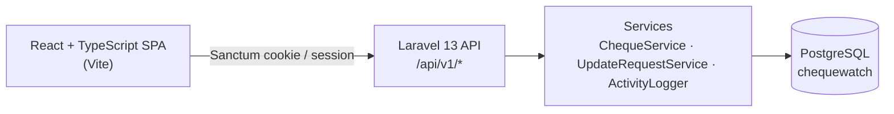
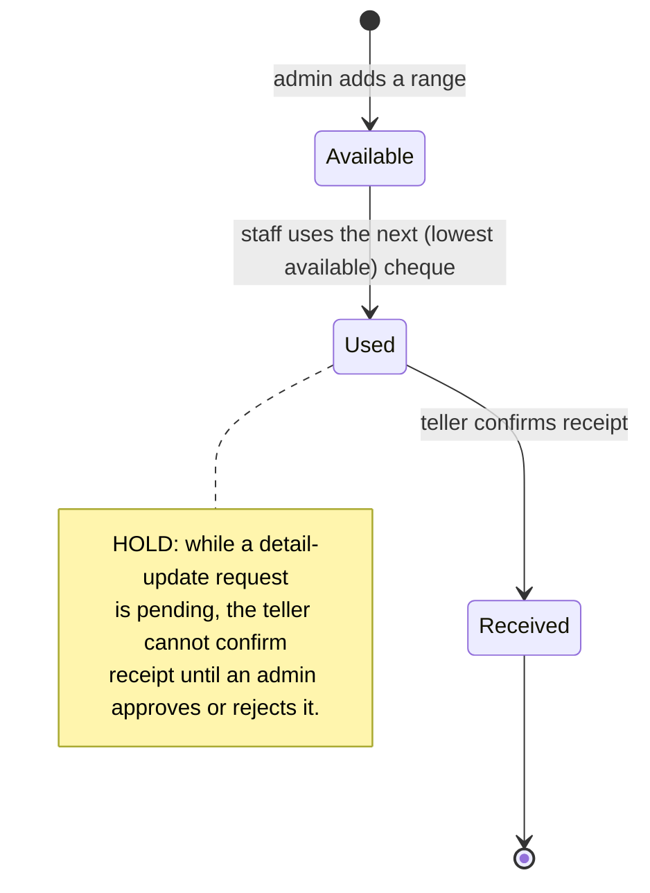
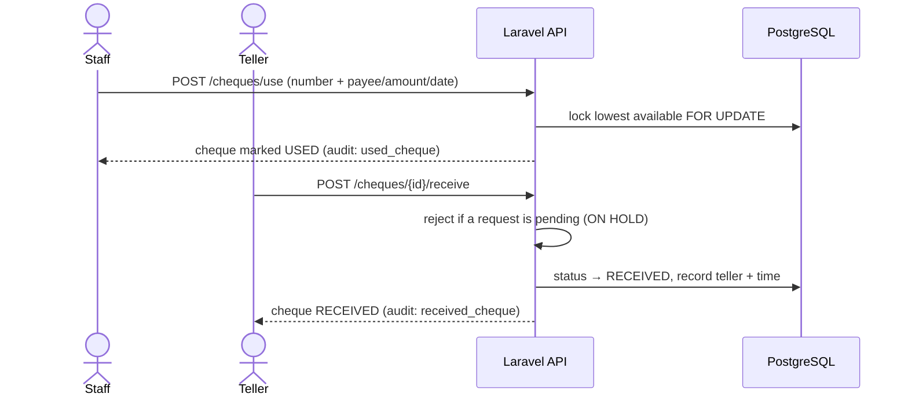
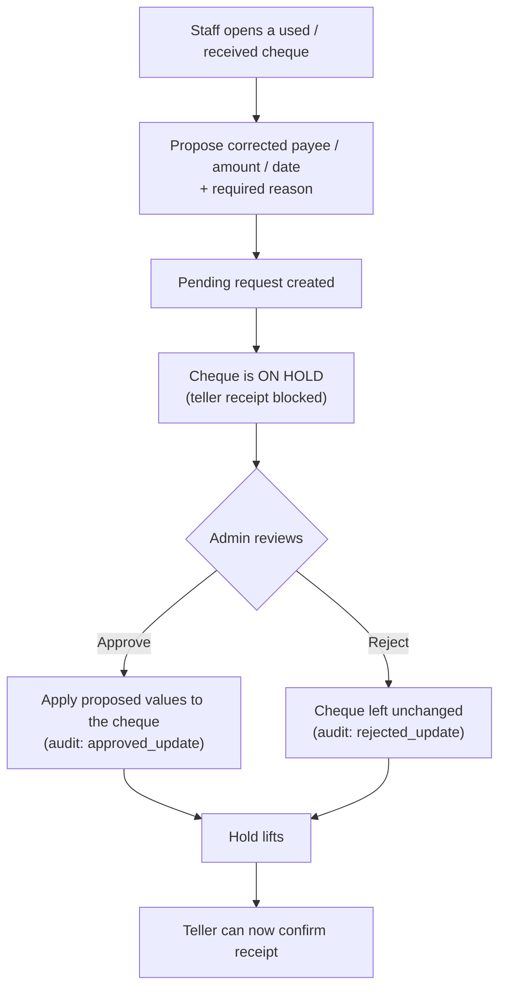

# ChequeWatch — System Documentation

> **Keep this current.** Whenever the system's behaviour changes (roles, cheque lifecycle,
> workflows, routes, or data model), update this document and its flow-charts in the **same change**.
> See [Maintaining this document](#maintaining-this-document).

_Last reviewed against the code: 2026-07-20._

---

## 1. What ChequeWatch is

ChequeWatch is a **cheque number monitoring & tracking system**. It enforces strict, gap-free
sequential usage of a business's cheque numbers and keeps a full audit trail. It is used by
finance/accounting staff, bank tellers, and administrators.

**Core guarantees**

- Cheque numbers form **one continuous integer sequence** — no batches, no gaps, no duplicates.
- Only the **lowest available** cheque may be used next; skipping is rejected **server-side**.
- Every login/logout, cheque use, receipt confirmation, and admin action is written to an
  **append-only audit log**.

---

## 2. Architecture



| Layer | Technology |
|---|---|
| Backend | Laravel 13, PHP 8.3+ |
| Auth | Laravel Sanctum (same-origin SPA cookie/session) |
| Frontend | React 19 + TypeScript, built with Vite, served by Laravel |
| Styling | Tailwind CSS v4 |
| Database | PostgreSQL |

**Where the logic lives**

- `app/Enums/` — `UserRole`, `ChequeStatus`, `ChequeAction`, `RequestStatus`
- `app/Services/ChequeService.php` — sequential usage, row locking, receipt confirmation, ranges
- `app/Services/UpdateRequestService.php` — the detail-correction request/approval workflow
- `app/Services/ActivityLogger.php` — append-only audit log
- `app/Http/Controllers/` — thin controllers; validation lives in `app/Http/Requests/`
- `routes/api.php` — all endpoints under `/api/v1`

---

## 3. Roles & permissions

| Capability | Admin | Staff | Teller |
|---|:---:|:---:|:---:|
| Sign in / view cheques & dashboard | ✓ | ✓ | ✓ |
| Use the next cheque | ✓ | ✓ | ✓ |
| Confirm a used cheque as **received** | | | ✓ |
| Request a **detail correction** (with reason) | | ✓ | |
| Approve / reject correction requests | ✓ | | |
| Add cheque ranges | ✓ | | |
| Manage users | ✓ | | |
| View the audit log | ✓ | | |

Roles are defined in `app/Enums/UserRole.php` and enforced by the `admin` and `teller`
middleware plus per-request authorization (e.g. staff-only requests).

---

## 4. Cheque lifecycle

A cheque moves through exactly one status at a time: **available → used → received**.



- **Available → Used** — `ChequeService::useNext()` locks the lowest available row `FOR UPDATE`
  inside a transaction and rejects any number that isn't the genuine next one (concurrency-safe,
  skip-proof).
- **Used → Received** — `ChequeService::confirmReceipt()`; teller-only. Blocked while the cheque
  is on hold (see §6).

---

## 5. Workflow — using & receiving a cheque



---

## 6. Workflow — detail correction (request → approval) & the hold

If a used/received cheque's details are wrong, **staff propose the corrected values with a
reason**. Nothing changes until an **admin approves**. While a request is pending the cheque is
**on hold** and the teller cannot confirm receipt.



**Rules enforced server-side** (`UpdateRequestService`)

- Only **used or received** cheques can be requested (available ones have no details).
- Only **staff** can create a request; only **admin** can approve/reject.
- A cheque may have **one pending request at a time**.
- A no-op request (proposed values identical to current) is rejected.
- A request that's already approved/rejected cannot be reviewed again.
- Approval applies the **staff-proposed** values exactly; rejection changes nothing.
- The cheque modal shows the full **request history** with each outcome (who, when, note).

---

## 7. Audit log

Every significant action appends an immutable row to `cheque_logs` via `ActivityLogger`.
Actions (`app/Enums/ChequeAction.php`): `login`, `logout`, `used_cheque`, `received_cheque`,
`requested_update`, `approved_update`, `rejected_update`, `added_cheque_range`, `created_user`,
`updated_user`, `deleted_user`. Admins view and filter the log at `GET /api/v1/logs`.

---

## 8. API reference (`/api/v1`)

| Method & path | Access | Purpose |
|---|---|---|
| `POST /login` | Public | Sign in |
| `POST /logout` | Auth | Sign out |
| `GET /me` | Auth | Current user |
| `GET /cheques` | Auth | List cheques (filter by status; includes hold flag) |
| `GET /cheques/summary` | Auth | Dashboard counts + next cheque |
| `GET /cheques/next` | Auth | The next usable cheque |
| `POST /cheques/use` | Auth | Use the next cheque |
| `POST /cheques/{cheque}/receive` | **Teller** | Confirm receipt (blocked if on hold) |
| `POST /cheques/{cheque}/update-requests` | **Staff** | Propose a detail correction |
| `GET /cheques/{cheque}/update-requests` | Auth | A cheque's request history + outcomes |
| `POST /cheques/add-range` | **Admin** | Extend the sequence |
| `GET /update-requests` | **Admin** | Pending correction requests |
| `POST /update-requests/{id}/approve` | **Admin** | Approve (apply proposed values) |
| `POST /update-requests/{id}/reject` | **Admin** | Reject (no change) |
| `GET /logs` | **Admin** | Audit log |
| `GET/POST/PUT/DELETE /users` | **Admin** | Manage users |

---

## 9. Data model

```mermaid
erDiagram
    USERS ||--o{ CHEQUES : "creates / uses / receives"
    USERS ||--o{ CHEQUE_UPDATE_REQUESTS : "requests / reviews"
    CHEQUES ||--o{ CHEQUE_UPDATE_REQUESTS : "has"
    CHEQUES ||--o{ CHEQUE_LOGS : "audited in"
    USERS ||--o{ CHEQUE_LOGS : "acts in"

    USERS {
        string name
        string username
        enum   role "admin | staff | teller"
        bool   is_active
    }
    CHEQUES {
        int    cheque_number "unique, sequential"
        enum   status "available | used | received"
        string payee_name
        decimal amount
        date   cheque_date
        fk     used_by
        fk     received_by
    }
    CHEQUE_UPDATE_REQUESTS {
        fk     cheque_id
        string proposed_payee_name
        decimal proposed_amount
        date   proposed_cheque_date
        text   reason
        enum   status "pending | approved | rejected"
        fk     requested_by
        fk     reviewed_by
        text   review_note
    }
    CHEQUE_LOGS {
        fk     user_id
        string username
        int    cheque_number
        enum   action
        text   description
    }
```

---

## Maintaining this document

This document is the human-readable spec of how ChequeWatch behaves. It is **not generated**
from the code, so it only stays accurate if it is updated alongside changes.

**The rule:** any change to roles, the cheque lifecycle, a workflow, an API route, or the data
model must update the matching section(s) **and flow-chart(s)** here, in the same commit as the
code change. This is part of the project's Definition of Done (see `CLAUDE.md`).

When updated, bump the _"Last reviewed against the code"_ date near the top.
