# E-MDS — System Documentation

> **Keep this current.** Whenever the system's behaviour changes (roles, cheque lifecycle,
> workflows, routes, or data model), update this document and its flow-charts in the **same change**.
> See [Maintaining this document](#maintaining-this-document).

_Last reviewed against the code: 2026-09-24._

---

## 1. What E-MDS is

E-MDS is a **cheque number monitoring & tracking system**. It enforces strict sequential
usage of a business's cheque numbers and keeps a full audit trail. It is used by
finance/accounting staff, bank tellers, and administrators.

**Core guarantees**

- Cheque numbers are registered per **physical cheque book**, by the first and last serial
  printed on it. **No number is ever registered twice** — an overlapping range is rejected.
- Books need not adjoin. A book running 10001–10200 can follow one running 1–500; the numbers
  in between were never issued by the bank and so never existed here.
- Only the **lowest available** cheque may be used next; skipping is rejected **server-side**.
- **LDDAP-ADA documents** draw on their **own independent check series** — unrelated to cheque
  numbers and to ACIC numbers — one document to one check number, always the lowest unused one.
  Completed ones are grouped onto an **ACIC**.
- Every login/logout, cheque use, receipt confirmation, and admin action is written to an
  **append-only audit log**.

---

## 2. Architecture

### 2.1 The shape of it

One Laravel monolith serves both the JSON API and the built SPA, from the same origin — which is
what lets Sanctum authenticate with an ordinary session cookie rather than a token.

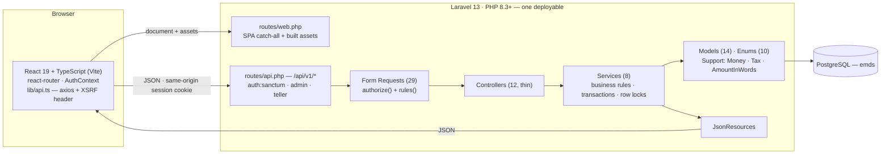

| Layer | Technology |
|---|---|
| Backend | Laravel 13, PHP 8.3+ (8.5 in development) |
| Auth | Laravel Sanctum — same-origin SPA cookie/session, no tokens |
| Frontend | React 19 + TypeScript, react-router 7, built with Vite, served by Laravel |
| Styling | Tailwind CSS v4 (CSS-based `@theme`) |
| Database | PostgreSQL (`emds`); the test suite runs on in-memory SQLite |

### 2.2 How a write travels

Every endpoint takes the same path, and each layer has exactly one job. The rules that matter —
no number twice, lowest first, only the next valid step — are enforced in the **service**, inside
a transaction, under a row lock: never in the controller, and never only in the UI.

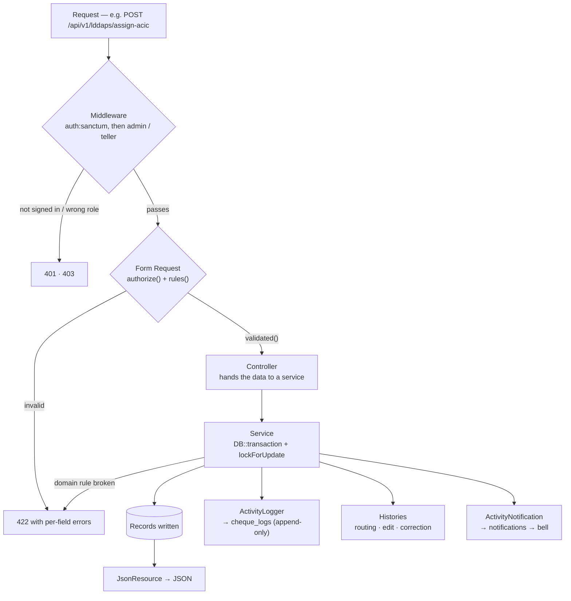

- **Middleware** answers *may this user reach the route at all* (`EnsureUserIsAdmin`,
  `EnsureUserIsTeller`); finer gates — admin **or** staff — live in the Form Request's
  `authorize()`.
- **Form Requests** hold *all* input validation. Controllers never validate.
- **Services** own the invariants and are the only place a transaction or a lock is opened. They
  throw `ValidationException`, so a broken rule reaches the client as the same 422 shape as a
  bad field.
- **Audit, histories and notifications are side effects of the service call**, inside the same
  transaction — an action and its record of itself cannot come apart.

### 2.3 Services, and what each one owns

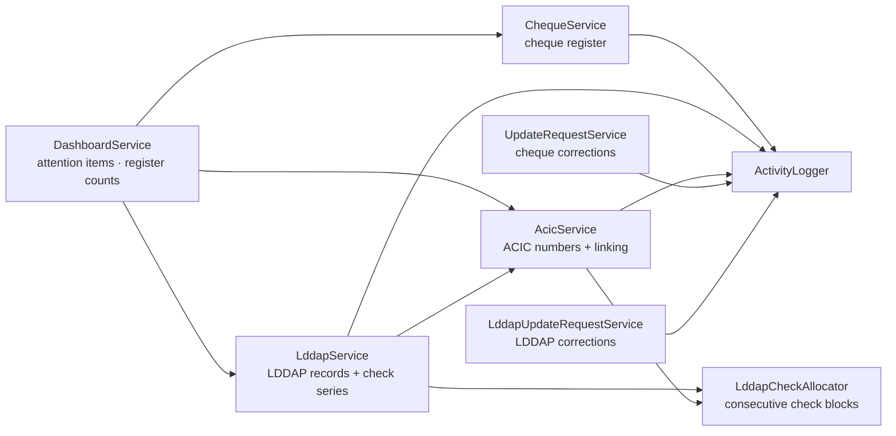

**Three independent number series**, each registered in blocks by an admin, each handing out the
**lowest unused** number next, none ever registering a number twice:

| Series | Table · column | Registered by | Issued by |
|---|---|---|---|
| Cheque numbers | `cheques.cheque_number` | `ChequeService::addRange()` | `ChequeService::useNext()` — locks the lowest available row |
| LDDAP check numbers | `lddap_checks.check_no` | `LddapService::addRange()` | `LddapCheckAllocator::claim()` — N consecutive, on ACIC assignment |
| ACIC numbers | `acic_numbers.acic_number` | `AcicService::addRange()` | `AcicService` — the lowest unused, when an ACIC is opened |

They are **unrelated to one another**: using an LDDAP check number consumes no cheque, and an
ACIC number is neither.

### 2.4 The data, grouped

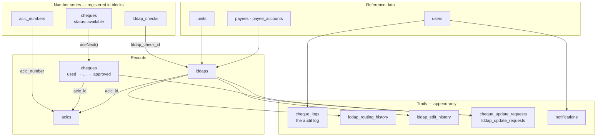

`cheques` is one table living two lives: a row is **registered** as part of a book (available),
and becomes a **record** the moment it is used. The other two series keep their numbers in their
own tables, and the record points at the number it took.

Full column-level detail is in [§ 10 Data model](#10-data-model).

**Where the logic lives**

- `app/Enums/` — `UserRole`, `ChequeStatus`, `ChequeAction`, `RequestStatus`, `AcicStatus`,
  `AcicNumberStatus`, `LddapStatus`, `LddapRoutingAction`, `LddapCheckStatus`, `NatureOfPayment`
- `app/Services/ChequeService.php` — sequential usage, row locking, receipt, review, ranges
- `app/Services/LddapService.php` — registration, the edit, the routing, the check series, ACIC linking
- `app/Services/LddapCheckAllocator.php` — claims a run of consecutive check numbers under a lock
- `app/Services/AcicService.php` — the ACIC number series, membership, sign-off and forwarding
- `app/Services/DashboardService.php` — what awaits the signed-in user, and every register's counts
- `app/Services/UpdateRequestService.php`, `LddapUpdateRequestService.php` — the correction workflows
- `app/Services/ActivityLogger.php` — the append-only audit log
- `app/Support/` — `Money` (bcmath decimals), `Tax` (the W/TAX–VAT rule), `AmountInWords`
- `app/Http/Controllers/` — thin controllers; validation lives in `app/Http/Requests/`
- `routes/api.php` — all endpoints under `/api/v1`; `routes/web.php` — the SPA catch-all
- `resources/js/` — `pages/` (one per route), `components/` (dialogs + shared UI),
  `auth/AuthContext.tsx` (the session), `lib/api.ts` (every call), `lib/tax.ts` (mirrors `Support\Tax`)

---

## 3. Roles & permissions

| Capability | Admin | Staff | Teller |
|---|:---:|:---:|:---:|
| Sign in / view cheques & dashboard | ✓ | ✓ | ✓ |
| **Route** · **receive** · **assign** · **release** a cheque | ✓ | | |
| **Forward an ACIC** to the tellers | ✓ | | |
| **Accept** · **deposit** · **return** an ACIC | | | ✓ *(the one who accepted it)* |
| **RTS** · **cancel** · **void** a cheque · **replace** a stale one | ✓ | | |
| Edit **own profile** (full name, email) / **change own password** | ✓ | ✓ | ✓ |
| Use the next cheque | ✓ | ✓ | ✓ |
| Confirm a used cheque as **received** | | | ✓ |
| Request a **detail correction** (with reason) | | ✓ | |
| Approve / reject correction requests | ✓ | | |
| **Review** an issued cheque (approve / return / disapprove) | ✓ | | |
| Register a cheque book (serial range) | ✓ | | |
| Register the **LDDAP check series** (range) | ✓ | | |
| Propose an **LDDAP correction** (with reason) | | ✓ | |
| Approve / reject LDDAP corrections | ✓ | | |
| **Correct an LDDAP directly** (reason required) | ✓ | | |
| **Use a check number** for LDDAP records | ✓ | ✓ | |
| Confirm an LDDAP as **received** | | | ✓ |
| **Act** on an LDDAP (approved / RTS / cancel) | ✓ | | |
| Assign approved LDDAPs to an ACIC | ✓ | ✓ | |
| Open an ACIC / assign cheques to it | ✓ | ✓ | |
| **Forward** an ACIC | ✓ | | |
| **Complete** a forwarded ACIC | | | ✓ |
| Manage users | ✓ | | |
| View the audit log | ✓ | | |

Roles are defined in `app/Enums/UserRole.php` and enforced by the `admin` and `teller`
middleware plus per-request authorization (e.g. staff-only requests).

### The user menu

The signed-in user's name in the header is a **dropdown trigger** (avatar initials on a phone,
name and role from `sm` up, a chevron that turns when open). The panel beneath it, aligned to the
right edge, holds a header with the full name and role, then **Profile**, **Change Password**,
and — set apart — **Sign Out**. Clicking the name again, clicking outside, or Esc closes it;
Enter/Space or an arrow key opens it, the arrows move between items, Esc returns focus to the
name, and `aria-expanded` follows the state (`resources/js/components/UserMenu.tsx`).

- **Sign Out** is a form submit that posts `POST /logout` with the XSRF token — not a link; a
  `GET /logout` is a 405. The endpoint is unchanged.
- **Profile** (`/profile`, `PUT /me`, `UpdateProfileRequest`): username and role read-only; the
  user edits their **full name** and **email** (`users.email`, nullable, unique) and saves. The
  header follows the new name at once. Logged as `updated_profile`.
- **Change Password** (`/change-password`, `PUT /me/password`, `ChangePasswordRequest`):
  *Current Password* (checked with the `current_password` rule — a wrong one is refused and
  nothing changes), *New Password* and *Confirm New Password* (`confirmed`, different from the
  current one, and the app's `Password::defaults()` rules — every failing rule is listed under
  the field). The user **stays signed in**: `ProfileController::changePassword()` writes the
  new hash back into the session (`password_hash_web`, the guard's HMAC of it — Sanctum's
  `AuthenticateSession` compares against that on every request), so the same session goes on
  working. Logged as `changed_password`; the page then shows a done view.

---

## 4. Cheque lifecycle

A cheque moves through **one ordered flow**, enforced server-side. `Available` sits outside it:
a number the bank printed and an admin registered as part of a book, waiting to be claimed.

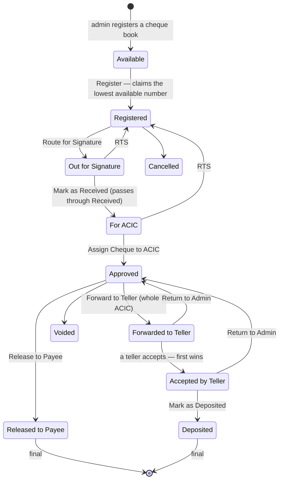

**The two branches after Approved.** A cheque goes **either** to the payee **or** to the
bank, never both:

| Branch | Steps | Unit | Who |
|---|---|---|---|
| **A — to the payee** | Approved → **Release to Payee** | one cheque | Admin |
| **B — to the bank** | Approved → **Forward to Teller** → Accepted → **Deposited** | the **whole ACIC** | Admin, then a teller |

### The steps

1. **Registered** — set automatically when a cheque is claimed from the book. The number is the
   **lowest available**, exactly as it always was; a cheque number is never allocated at ACIC
   time (that rule belongs to LDDAP check numbers).
2. **Route for Signature** (`POST /cheques/{cheque}/route`) — *Forward to*, *Unit name*, *Date
   forwarded*, *Note*. Forwarded by is the signed-in user.
3. **Mark as Received** (`POST /cheques/{cheque}/receive`) — *Received by* (defaults to the
   signed-in user, editable), *Date received*, *From unit name*, *Note*. **Received is a
   pass-through**: the step carries the cheque straight on to **For ACIC**, and the history
   records both moves.
4. **For ACIC** — the only status *Assign Cheque to ACIC* offers. Several cheques share one ACIC
   number. Assigning sets **Approved**.
5. **Release to Payee** (`POST /cheques/{cheque}/release`) — *Received by* (payee or authorised
   representative), *Date received*, *Note*. Refused without an ACIC or without a cheque number.
   Final.

### Branch B — the ACIC goes to the tellers

The ACIC is the unit here, not the cheque:

- **Forward to Teller** (`POST /acics/{acic}/forward-to-teller`, admin) — refused unless **every**
  cheque on the ACIC is Approved, and refused outright if any has already been released to
  its payee. Every teller is notified; the ACIC shows as **Pending** on the deposit queue.
- **Accept** (`POST /acics/{acic}/accept`, teller) — **the first teller to accept claims it**,
  through a conditional write (`accepted_by` is set only where it is still null), so two tellers
  clicking at the same instant cannot both succeed. The second is told *"Already accepted by
  {name}."* and the ACIC leaves every other teller's Pending list.
- **Mark as Deposited** (`POST /acics/{acic}/deposit`) — *Deposit date* (one date for the whole
  ACIC, not in the future, not before the date accepted), the bank read-only as **Land Bank of
  the Philippines**, *Deposit slip / reference no.*, *Note*. Every cheque becomes **Deposited**.
- **Return to Admin** (`POST /acics/{acic}/return-to-admin`) — reason required. Every cheque goes
  back to **Approved**, the claim is released and the admin is notified, who can forward it
  again or release the cheques individually.

Only the teller who accepted an ACIC (or an admin) may deposit or return it. The teller
dashboard is **Deposit queue** (`/deposit-queue`), with Pending and Accepted lists.

### The three ways out

| Exception | Allowed at | Result |
|---|---|---|
| **RTS** | Out for Signature · Received · For ACIC | back to **Registered**, routing cleared, ready to go round again |
| **Cancel** | before an ACIC — Registered · Out for Signature · Received · For ACIC | **Cancelled**, final |
| **Void** | **Approved only** — never once a teller has it | **Voided**, final; the number stays used and is never reassigned |

Each needs a reason, kept on the cheque as `exception_reason`.

### The rules behind every step

Everything funnels through `ChequeFlowService::move()`, so no step can forget a check:

- **The order is enforced server-side.** `ChequeStatus::nextStates()` is the whole transition
  table; anything not in it is refused. No skipping forward, no walking back.
- **Optimistic concurrency.** Each step may carry `expected_status` — the status the caller's
  page was showing. If the row has moved since, the step is refused with
  *"This record was updated by another user. Refresh to continue."*
- **Dates.** Never in the future, and never before the previous step's date (routed ≥ cheque
  date, received ≥ forwarded, released ≥ the date the ACIC was assigned, deposited ≥ accepted).
- **The hold.** A pending correction request stops a cheque moving on; only the system's own
  step (going stale) and the exceptions that close it are not held up.
- **Every change is written to `cheque_status_history`** — from/to status, the named action, the
  user, the timestamp and the step's own fields. **An ACIC-level action writes one row per
  cheque on that ACIC**, so each cheque's trail is complete on its own. Readable at
  `GET /cheques/{cheque}/status-history`, and shown as the **Timeline** on the record.
- **Roles.** Admins register, route, receive, assign, release, forward, cancel and void. Tellers
  accept, deposit and return. Enforced in the Form Requests and re-checked in the services.

### What this replaced

The old `status` + `disposition` pair is folded into this one field — where a cheque *is* and
how far it has *got* turned out to be the same question once the flow was written down. The
admin **review** flow (Approved / Returned / Disapproved) retires with it: RTS, Cancel and Void
take its place, and **Mark as Received → For ACIC** is the sign-off. The migration
`2026_09_24_000000_rework_cheque_status_flow` remaps every existing row — a settled disposition
wins over the review beside it, `approved` + an ACIC becomes Approved, `complies` becomes
Registered and `disapproved` becomes Cancelled.

---

## 4b. Cheque validity — the 90-day clock

The 90-day validity runs beside the flow above. A cheque ages from its **cheque date** wherever
it happens to be sitting, and **Stale** overtakes whatever status it was in.

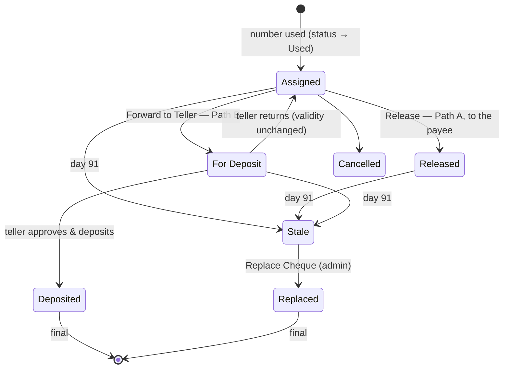

**The rule.** A cheque is valid for **exactly 90 calendar days from its cheque date**. Day 0 is the
cheque date, day 90 is the last valid day, and from **day 91** it is stale. Counted in whole days
(`App\Support\Validity`), never in months, so leap years and month-ends need no special case, and
always reckoned in **Asia/Manila** whatever the app's timezone — the rule is about the calendar
date on a piece of paper in a Philippine office, not an instant in UTC. `validity_until` is
derived on save: set the cheque date and it follows, change the date and it moves (and the
one-time alert reopens).

**Eight statuses perish**: Registered, Out for Signature, Received, For ACIC, Approved,
Forwarded to Teller, Accepted by Teller and Released to Payee. A cheque can go stale while it is
waiting for signature, sitting with a teller, or held uncashed by the payee. Deposited,
Cancelled, Voided, Stale and Replaced are never touched again.

| Path | Steps | Who |
|---|---|---|
| **A — direct to payee** | Assigned → **Release** → Released | Admin/staff |
| **B — deposit via teller** | Assigned → **Forward to Teller** → For Deposit → **Approve & Deposit** → Deposited | Admin/staff, then the teller |

A cheque follows **one path only**: a released cheque is never forwarded, and one with a teller is
never released. `ChequeDisposition::canMoveTo()` is the whole transition table, and every move is
checked three ways in `ChequeDispositionService` — signed off (`status` = Approved), a transition
the enum allows, and still inside validity.

- **Release** (`POST /cheques/{cheque}/release`) — *Received by* (the payee **or the
  representative who collected it**, pre-filled with the payee but editable), *Date received*
  (defaults to today; not in the future, not before the cheque date, not after `validity_until`)
  and an optional note. `released_by` / `released_at` are the signed-in user and now. The dialog
  asks once more before committing, because a release cannot be undone.
- **Forward to Teller** (`POST /cheques/{cheque}/forward`) — pick an active teller; they are
  notified.
- **Approve & Deposit** (`POST /cheques/{cheque}/deposit`) — *Date deposited* (not in the future,
  not after validity), the bank shown read-only as **Land Bank of the Philippines**, an optional
  deposit reference and note. **Every active user is notified** that the cheque was deposited.
- **Return** (`POST /cheques/{cheque}/return`) — the teller hands it back with a required reason.
  It returns to Assigned and **keeps its original `validity_until`**: returning does not restart
  the 90-day clock.
- Only the teller a cheque was forwarded to, or an admin, may deposit or return it.

**An action attempted past validity does not merely fail.** The cheque is marked stale then and
there, and the refusal says so. That marking happens *before* the action's own transaction opens —
doing it inside would work right up until the refusal threw, at which point the rollback would
undo the very fact it had just established.

### Going stale

1. **The nightly sweep** — `cheques:sweep-validity`, scheduled `dailyAt('00:05')` in Asia/Manila
   (`routes/console.php`). It marks every perishable cheque past its last valid day as Stale with
   `stale_at`, and writes *"Auto-marked stale by system — exceeded 90-day validity"* naming the
   stage it expired in: *never signed/released*, *released to {name} on {date}, not encashed*, or
   *with teller, not deposited*. System entries are attributed to `system` in the audit log.
2. **On read** — `Cheque::effectiveStatus()` reports Stale the moment the date turns, sweep or
   no sweep, and `scopeEffectivelyIn()` is the same answer in SQL. Every guard, every badge and
   every tab reads the effective value, so **correctness never depends on the job having run**.
   The sweep only writes down what the model already reports.
3. **Idempotent** — `markStale()` re-reads under a lock and returns early if the cheque is already
   stale, and the alert is stamped on the row. Running the sweep twice changes nothing and
   notifies nobody twice. `--dry-run` reports without writing.

### The 10-day alert

Fires once when a perishable cheque has **10 days or fewer** left (expiry day included), stamped
with `expiry_alert_sent_at` so it never repeats. Changing the cheque date clears the stamp.

The message carries the cheque number, payee, amount, cheque date, `validity_until`, the countdown
and the current status, and opens the Expiring Soon tab. What it says, and who else gets it:

| Status | Message | Extra recipient |
|---|---|---|
| Registered · Out for Signature | *Pending signature — this cheque will become stale in N days if not released or forwarded.* | — (admins are the signatories, and are always notified) |
| Released to Payee | *Released to {name} on {date} — … if not encashed. Please follow up with the payee.* | the user who released it |
| Forwarded / Accepted by Teller | *Awaiting teller deposit — … if not deposited to Land Bank of the Philippines.* | the teller holding the ACIC |

Base recipients are the user who assigned the number and the active admins. Delivery is **in-app**
(the header bell); **email is optional and off by default** — `cheques.alert_email`
(`CHEQUE_ALERT_EMAIL=true`) turns it on once a mailer is configured.

### Stale cheques and replacement

Stale is terminal: the cheque cannot be signed, released, forwarded, deposited or edited back to an
active state, and **its number stays consumed** — never reused, exactly as for every other number
in this system.

**Replace Cheque** (`POST /cheques/{cheque}/replace`, **admin only**) issues a new cheque on the
next available number through the existing `useNext()` rules, carrying the payee and amount over,
with a fresh cheque date and a fresh 90 days. The old cheque becomes **Replaced**, and the two are
linked both ways (`replaces_id` / `replaced_by_id`); both keep their full history. A cheque can be
replaced once. If the stale cheque had been **released**, the dialog warns first — *"This cheque
was released to {name}. Make sure the original cheque has been returned before issuing a
replacement."*

### Editing, after the fact

- **The cheque date is fixed once the cheque leaves.** It may only be changed while the
  status is Registered; afterwards a correction naming a different date is refused, because
  the 90-day clock runs from it.
- **Release details cannot be edited by the person who entered them.** Only an admin may correct
  `received_by_name` / `date_received` (`PATCH /cheques/{cheque}/release`), a reason is required,
  and the audit log records `field 'old' → 'new'` alongside it.

### On the cheque page

- **Validity column** — the countdown (*12 days left* · *Expires today* · *Stale — 5 days ago*)
  with the date beneath. Deposited cheques read *Deposited to Land Bank {date}*; Cancelled,
  Spoiled and Replaced read *—*.
- **Received by column** — `received_by_name` and `date_received`, for released cheques.
- **Badges** — one per status: teal *Released to Payee*, purple *Forwarded to Teller*, indigo
  *Accepted by Teller*, blue *Deposited*, red *Stale* / *Cancelled* / *Voided*. The Validity
  column adds green (more than 10 days) / amber (10 or fewer, with an *Unsigned* / *With payee*
  / *With teller* tag) / red once stale.
- **Banner** — *"4 cheques will become stale within 10 days (2 pending signature, 1 with payee,
  1 with teller)."* Clicking it filters to those cheques.
- **Tabs** — All, then any status in the flow (Registered · Out for Signature · For ACIC ·
  Approved · Released · Forwarded to Teller · Accepted by Teller · Deposited), plus
  Expiring Soon and Stale (`GET /cheques?tab=`), and a **nearest expiry first** sort
  (`&sort=expiry`).
- **Row actions** — exactly the one step the cheque is ready for (Route for Signature · Mark as
  Received · Assign to ACIC · Release to Payee), then the ways out (RTS · Cancel · Void) and
  Replace on a stale one. Every button is driven by a `can_*` flag the server computes, so the
  buttons and the endpoints can never disagree. The teller's actions live on the **Deposit
  queue**, not on the cheque row.
- **Detail page** — a **Timeline** of everything that happened: assigned → signed off → released,
  or → forwarded → returned/deposited, then stale or replaced, each with user and timestamp.

### Backfilling

The migration `2026_09_23_000000_add_validity_and_disposition_to_cheques_table` computed
`validity_until` for every existing cheque and marked anything already past it as Stale — **silently**, so a history
of back-dated cheques does not fire a flood of old alerts. Its `backfill()` is public and
idempotent, and the test suite exercises it directly.

---

## 4a. Workflow — registering a cheque book

Before any cheque can be used it must exist. An **admin** registers a newly issued physical cheque
book by entering the **first and last serial printed on it** (e.g. 10001 to 10200); the system
creates one `available` row per serial.

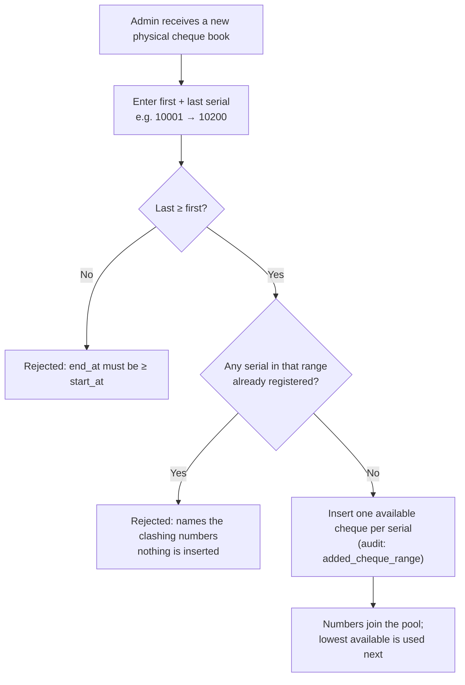

**Rules enforced server-side** (`ChequeService::addRange()`)

- `end_at` must be **greater than or equal to** `start_at`; a single-cheque book is allowed.
- **Overlap is rejected.** Any serial in the range that already exists fails the whole request —
  the error names the clashing numbers, and nothing is inserted.
- The check and the insert share one **locked transaction**, so two admins registering overlapping
  books at the same time cannot both succeed.
- A range wider than **100,000** serials is rejected as a likely typo.
- Books **need not adjoin**. Registering 10001–10200 when the highest existing number is 500 is
  valid; 501–10000 never existed. Sequential *usage* is unaffected — `useNext()` still issues the
  lowest available number across every registered book.

---

## 5. Workflow — using & receiving a cheque

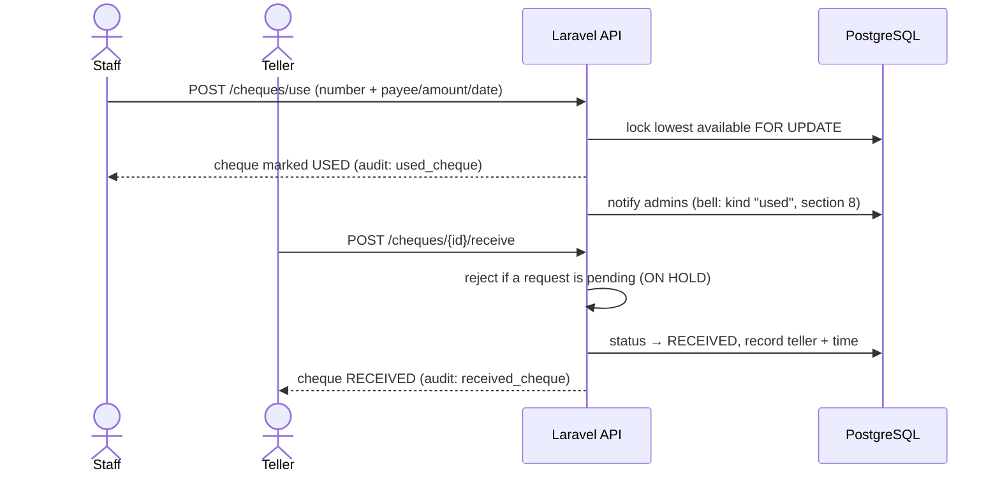

---

## 6. Workflow — detail correction (request → approval) & the hold

If a used/received cheque's details are wrong, **staff propose the corrected values with a
reason**. Nothing changes until an **admin approves**. While a request is pending the cheque is
**on hold**: neither teller receipt nor admin review (§6a) can proceed.

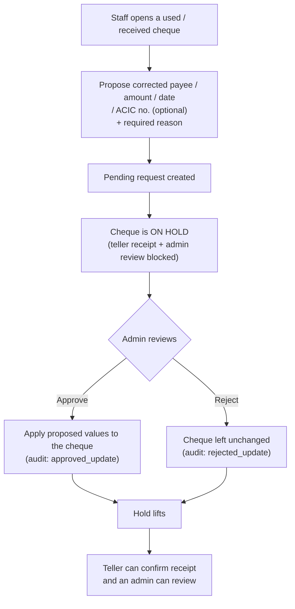

**Rules enforced server-side** (`UpdateRequestService`)

- Only **used or received** cheques can be requested (available ones have no details).
- **ACIC no. is optional.** It is not captured on the use-cheque form; it is recorded later
  through a detail-update request.
- Only **staff** can create a request; only **admin** can approve/reject.
- A cheque may have **one pending request at a time**.
- A no-op request (proposed values identical to current) is rejected.
- A request that's already approved/rejected cannot be reviewed again.
- Approval applies the **staff-proposed** values exactly; rejection changes nothing.
- The cheque modal shows the full **request history** with each outcome (who, when, note).
- Creating a request notifies **admins**; approving/rejecting notifies the **requester** (section 8).

---

## 6a. Workflow — admin review (approve / disapprove)

Once a cheque has been issued, an **admin** signs off on it from the Action column of the cheques
table. Two entry points, one decision:

- **Approve** — a confirmation dialog only. On confirm the cheque becomes **approved**; no note
  is required.
- **Disapprove** — opens a dialog with a required **reason / notes** field and a **status** select
  offering **Returned** or **Disapproved**. On confirm the chosen outcome and the note are
  saved.
  - **Returned** hands the cheque back to the staff member to fix what the note describes.
    It is **not final** — once they comply, an admin reviews it again and can approve it.
  - **Disapproved** rejects the cheque outright and is **final**.

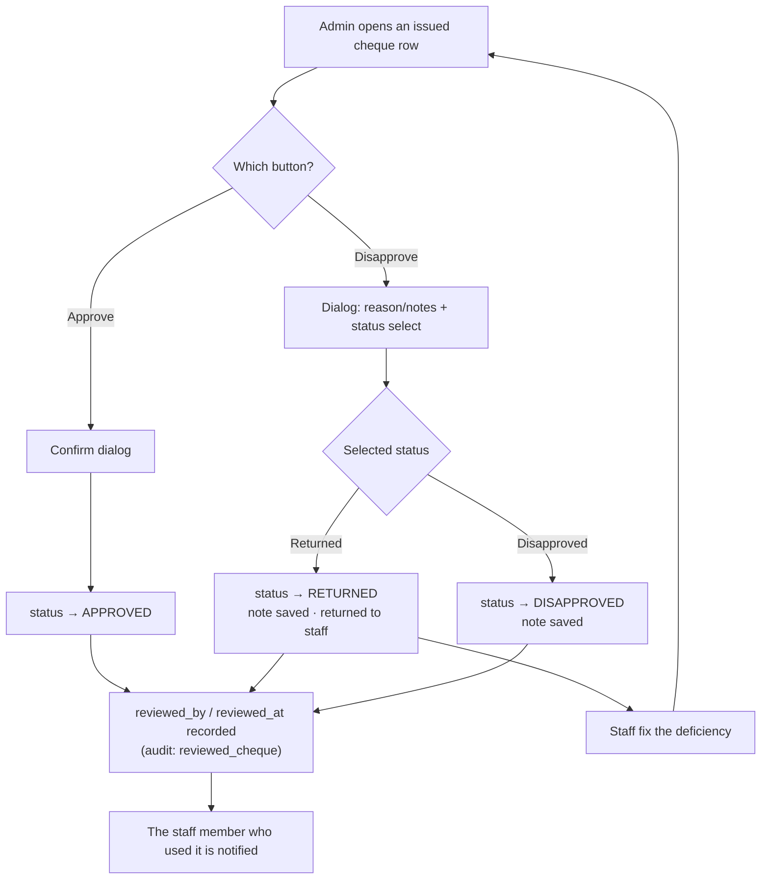

**Rules enforced server-side** (`ChequeService::review()`)

- Only **issued** cheques (used or received) can be reviewed — an available one has nothing to
  check.
- A cheque **on hold** (pending correction request) cannot be reviewed until the request is
  resolved, the same rule that blocks teller receipt.
- **Approved and Disapproved are terminal** — they cannot be reviewed again. A cheque sitting
  at **Returned** stays reviewable, which is the whole point of that outcome.
- The note is **required** for Returned and Disapproved, and not asked for on a plain
  approval. Reviewing again **overwrites** `review_note`, `reviewed_by` and `reviewed_at` —
  the superseded note remains in the audit log.
- The outcome, reviewer and note are stored on the cheque (`status`, `reviewed_by`, `reviewed_at`,
  `review_note`) and appended to the audit log as `reviewed_cheque`.
- **Returned** is stored as the status value `complies` (and filtered as
  `GET /cheques?status=complies`); "Returned" is its display label everywhere in the UI —
  with one exception, below. The value was named before the label was, and is deliberately left
  alone: it is in the API, the tab query string and the database.
- **Once complied with, the Status badge reads differently on each side.** The stored status is
  still `complies` — only the admin's approval of the correction moves it on — but leaving the
  row reading "Returned" would suggest the staff member still owes work they have already
  done. So while a correction is pending (`has_pending_update`), `StatusBadge` relabels it:
  **staff see On Hold**, **admins (and tellers) see Complied**, and the badge drops its coral
  "act on me" styling for cyan. The label is the only thing that changes — the status value, the
  **Returned** tab it is filtered under, and the hold itself all stay as they are. The
  LDDAP table does the same through `LddapStatusBadge` (section 6c).
- Because the badge now carries the hold on a Returned cheque, `ChequeDetailModal` drops
  its separate **On hold** chip for that status; the chip still appears on a Used or Received
  cheque, where the badge says nothing about it.
- The staff member who used the cheque is notified of the outcome (section 8) — and on a
  Returned outcome that notification is also the hand-back: they are the only one who can act on
  it afterwards. Returned arrives as a `request`-kind notification, since it is an action item rather than a verdict.

**Searching the list**

`GET /cheques` accepts a `search` term (max 100 chars) that matches **either the cheque number or
the ACIC no.**, as a case-insensitive substring — so `1000` finds #10001–#10005, and `acic-2026`
finds every cheque on that ACIC. It combines with `status` (both must match) and with pagination.
`%` and `_` in the term are escaped and matched literally rather than acting as wildcards.

On the cheques page the box sits above the table, debounced by 300 ms, and resets to page 1 on
every new term so a match is never stranded on a later page.

---

## 6b. ACIC records

An **ACIC** (Advice of Checks Issued & Cancelled) groups approved cheques for onward transmittal.
The ACIC page lists every record with **ACIC No., Status, Used By, Created Date, Forward Date**
and **Received By**.

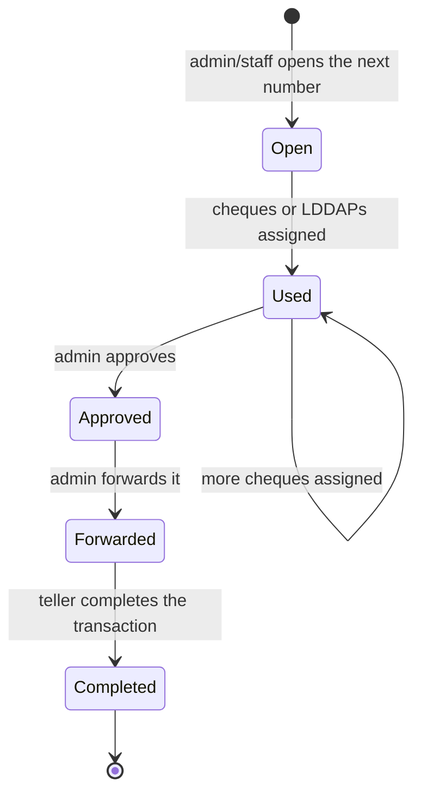

**The number sequence**

- ACIC numbers are a **gap-free running sequence generated by the system** — 1, 2, 3… — never
  entered by hand and never skipped.
- `AcicService::create()` reads the current maximum `FOR UPDATE` inside a transaction, so two
  concurrent opens can never take the same number.
- The next number continues from the **highest ever used**, so deleting a record cannot cause a
  later one to reuse its number.

#### The ACIC number series

ACIC numbers are **registered in blocks**, not invented by the system — the office is issued them,
the way it is issued cheque books and LDDAP check numbers. `acic_numbers` holds one row per
number (`available` | `used`); the series is independent of the cheque and LDDAP check registers
and may overlap either without conflict.

- **No number is ever registered twice.** `AcicService::addRange()` rejects any overlap with what
  is already on file — straddling, enclosed or a single number — checked under a lock so a
  concurrent registration cannot slip one in behind it. `POST /acics/add-range`, admin only, from
  **ACIC Series** in the sidebar.
- **An ACIC always takes the lowest unused number.** `create()` claims that row `FOR UPDATE` and
  marks it used, so two concurrent creates can never take the same number.
- **A block registered below numbers already in use is drawn on first.** Register 500–505, open
  #500, then register 10–12, and the next three ACICs are #10, #11, #12 — only then #501. This is
  the whole point of a registered series over a counter.
- **Adjoining blocks continue the run.** Numbers are rows, not "series" objects, so registering
  13–15 after 10–12 simply hands out 10, 11, 12, 13, 14, 15 unbroken — nothing separate is
  created. Blocks that do **not** adjoin leave the numbers between them unregistered, and those
  are never issued.
- When the series is exhausted `GET /acics/next` returns null, the page says so, and opening an
  ACIC is refused until an admin registers more. `GET /acics/series` reports
  registered / available / used.

The ACIC page opens with the next number stated once, then **two panels** under it — **Cheque
ACIC** and **LDDAP ACIC** — one per record type, each carrying its own assign button. They are
entry points, not two sequences: both take the same next number, and whichever is assigned first
claims it. The table's **Category** column then reads back what each ACIC actually holds —
**Cheque ACIC**, **LDDAP ACIC**, **Mixed** when it carries both, or *Empty* when it has been
opened but not filled — with the counts underneath. It is derived from `cheque_count` and
`lddap_count` on `AcicResource`, so it always reflects membership rather than how the ACIC was
opened.

The table's tabs filter on both dimensions: **All · Cheque ACIC · LDDAP ACIC · Forwarded ·
Completed**. The first three go to `GET /acics?category=cheques|lddaps` (a `has()` on the
relation), the last two to `?status=`; the two parameters combine server-side, though the tab row
lights only one at a time. A **Mixed** ACIC is listed under *both* category tabs, and an ACIC
opened but not yet filled under neither.

**Assign LDDAP to ACIC** (`LddapAssignModal`, on the LDDAP page beside **Add LDDAP**, and on the
ACIC page) lists only approved LDDAPs not already on an ACIC, **multi-select** — many share one
ACIC number. The user types the **ACIC #** (prefilled with the next in the series; it must be an
existing open ACIC or that next number, never invented) and ticks records; a **Check No.**
column previews the number each will take, in tick order. See [6c](#6c-lddap-ada-records) for
the numbering and locking rules.

**Assign cheque to ACIC** is the ACIC page's primary button. It opens `AcicUseModal` on the
**next number in the sequence**, restricted to a **single** approved cheque (radio, not
checkboxes). The ACIC itself is only opened when the dialog is submitted — cancelling out leaves
no empty number behind — after which `POST /acics` and `POST /acics/{acic}/cheques` run back to
back. The per-row **Use ACIC** action is unchanged and still assigns many cheques at once to an
ACIC that already exists.

#### Approval, re-assignment, forwarding and printing

The ACIC table's Action column carries only **View** — plus **Complete** for a teller on a
forwarded ACIC. Every other action moved into the **View ACIC** dialog, below the record it acts
on, and what is offered follows the status:

| Status | Who | Offered in the View dialog |
|---|---|---|
| Open / **Used**, still empty or Mixed | Admin/Staff | **Add cheque**, **Add LDDAP** — more records onto *this* ACIC |
| Open / **Used**, **LDDAP ACIC** | Admin/Staff | **Add LDDAP** only |
| Open / **Used**, **Cheque ACIC** | — | neither Add action |
| Used | Admin | **Approve** — signs the ACIC off (`POST /acics/{acic}/approve`) |
| Used | Admin/Staff | **Re-assign** |
| **Approved** | — | **Print** |
| **Approved** | Admin | **Forward** (the only place it is offered), **Re-assign** |
| Forwarded / Completed | — | nothing; membership is fixed once it has left the office |

- **The category governs what an ACIC may still take on**, derived in the View dialog exactly as
  the table's Category column derives it:

  | Category | Add cheque | Add LDDAP |
  |---|---|---|
  | **Cheque ACIC** (cheques, no LDDAPs) | — | — |
  | **LDDAP ACIC** (LDDAPs, no cheques) | — | ✓ |
  | **Mixed**, or still empty | ✓ | ✓ |

  A Cheque ACIC is closed to further additions — what is on it is what it is for — while an LDDAP
  ACIC keeps taking LDDAPs but never cheques. **Re-assign** and **Approve** are unaffected in
  every case, so membership can still be swapped and the ACIC can still be signed off.
- **Used says nothing about capacity.** It only records that the ACIC already carries something.
  Many cheques and LDDAPs share one ACIC number, so a Used ACIC keeps accepting more — **Add
  cheque** and **Add LDDAP** in the View dialog put them on *that* ACIC rather than opening a new
  number, and everything on it stays grouped in its one table. `AcicStatus::acceptsRecords()`
  (Open or Used) is the gate for **LDDAPs**; for cheques, see the next point.
- **Assigning cheques signs the ACIC off in the same step.** `assignCheques()` sets the ACIC to
  **Approved** as well as linking the cheques, so a cheque ACIC is ready to forward or print at
  once with no separate click. It **keeps accepting cheques** while approved — many share one
  number — so for a cheque ACIC it is **forwarding**, not approval, that closes membership.
  Assigning **LDDAPs** leaves the ACIC `used`, to be approved on its own as before.
- **Approve** (`POST /acics/{acic}/approve`) moves `used → approved` for an ACIC that is still
  Used — in practice an LDDAP one. It refuses an ACIC that carries nothing, and one already
  approved (*"has already been approved"*), which a cheque ACIC will be. **Admin-only**.
- **Forwarding now follows the sign-off.** `AcicService::forward()` refuses an ACIC that has not
  been approved, so what leaves the office is what was approved.
- **Re-assign** (`POST /acics/{acic}/reassign`, admin **and** staff) swaps one record on the ACIC
  for another of the same kind. The record coming off has its `acic_id` cleared and is
  **released back to the pool** — it reappears under `linkable-cheques` / `lddaps/linkable` and
  can go on a later ACIC; the one going on must be approved and not already on another ACIC.
  Both halves run in one locked transaction, so the ACIC is never briefly short of what it
  carries and a released number can never be claimed twice. Allowed while the ACIC is Used or
  Approved, refused once Forwarded.
- **Print** renders the ACIC form to the **pre-agreed sheet the depository bank accepts**, not a
  generic listing. The layout is fixed: a three-column header (bank block · agency block ·
  ACIC NO./ORG CODE/FUNDING SOURCE/AREA CODE/ALLOCATION NO), the centred title **ADVICE OF CHECKS
  ISSUED AND CANCELLED**, the account number, a ruled table with a shaded head (CHECK NO · DATE OF
  ISSUE · PAYEE · AMOUNT · OBJ CODE · REMARKS), the totals and **AMOUNT IN WORDS** line, a clear
  band for the bank's stamp, and the foot — the bordered CANCELLED CHECKS box beside the
  CERTIFIED CORRECT / VERIFIED / RECEIVED / APPROVED / POSTED / DELIVERED signature grid, with the
  transmittal filename and *FOR LBP USE ONLY*. Arial 9.5pt throughout. It lives in the
  `.acic-print` block and the `@media print` rules in `resources/css/app.css`, which hide the rest
  of the page.
  - **One ACIC, one table.** Every record on the ACIC — however many LDDAPs, however many cheques
    — is a row in the single check table, never a table apiece. The View dialog shows the same
    thing on screen (**Records on this ACIC**), so what is read matches what is printed.
  - The form is **portalled to `<body>`** rather than printed from inside the dialog. The dialog
    is a `position: fixed` overlay wrapping an `overflow-y-auto` card, and a fixed, clipped
    ancestor makes browsers clip the sheet to one viewport-sized page and repeat it on the next —
    which split a single ACIC's table into what looked like several. As a top-level element the
    form is in the normal print flow, and `@media print` simply hides `body > *:not(.acic-print)`.
  - Pagination is explicit: the table may break **between rows** (`break-inside: avoid` on `tr`),
    repeats its header (`thead { display: table-header-group }`), and the header block, totals,
    signature foot and filename line are each kept whole.
  - An **LDDAP** row prints its check number, check date, **LDDAP number as the payee** and OBJ
    number — as the reference sheet does. A cheque row prints its number, cheque date and payee,
    and leaves OBJ blank.
  - **AMOUNT IN WORDS** is spelled by `App\Support\AmountInWords`, matching the form's
    conventions: hyphenated compound tens, no "and" between hundreds and tens, and a
    `… PESOS AND … CENTAVOS` tail only when there are centavos.
  - The form's **ACIC NO.** is `YY-MM-SEQ` (e.g. `25-10-248`), derived from the ACIC's creation
    date and its sequence number — not the bare integer shown elsewhere in the UI.
  - Everything that belongs to the office rather than to one ACIC — bank and agency blocks, org /
    funding / area / allocation codes, account number, signatories, filename prefix — lives in
    **`config/acic.php`**, each value overridable from `.env` (see `.env.example`). The defaults
    are the values on the reference sheet.

**Use ACIC — linking cheques** (`AcicService::assignCheques()`)

- Only cheques with status **approved** can be put on an ACIC — the terminal positive review
  outcome, i.e. a fully signed-off cheque.
- A cheque belongs to **at most one ACIC** (`cheques.acic_id`). Assigning one that already sits on
  a different ACIC is rejected, and the error names the offending cheque numbers.
- **Many cheques to one ACIC** is the normal case; the picker is multi-select.
- A batch is **all-or-nothing** — one ineligible cheque fails the whole request, so nothing is ever
  half-assigned. Everything is validated under a row lock.
- Re-assigning a cheque already on *this* ACIC is a harmless no-op.
- The first assignment moves the record Open → **Used** and stamps **Used By** / used at.

**Forward** (`AcicService::forward()`)

- **Admin only.** Records the **Forward Date** and who received it, and moves the record to
  **Forwarded**, which is terminal.
- An ACIC with no cheques on it cannot be forwarded, and a forwarded ACIC accepts no further
  cheques and cannot be forwarded again.
- The recipient is normally the **teller**, and must then be an **active** user (`received_by`).
  When the ACIC is handed to someone with **no account** — another agency's teller, a courier —
  the modal's "Someone else…" option records the typed-in name of whoever accepted it
  (`received_name`) instead. Exactly **one** of the two is stored; supplying both is rejected.
- `AcicResource` exposes `forwarded_to`, which resolves to whichever of the two applies, so the
  ACIC and LDDAP tables render one "Forward To" column without caring which kind it is.

**Complete — the teller step** (`AcicService::complete()`)

- **Teller only**, matching the existing rule that confirming receipt is strictly the teller's job.
  Admin and staff see the status but cannot complete.
- Only a **Forwarded** ACIC can be completed; an Open or Used one is refused, and a completed one
  cannot be completed again or take further cheques. **Completed is terminal.**
- Records **completed at** and **completed by**.
- **Cheque synchronisation.** Completing stamps the teller's receipt (`received_by` /
  `received_at`) on every cheque on the ACIC that does not already carry one, in the same
  transaction — so the cheque records never lag behind the ACIC that represents them. An existing
  receipt is left alone: it belongs to whoever actually made it.

**Status tabs**

The ACIC page has **All / Forwarded / Completed** tabs, served by `GET /acics?status=`:

- **All** — every record whatever its status, including Open and Used.
- **Forwarded** — only records awaiting teller action. This is the teller's work queue.
- **Completed** — records the teller has finished. A record leaves the Forwarded tab and appears
  here the moment it is completed.

Cheques carry `acic_id` rather than a free-text ACIC number, so the cheques table's "ACIC no."
column and its search read through the link, and `ChequeResource` also reports `acic_status` so a
cheque row can never disagree with the ACIC it sits on.

---

## 6c. LDDAP-ADA records

An **LDDAP-ADA** (Listing of Due and Demandable Accounts Payable — Advice to Debit Account) is a
disbursement document. The LDDAP page lists every record with **Check No., Status, LDDAP No.,
Amount, OBJ No., Used By, ACIC No.** and **Forward To / Date**.

### The LDDAP check series is independent

The **Check No.** on this page comes from `lddap_checks`, a register that shares **nothing** with
`cheques.cheque_number` or with `acics.acic_number`:

- The three sequences advance separately. LDDAP check #500 and cheque #500 are different things
  and may both exist; using an LDDAP check number consumes **no cheque**, and opening an ACIC
  does not move the LDDAP series.
- An admin registers blocks of the series on **LDDAP Series** (`POST /lddaps/add-range`), the way
  cheque books are registered. **No number is ever registered twice** — an overlapping block is
  rejected inside a locked transaction.
- Blocks need not adjoin; the numbers between two blocks never existed.
- `check_no` is a **big integer**: real LDDAP-ADA numbers run to ten digits (e.g. 9910031148),
  well past the 2,147,483,647 ceiling of a 4-byte integer. Anything above
  `LddapService::MAX_CHECK_NO` is refused in validation rather than at the database.

### How the next number is chosen

- The next number is always the **lowest unused** number in the series — never a random one, and
  never one out of order.
- Numbers are handed out **when records go on an ACIC** — never at registration — as a
  **consecutive block**: N ticked records take the first run of N gap-free unused numbers,
  searching up from the lowest, in the order ticked. Free numbers a longer batch had to skip
  remain for a shorter one.
- **A number is never skipped past for good**, and never issued twice. The caller sends the
  block it previewed (`expected_check_nos`); a client working from a stale preview is rejected
  by name rather than silently renumbered.
- **A block registered later, below numbers already in use, is used first — when the batch
  fits.** Register 500–505, use 500 and 501, then register 1–3: a batch of three takes 1, 2, 3;
  a batch of four cannot, so it takes 502–505 and leaves 1–3 for later.
- Selection happens under a `FOR UPDATE` lock, so two concurrent batches can never claim the same
  numbers, and `lddaps.lddap_check_id` is **unique**, so a number can never be held twice
  whatever happens above it.
- **Registration is one record at a time.** Numbers, by contrast, go out in one locked batch
  per ACIC assignment — however many records were ticked.
- **`lddap_no` is unique**: the same document can never be registered twice — enforced by the
  database index, the form request and a locked re-check in the service.
- The **date of issue is entered** with the record (`check_date`, defaulting to today in the
  dialog); a caller that omits it gets the day of registration.

### What a record is registered with

**Register LDDAP record** (`LddapRegisterModal`) collects one record's fields. There is **no
check number field**: the number is issued when the approved record is put on an ACIC
(`LddapAssignModal`). Every field but one is required (`LddapDetailsRequest` — the one form
request behind both Register and Edit):

| Field | Column | Notes |
|---|---|---|
| LDDAP Number | `lddap_no` | unique across the register |
| NCA Number · ORB Number · DV Number | `nca_no` · `orb_no` · `dv_no` | the references the disbursement is drawn against |
| Nature of Payment | `nature_of_payment` | `NatureOfPayment` enum; offered in caps, e.g. **PAYROLL / PERSONAL CLAIMS**, **LOCAL TRAVEL**, **POL** |
| UACS Object Code | `obj_no` | *optional*; the same column that always held OBJ No. — it is what prints as OBJ CODE on the ACIC |
| Unit Name | `unit_id` → `units` | select, from the `units` reference table |
| Date Issued | `check_date` | `type="date"`, defaults to today |
| Payee | `payee_id` → `payees` | searchable lookup by name **or account number**; results in a table (Payee · Account Number · **Select**) |
| Account Number | `payee_account_id` → `payee_accounts` | select of the payee's accounts as `account number – bank`; **auto-picked when there is only one** |
| ACIC # | `acic_ref` | *optional*; the number written on the form — distinct from `acic_id`, the ACIC it is later put on |
| Gross Amount | `gross_amount` | `decimal(14,2)` |
| W/TAX 0.01 · 0.02 · 0.03 · 0.05 | `wtax_1` … `wtax_5` | `decimal(14,2)`, default 0 |
| VAT 0.01 · 0.02 · 0.03 · 0.05 · 0.10 · 0.12 · 0.30 | `vat_1` … `vat_30` | `decimal(14,2)`, default 0 |
| Retention · Liquidated Damages · Advance Payment | `retention` · `liquidated_damages` · `advance_payment` | `decimal(14,2)`, default 0 |
| FWD to LBP · Date Loaded | `fwd_to_lbp_at` · `date_loaded` | *optional* dates |
| Note · Remarks | `note` · `remarks` | *optional* |

The dialog groups these as **Details · Payee · W/TAX · VAT · Deductions · Dates · Notes**, with a
live **Net payable** line between Deductions and Dates.

**Money.** Every amount is a `decimal(14, 2)` column and is handled server-side as a decimal
string through `App\Support\Money` (bcmath) — never a float, so `0.10 + 0.20` is `0.30` and
`2.675` rounds to `2.68`. **`amount` is the net payable**: gross less every W/TAX, VAT and
deduction, derived in `LddapService::register()` and refused if it would not be positive. It
keeps its old meaning downstream — it is what the ACIC prints and totals. Records that predate
the breakdown were backfilled with `gross_amount = amount`.

**The tax rule.** Gross amounts are VAT-inclusive, so each rate button computes
`(gross ÷ 1.12) × rate`, rounded to two decimals — `App\Support\Tax::withheld()` is the tested
reference, mirrored client-side in `resources/js/lib/tax.ts`. Clicking a rate fills its amount
and marks the rate **active**; changing the gross recomputes every active rate in both grids.
Typing in an amount keeps it and drops the rate from the active set, so a manual figure is never
silently overwritten. Amounts default to 0 and stay editable.

- **The payee is chosen, not typed.** `GET /payees?search=` matches registered payees by name
  or any of their account numbers (case-insensitive, capped at 15) and returns each with its
  `accounts` (`account_no`, `bank`, `label`). A payee may hold **several accounts**
  (`payee_accounts`); the form's Account Number select offers them and picks a lone one
  automatically, and the server does the same when `payee_account_id` is omitted for a
  single-account payee. An account that is not the chosen payee's own is refused. On registration
  the payee's **name, account number and bank are copied** onto the record (`payee_name`,
  `payee_account_no`, `payee_bank`), so an LDDAP reads the same forever even if the payee or the
  account is later edited.
- `GET /lddaps/options` serves the two selects in one call: every nature of payment
  (`value` + caps `label`) and every unit on file, name order.
- **Units and payees are reference lists** (`units`, `payees`) with no admin screen yet — they
  are populated by the seeder (sample entries) or directly. The dialog says so when either is
  empty. Staff **corrections** still cover the original four fields (LDDAP No., UACS code, payee
  name, amount); the new references are set at registration.
- The LDDAP table shows the references stacked in one **References** column (NCA / ORB / DV),
  plus **Nature**, **Unit** and **UACS Code**, with the payee's account number beneath the payee
  name; the list search matches all of them.

### Lifecycle

The LDDAP has **no cheque to inherit a status from**, so it carries its own, mirroring the cheque
lifecycle step for step.

```mermaid
stateDiagram-v2
    ForOut: For Out
    ReturnedForAcic: Returned for ACIC
    [*] --> Registered: "Add LDDAP"
    Registered --> ForOut: Forward
    ForOut --> ReturnedForAcic: Receive
    ReturnedForAcic --> Approved: Action · Approved
    ReturnedForAcic --> RTS: Action · RTS (own form, comment required)
    RTS --> ForOut: (edit) then Forward again
    ReturnedForAcic --> Canceled: Action · Cancel (own confirmation, reason required)
    Approved --> Approved: put on an ACIC — takes the next check number
    Approved --> [*]: eligible for an ACIC
    Canceled --> [*]: closed, read-only; LDDAP number stays used
```

- **Registered** — created through **Add LDDAP** (`POST /lddaps`, admin/staff): **one record
  per submission**, no check number. The LDDAP number is unique (`lddaps_lddap_no_unique` at the
  database, `Rule::unique` in the form request, a locked re-check in `LddapService::register()`),
  and a duplicate is refused by name.
- **For Out** — the **Forward** action on a Registered record (`POST /lddaps/{lddap}/forward`,
  admin/staff): *Forward To*, *Unit Name* (select), *Date Forwarded*, *Note*; *Forwarded By* is
  the signed-in user. Stored on the record (`forward_to`, `forward_unit_id`, `forwarded_by`,
  `date_forwarded`) and in the trail.
- **Returned for ACIC** — the **Receive** action on a For Out record
  (`POST /lddaps/{lddap}/receive-back`, admin/staff): *From Unit Name* (select), *Date Received*,
  *Note*; *Received By* is the signed-in user. Stored as `return_unit_id`, `returned_by`,
  `date_returned`.
- **Action** — on a Returned for ACIC record, admin only. Above the buttons the dialog shows
  **the essentials of the record** (`LddapRecordDetails`, `compact`): LDDAP No., DV No., nature
  of payment, unit, date issued; the payee with account and bank; then the money — gross, only
  the W/TAX and VAT rates and deductions that actually apply, and **Net payable** as gross −
  withheld — plus the registration note if any. *Show every registered detail* expands it to
  the full record in the register form's sections (**LDDAP Details**, **Payee**, **W/TAX** and
  **VAT** with every rate, **Deductions**, **Net payable**, **Notes**), which is also what the
  record's detail dialog shows. Three buttons:
  - **Approved** (`POST /lddaps/{lddap}/approve`) — signed off; now offered by **Assign LDDAP to
    ACIC**.
  - **RTS** (`POST /lddaps/{lddap}/rts`) — Return to Sender, a status of its own with an **amber**
    badge. Taken through its own form: *Date Received*, *Received By*, *RTS Unit* (select), *RTS
    Date* and a **required Comment**. Not a verdict — nothing is stamped as reviewed. An RTS
    record **can be edited** (staff correction or admin direct edit — details only, the status
    stays RTS) and then **forwarded again** with the same Forward fields, back to For Out, on
    round the routing once more. **Every RTS is its own history row** (`received_by_name`,
    `received_on`, `unit_id`, `acted_on`, `note`); nothing is overwritten, so a record returned
    three times keeps all three. The list carries `rts_count`, shown as an **RTS: n** badge
    beside the status in the table and the record; the record's **RTS History** section lists
    every return newest first — Date Received · Received By · RTS Unit · RTS Date · Comment —
    and is hidden when there has been none.
  - **Cancel** (`POST /lddaps/{lddap}/cancel`) — closed for good, through its own
    confirmation dialog: *Canceled By* (the signed-in admin, read-only), *Date Canceled*
    (defaults to today) and a **required Reason**. Stored as `canceled_by`, `date_canceled` and
    `cancel_reason` (the reason is also the review note, and `reviewed_by` / `reviewed_at` are
    stamped, so the audit reads the same as any other outcome). The status becomes
    **Canceled** — its own red badge and its own **Canceled** filter tab. From then on the
    record is **read-only**: no Edit, Forward, RTS, Approve or Assign is offered, and the server
    refuses every routing step, any correction (staff request or admin direct edit) and any ACIC
    assignment — a canceled record is never listed in **Assign LDDAP to ACIC**. **The LDDAP
    number stays used**: it cannot be registered again. The record shows a **Cancellation
    Details** section — Canceled By · Date Canceled · Reason — only when canceled.
- **Only the next valid step is ever allowed.** `LddapStatus::canForward()` (Registered *or*
  RTS), `canReceive()` and `awaitsAction()` name it, the resource exposes them (`can_forward`, `can_receive`,
  `awaits_action`), the table offers only that button, and `LddapService::assertStep()` refuses
  anything else server-side with the record's actual status in the message. A pending correction
  holds the record at every step.
- **Every step is a history entry.** `lddap_routing_history` records the action, the statuses
  either side, the user, the unit and counterparty, the date and the note — appended by
  `LddapService::trail()` on registration and each step, readable at
  `GET /lddaps/{lddap}/routing-history`, and shown on the record as its **Routing trail**.
- **The old "Returned" status is gone**, together with `returned_from_routing` and the legacy
  `used` / `received`. The migration
  `2026_09_22_000000_route_lddaps_through_for_out_and_returned_for_acic` remaps every record on
  those statuses to **Returned for ACIC** — awaiting the admin's action, check numbers intact —
  through a public `remap()` that the test suite exercises directly. Approving a correction no
  longer moves a record; the correction path now runs through RTS.
- **"Cancelled" is spelt `canceled`** since the Cancel rework. The migration
  `2026_09_22_000200_add_cancellation_details_to_lddaps` adds the three cancellation columns and,
  through its own public `remap()`, moves every record and history row on the old `cancelled`
  value to `canceled`, back-filling *Canceled By / Date Canceled / Reason* from the review stamp
  the old Cancel left.
- **Assign LDDAP to ACIC** is when the check number arrives. Approved records with no ACIC are
  listed; the user ticks one or more and names the ACIC number; on save every ticked record
  goes on that ACIC and the batch takes a **consecutive block** of check numbers:
  - N records take numbers k … k+N−1 with **no gap** — the first such run in the registered
    series, searching **up from the lowest unused** number.
  - A run broken by a used (or never-registered) number is **skipped whole**. With 1 and 2 free
    and 3 used, three records take 4–6; **1 and 2 stay free** for a later batch of one or two.
    A batch never straddles the gap between two registered blocks.
  - Numbers go out **in the order the records were ticked**.
  - `LddapCheckAllocator::claim()` runs inside the assignment transaction: it first locks the
    lowest unused row `FOR UPDATE` — every allocator contends for that same row, so two users
    assigning at once run one after the other — then locks the chosen block and confirms each
    number is still free. Two users can never receive overlapping numbers.
  - The dialog **previews the block** (`GET /lddaps/next-numbers?count=N`, refetched as the
    selection changes) and sends it with the save. If any previewed number has since been taken
    the save is refused naming that number — *"Check number X is already used. Please refresh
    and try again."* — and the dialog recomputes and shows the next whole block.
  - Numbers are never reused: `lddap_checks.check_no` and `lddaps.lddap_check_id` are both
    unique. Who did it and when is written to the audit log (`used_acic`, naming each record
    and its number) and to the ACIC's `used_by` / `used_at`.
- **Check # is read-only everywhere.** No form takes one; the only way a record gets a number
  is by going on an ACIC. `lddaps.lddap_check_id` is nullable so records before that point stand
  without one.
- A record **re-assigned off** an ACIC keeps the number it was issued; the one swapped on takes
  the next.
- **Teller receipt** presupposes a check number, i.e. an ACIC; it stamps `received_by` /
  `received_at` and leaves the status alone.
- **Teller** confirms receipt (`POST /lddaps/{lddap}/receive`), exactly as for cheques.
- **Admin** takes the action on a Returned for ACIC record (`POST /lddaps/{lddap}/approve`,
  `/rts`, `/cancel` — see *Routing* above). Approved and Canceled are final — a record in either
  state takes no further step.
- Only **Approved** records may go on an ACIC.

### Linking to an ACIC

- Only **Approved** LDDAPs can be linked; the picker offers nothing else and the server
  re-checks under a lock, naming the offending **LDDAP numbers**.
- **Many approved LDDAPs to one ACIC** is the normal case; the picker is multi-select and can
  open the next ACIC in the sequence without leaving the modal.
- Membership lives on `lddaps.acic_id`. An LDDAP already on **another** ACIC is refused — the
  duplicate guard — while re-assigning to the *same* ACIC is a harmless no-op.
- The LDDAP rows **stay in the LDDAP table**; linking only fills in their ACIC columns.
- An ACIC can carry **cheques, LDDAPs, or both**. Forwarding needs at least one of either, and
  completing it stamps the teller's receipt on every record it carries that lacks one.

### Editing a record — "Edit LDDAP Record"

While a record is in the registrant's hands — **Registered**, or **RTS**'d back to them — it is
edited through **the register form itself**. **Edit**, inside the record's detail dialog (from
View or the LDDAP number), opens the same dialog as *Add LDDAP*, titled **Edit LDDAP Record**, with **every
field pre-filled** from the saved values: LDDAP, NCA, ORB and DV numbers, nature of payment,
unit, date issued, the payee and its account (the saved payee is fetched with its accounts —
`GET /payees/{payee}` — so the picker shows the current choice and can still change it), UACS
object code, gross amount, every W/TAX and VAT amount, retention, liquidated damages, advance
payment, FWD to LBP, date loaded, note and remarks. The rate buttons recompute from the gross
exactly as when registering. **Check #** and **ACIC #** are shown read-only — the check number
is only ever set by *Assign LDDAP to ACIC* — and the button reads **Save Changes**.

- One form for both: `LddapRegisterModal` (with a `lddap` prop) on the client,
  `LddapDetailsRequest` on the server, and `LddapService::attributes()` building the columns
  for `register()` and `update()` alike — so the two never drift apart.
- `PUT /lddaps/{lddap}` (admin/staff). **Registered and RTS only** — For Out, Returned for ACIC,
  Approved and Canceled are refused (*"cannot be edited"*) and get no Edit button
  (`LddapResource.can_edit`, `LddapStatus::canEdit()`). Refused while a correction request pends.
- **The LDDAP number stays unique**, but the record's own number is not a duplicate of itself
  (`Rule::unique()->ignore()` in the request, and the locked re-check skips the record).
- The **check number, status, routing and registrant are never touched**; extra keys in the
  payload are ignored.
- **Every edit that changes something is kept** in `lddap_edit_history` — who, when, and each
  field's before and after (`changes = {field: {from, to}}`), readable at
  `GET /lddaps/{lddap}/edit-history` and shown as **Edit history** on the record. An edit that
  changes nothing writes no entry. The audit log gets `updated_lddap` naming the fields.

### Correcting the details

Once a record is **out of the registrant's hands** — For Out, Returned for ACIC, Approved — it is
not edited. Staff **propose** a correction with a reason, and an admin reviews and applies it —
the same request/approve flow the cheque register uses (`LddapUpdateRequestService`) — or an
admin applies one directly (*Correct details*, reason required). Neither is offered on a
Registered or RTS record, where Edit applies instead.

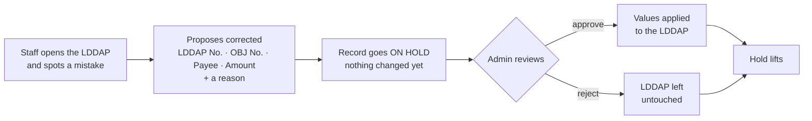

- **Correctable fields:** LDDAP No., OBJ No., Payee and Amount. The **check number is never
  among them** — it is assigned by the series, and an approval leaves `lddap_check_id` alone.
- **Staff only** may propose; **admin only** may approve or reject. Anyone authenticated can read
  a record's request history with its outcomes.
- **One pending request per LDDAP.** A proposal identical to the current values is rejected as a
  no-op, and a reason of at least 5 characters is required.
- **`lddap_no` stays unique.** A correction that would collide with another record is refused
  when raised *and* re-checked under a lock at approval time, since another record may have taken
  the number in between. That approval fails and the request stays pending.
#### Corrections and the routing

A correction changes the **details only** — it never moves a record in its routing. Approving
one applies the proposed values and leaves the status exactly where it was. The route back for a
record that came in wrong is the admin's **RTS** action on a Returned for ACIC record: it becomes
**RTS**, the staff member **edits** it (Edit LDDAP Record — the full form), and once it is right
it is **forwarded again**. The record carries the whole loop in its routing trail —
registered, forwarded, received, RTS, forwarded, received, approved — and each RTS in its RTS
History.

A **canceled** record is closed: a correction on it — proposed by staff or applied directly by
an admin — is refused (*"is canceled and can no longer be edited"*), as are every routing step
and any ACIC assignment.

#### Admin direct correction

An admin does not have to send a record back to change it: `PATCH /lddaps/{lddap}` applies the
correction **immediately**. It is reachable from two places, both admin-only: the detail modal
(from the LDDAP number), as **Correct details** on a record that is out of the registrant's
hands (For Out, Returned for ACIC, Approved).

- **The reason is mandatory.** A change with no second pair of eyes has to say why it was made.
- It is written into the **same correction history**, flagged `applied_directly`, so a record has
  one history whether the change came from a staff request or straight from an admin. The audit
  log records the `field 'old' → 'new'` summary alongside the reason.
- The staff member who used the number is **notified** that their record changed.
- It is **refused while a request is pending** — the admin resolves that request rather than
  editing around it.
- The check number is never editable, here or anywhere else.

- **The hold.** While a request is pending the record cannot be confirmed as received by the
  teller or reviewed by the admin — nobody signs off on details still in dispute. The hold lifts
  the moment the request is approved or rejected. The LDDAP table flags held rows, and
  `LddapResource` reports `has_pending_update`.
- The admin's review and **Edit** row actions stay visible on a held record; the server refuses
  them with an explanation naming the pending request, rather than the button silently
  disappearing. Held rows are marked in the **Status** column, not beside the LDDAP number.
- Approving writes a `field 'old' → 'new'` summary to the audit log and notifies the requester;
  raising a request notifies every active admin.

The admin queue lives on **Update Requests**, which has a **Cheques / LDDAP** tab with a pending
count on each.

### Actions by status

The LDDAP table's action column is driven by the record's status, exactly as the cheque table's
is (see [6d](#6d-cheque-table--actions-by-status)) — each row offers only the step that is
actually next.

| Status | Who | Action |
|---|---|---|
| **Registered** | Admin/Staff | **Forward** — Forward To, Unit, Date Forwarded, Note (Edit lives in the record dialog) |
| **For Out** | Admin/Staff | **Receive** — From Unit, Date Received, Note |
| **Returned for ACIC** | Admin | **Action** — Approved · RTS (opens the RTS form) · Cancel (opens the cancel confirmation: Canceled By · Date Canceled · Reason) |
| **RTS** | Admin/Staff | **Forward** — corrected (via Edit in the record dialog), out again with the same Forward fields |
| **Approved** | Admin/Staff | **Assign** — put it on an ACIC; this is when it takes its check number |
| Approved (already linked) | — | `On ACIC #n` — forwarding is the ACIC's own step |
| **Canceled** | — | `Canceled <date>` — read-only; nothing is offered |

- The LDDAP number in the first column is itself the link to the full record, so there is no
  separate View action; the record shows its **Routing trail** and its correction history.
- The status badge sits in the table's Status column.
- **Filter bar** above the table — *Search*, *Status* (All · Registered · For Out · Returned for
  ACIC · Approved · RTS · Canceled), *Nature of Payment* (All plus the register form's list, from
  `GET /lddaps/options`), then **Filter** and **Clear**. Nothing applies until Filter is pressed
  (Enter in the search box does the same); Clear resets every field and shows all records. The
  filters **combine (AND)** and are applied **server-side** as the query string of `GET /lddaps`
  — `?search=&status=&nature=&page=` — which the page keeps in its own URL, so a filtered view
  survives a refresh and can be bookmarked, the inputs keep their values after filtering, and
  Prev/Next carry the filters (the paginator's links do too). A line above the table reads
  *Showing 12 records* (or *Showing 51–100 of 120 records* when paged), and *No records found*
  when nothing matches. `FilterLddapsRequest` validates the parameters; an unknown status or
  nature is a 422.
  - **Search** is one box that matches any of three things (`Lddap::scopeSearch()`): **part of
    the LDDAP number**, **part of the check number** (compared as text, so `2026` finds
    `120260`), or the **gross amount exactly** when the text reads as an amount — with or
    without the peso sign, thousands separators or centavos: `194032`, `194,032.00` and
    `₱194,032` all find ₱194,032.00 (`Money::parse()`); `LDDAP-0001` is never mistaken for an
    amount.
- **Teller receipt** is confirmed inside the detail modal rather than from the row, once the
  record carries a check number.
- An admin's **direct correction** also lives in the detail modal, reached from the LDDAP number.

### Forwarding

Forwarding happens on the **ACIC**, not on the individual LDDAP — see
[6b · Forward](#6b-acic-records). Every LDDAP on that ACIC shows the same Forward To / Date in
its row, but the action itself is taken only from the ACIC page's **View** dialog, on an
approved ACIC. The LDDAP table reports where the record sits; it does not act on the ACIC.

---

## 6d. Cheque table — actions by status

The cheque table's action column is driven entirely by the cheque's status, so each row offers
only the step that is actually next.

| Status | Who | Action |
|---|---|---|
| Available (next in line) | Admin/Staff | **Use** — record the details and put the number into use |
| Available (next in line) | Teller | `Use from the panel above ↑` |
| Available (not next) | — | **Locked** — only the lowest available number may be used |
| **Used** / Received | Admin | **Review** — the single entry point; nothing else is shown |
| **Returned** | Staff *(the one it was returned to)* | **Action** — opens the dialog for editing the details |
| Returned | Any other staff | `Returned to {name}` — read-only; the correction is theirs |
| Returned (complied) | Staff | Status reads *On Hold*; row reads `Update awaiting admin approval` |
| Returned (complied) | Admin | Status reads *Complied*; the correction is approved from **Update Requests** |
| Returned | Admin | **Review** — to finish the cycle once the update is approved |
| **Approved** | any | **View** — the cheque's face, printable onto Landbank stock |
| **Approved** | Admin/Staff | **Assign** — put it on an ACIC |
| Approved (already linked) | — | `On ACIC #n` |
| Disapproved | — | `Reviewed <date>` |

**Review** (`ChequeReviewModal`, mode `review`) offers all three outcomes in one dialog —
Approved, Returned, Disapproved. A straight approval needs no note; the other two require
one, matching `ReviewChequeRequest`. The older `approve` / `disapprove` modes still exist for
callers that want a narrowed dialog.

**Action** (`ChequeDetailModal`, mode `action`) is the return path, and is **the** staff
member's to take — the one who used the number:

- **A returned cheque goes back to exactly one person.** `ChequeService::review()` notifies them
  (`Cheque #n returned to you` — *"…it needs your attention before it can be signed off"*, plus
  the note), and only they may correct it. Another staff member sees `Returned to {name}` in the
  Action column and gets no correction form in the detail modal;
  `UpdateRequestService::create()` refuses their request by name, so the UI and the server agree.
  The restriction is specific to a returned cheque — proposing an ordinary correction on a used
  cheque stays open to any staff member.
- The **review outcome section is hidden** — deciding the outcome is not their call. In its place
  the dialog leads with the admin's note, which is the instruction they have to act on.
- The correction CTA reads **Edit Details** rather than "Request an update".
- Submitting raises an ordinary update request: it goes to the admin for approval, and the cheque
  **stays Returned** until they approve it. That approval is the sign-off — it applies the
  details and moves the cheque straight to **Approved**, ready to be assigned to an ACIC.
- While that request is pending the row reads *Update awaiting admin approval*, and the cheque is
  on hold for teller receipt and for review as usual.

**Use** on an *available* cheque (`ChequeUseModal`) is the row entry point for a cheque that has
just been registered, offered to **admin and staff** — the two roles that put numbers into use:

- It appears only on the **next-in-line** cheque. The lowest-available rule is the point of the
  system, so a row that cannot legally be used next offers **Locked**, not a button that the
  server would refuse. Right after a first range is added, that next-in-line cheque *is* the
  newly added one; when a new book is registered above numbers still available in an older one,
  the older number is used first and gets the button.
- It captures the same details as the next-in-line panel (payee, amount, cheque date) and writes
  through the same `POST /cheques/use`, so the number is still re-checked against the real
  next-available row **under a lock**. The dialog is a second way in, never a way around the
  sequence.
- A **teller** gets no button; their next-in-line row still points at the panel above.

**View** (`ChequeViewModal`) exists for an **approved** cheque only — the row shows the button for
that status alone, and `GET /cheques/{cheque}/print` refuses any other. It shows the cheque's
face at real size on a white ground, laid out to the Landbank cheque: Check No., Date, Pay to
the Order of, the amount in figures (`₱185,369.86`) and in words (*"One Hundred Eighty-Five
Thousand Three Hundred Sixty-Nine Pesos and 86/100 Only"*, from `AmountInWords::cheque()`), the
account the cheque is drawn on (`config('acic.account_no')`), and a reference line with the ACIC
# (a cheque carries no LDDAP number; that slot is empty). **Print** outputs only the fields —
no dialog, buttons or page — at cheque size (`@page cheque { size: 178mm 76mm }`), each field at
a fixed millimetre position on `.cheque-face` in `app.css`, where **every measurement sits in
one block** to be tuned after a test print on pre-printed stock. The pre-printed labels are
drawn faintly on screen and dropped in print. The face is portalled to `<body>` for printing,
as the ACIC form is.

**Assign** is the next step after sign-off. It opens `AcicUseModal` — the same dialog as the ACIC
page's **Assign cheque to ACIC** button — with the clicked cheque preselected: **one** approved
cheque, onto the **next number in the sequence**, which is opened only on submit. It writes
through `POST /acics` then `POST /acics/{acic}/cheques`, the same locked paths the ACIC page uses,
so the eligibility and duplicate rules in [6b](#6b-acic-records) apply unchanged. Only approved
cheques not already on an ACIC are listed.

---

## 7. Audit log

Every significant action appends an immutable row to `cheque_logs` via `ActivityLogger`. Actions
the system takes unprompted — the nightly validity sweep — are recorded with no user id and the
username `system`.
Actions (`app/Enums/ChequeAction.php`): `login`, `logout`, `updated_profile`, `changed_password`,
`routed_for_signature`, `ready_for_acic`, `rts_cheque`, `voided_cheque`, `accepted_by_teller`,
`released_cheque`, `forwarded_cheque_to_teller`, `deposited_cheque`, `returned_cheque_from_teller`,
`cancelled_cheque`, `spoiled_cheque`, `staled_cheque`, `replaced_cheque`, `corrected_release`,
`used_cheque`, `received_cheque`,
`reviewed_cheque`, `requested_update`, `approved_update`, `rejected_update`, `added_cheque_range`,
`created_acic`, `used_acic`, `forwarded_acic`, `completed_acic`, `created_user`, `updated_user`,
`deleted_user`.
Admins view and filter the log at `GET /api/v1/logs`.

---

## 7a. Dashboard

`GET /dashboard` (`DashboardController` → `DashboardService::for($user)`) feeds the landing page,
which reads top to bottom: what is waiting on *you*, then every register at a glance. Every tile
is a link into the matching filtered list (`/cheques?status=`, `/lddaps?status=`, `/acics?tab=`).

- **Needs your attention** — by role, only items with a non-zero count (an empty list reads
  *Nothing is waiting on you right now*):

  | Role | Item | Counts | Opens |
  |---|---|---|---|
  | Admin | LDDAPs awaiting your action | Returned for ACIC | `/lddaps?status=returned_for_acic` |
  | Admin | Cheques awaiting review | Used + Received | `/cheques?status=used` |
  | Admin | Update requests pending | pending cheque + LDDAP corrections | `/admin/update-requests` |
  | Admin | ACICs to sign off | ACIC status Used | `/acics?tab=all` |
  | Staff | Returned to you (RTS) | RTS LDDAPs **registered by them** | `/lddaps?status=rts` |
  | Staff | Cheques returned to you | Returned cheques **used by them** | `/cheques?status=complies` |
  | Staff | Registered, not yet forwarded | their Registered LDDAPs | `/lddaps?status=registered` |
  | Staff | Approved LDDAPs awaiting an ACIC | Approved, no ACIC | `/lddaps?status=approved` |
  | Teller | Cheques to receive | Used | `/cheques?status=used` |
  | Teller | LDDAPs to receive | carrying a check number, not received | `/lddaps?status=approved` |
  | Teller | ACICs forwarded to you | ACIC status Forwarded | `/acics?tab=forwarded` |

- **Cheques** — the seven status tiles (`ChequeService::counts()`) and, for admin/staff, the
  **next-in-line cheque** panel, usable from the dashboard as before.
- **LDDAP-ADA** — a tile per routing status (Registered · For Out · Returned for ACIC · RTS ·
  Approved · Canceled) and, of the approved, how many await an ACIC vs. sit on one.
- **ACIC** — a tile per status (Open · Used · Approved · Forwarded · Completed).
- **Number series** — the cheque book, the LDDAP check numbers and the ACIC numbers: how many are
  **available**, the **next** number each will issue, used-of-registered, and a **Low** flag under
  `DashboardService::LOW_SERIES` (10) free numbers; admins get a *Register more* link to the
  series page.
- **Recent activity** (admin only) — the latest eight audit rows, newest first, linking to the
  full log. Other roles get an empty `recent`.

---

## 8. Notifications

Workflow events raise **in-app notifications**, stored per-user in the `notifications` table
(Laravel database notifications) and surfaced in a **bell dropdown** in the header. Each carries a
`kind` that drives its coloured dot, a title, a message, and an optional deep-link. The bell shows
an unread badge; the SPA polls every 30s. Opening an item marks it read and navigates to its link.

| Event | Raised in | Recipients | `kind` | Links to |
|---|---|---|---|---|
| Cheque used | `ChequeService::useNext` | Active admins (except the actor) | `used` | `/admin/logs` |
| Update requested | `UpdateRequestService::create` | Active admins (except the actor) | `request` | `/admin/update-requests` |
| Request approved | `UpdateRequestService::approve` | The requester | `approved` | `/cheques` |
| Request rejected | `UpdateRequestService::reject` | The requester | `rejected` | `/cheques` |

Notifications are a **convenience layer only** — the authoritative record of every action remains
the append-only audit log (section 7). Delivery is best-effort and does not affect the outcome of
the action that raised it.

---

## 9. API reference (`/api/v1`)

| Method & path | Access | Purpose |
|---|---|---|
| `POST /login` | Public | Sign in |
| `POST /logout` | Auth | Sign out |
| `GET /me` | Auth | Current user |
| `PUT /me` | Auth | Profile: the signed-in user's own full name and email (`UpdateProfileRequest`) |
| `PUT /me/password` | Auth | Change own password — current password required, confirmed, session kept (`ChangePasswordRequest`) |
| `GET /cheques` | Auth | List cheques (`status`, `search`, `tab`, `sort`; includes hold flag) |
| `GET /cheques/summary` | Auth | Cheque counts + next cheque (the cheque page's header) |
| `GET /dashboard` | Auth | The dashboard: attention items by role, every register's counts, the series, admin's recent activity |
| `GET /cheques/next` | Auth | The next usable cheque |
| `POST /cheques/use` | Auth | Use the next cheque |
| `GET /cheques/validity-summary` | Auth | Banner counts, the viewer's deposit queue, the tellers, the bank |
| `GET /cheques/{cheque}/status-history` | Auth | Every step the cheque has taken, oldest first |
| `POST /cheques/{cheque}/route` | **Admin** | Step 2 — route out for signature (`RouteChequeRequest`) |
| `POST /cheques/{cheque}/receive` | **Admin** | Step 3 — signed and back; carries on to For ACIC (`ReceiveChequeRequest`) |
| `POST /cheques/{cheque}/release` | **Admin** | Branch A — release to the payee (`ReleaseChequeRequest`) |
| `POST /cheques/{cheque}/rts` · `/cancel` · `/void` | **Admin** | The three ways out, reason required (`ChequeExceptionRequest`) |
| `POST /cheques/{cheque}/replace` | **Admin** | Issue a replacement for a stale cheque (`ReplaceChequeRequest`) |
| `POST /acics/{acic}/forward-to-teller` | **Admin** | Branch B — send the whole ACIC to the tellers |
| `POST /acics/{acic}/accept` | **Teller** | Claim a forwarded ACIC — first one wins |
| `POST /acics/{acic}/deposit` | **Teller** | Bank it; one deposit date for the whole ACIC |
| `POST /acics/{acic}/return-to-admin` | **Teller** | Hand it back, reason required |
| `GET /acics/teller-queue` | Auth | The deposit queue: Pending and Accepted |
| `POST /cheques/{cheque}/receive` | **Teller** | Confirm receipt (blocked if on hold) |
| `POST /cheques/{cheque}/update-requests` | **Staff** | Propose a detail correction |
| `GET /cheques/{cheque}/update-requests` | Auth | A cheque's request history + outcomes |
| `POST /cheques/add-range` | **Admin** | Register a book by `start_at` / `end_at` serial |
| `GET /lddaps` | Auth | List LDDAP records — the filter bar's `search`, `status`, `nature`, `page`, `per_page` (`FilterLddapsRequest`) |
| `GET /lddaps/next-numbers` | Auth | The next `count` check numbers in the LDDAP series |
| `GET /lddaps/series` | Auth | LDDAP check series counts (registered / unused / used) |
| `GET /lddaps/linkable` | Auth | Completed LDDAPs not yet on an ACIC |
| `GET /lddaps/options` | any | The natures of payment and the units the register dialog offers |
| `GET /payees?search=` | any | Registered payees by name or account number, each with its accounts, capped at 15 |
| `GET /payees/{payee}` | any | One payee with its accounts — pre-fills the picker in Edit LDDAP Record |
| `POST /lddaps` | **Admin/Staff** | Register **one** LDDAP, without a check number |
| `PUT /lddaps/{lddap}` | **Admin/Staff** | Edit LDDAP Record — the same form (`LddapDetailsRequest`) on a Registered or RTS record; own number ignored by the unique rule; check number untouched |
| `GET /lddaps/{lddap}/edit-history` | any | Every edit: user, time, `{field: {from, to}}`, newest first |
| `POST /lddaps/{lddap}/forward` | **Admin/Staff** | Forward: Registered → For Out |
| `POST /lddaps/{lddap}/receive-back` | **Admin/Staff** | Receive: For Out → Returned for ACIC |
| `GET /lddaps/{lddap}/routing-history` | any | The record's routing trail |
| `POST /lddaps/{lddap}/approve` · `/rts` · `/cancel` | **Admin** | The action on a Returned for ACIC record (`cancel`: `note` required, `date_canceled` optional) |
| `POST /lddaps/assign-acic` | **Admin/Staff** | Put ticked approved records on a typed ACIC number; each takes the next check number |
| `POST /lddaps/add-range` | **Admin** | Register a block of the LDDAP check series |
| `POST /lddaps/{lddap}/receive` | **Teller** | Confirm an LDDAP as received |
| `POST /lddaps/{lddap}/update-requests` | **Staff** | Propose a detail correction |
| `PATCH /lddaps/{lddap}` | **Admin** | Correct the details directly (reason required) |
| `GET /lddaps/{lddap}/update-requests` | Auth | An LDDAP's request history + outcomes |
| `GET /lddap-update-requests` | **Admin** | Pending LDDAP correction requests |
| `POST /lddap-update-requests/{id}/approve` | **Admin** | Approve (apply proposed values) |
| `POST /lddap-update-requests/{id}/reject` | **Admin** | Reject (no change) |
| `POST /acics/{acic}/lddaps` | **Admin/Staff** | Assign approved LDDAPs to an ACIC; each takes the next check number (`expected_check_nos` optional) |
| `GET /acics` | Auth | List ACIC records (filter by `status`) |
| `GET /acics/next` | Auth | The number the next ACIC will take |
| `GET /acics/linkable-cheques` | Auth | Approved cheques not yet on an ACIC |
| `GET /acics/{acic}` | Auth | One ACIC with its cheques |
| `POST /acics` | **Admin/Staff** | Open the next ACIC |
| `POST /acics/{acic}/cheques` | **Admin/Staff** | Assign approved cheques to it |
| `POST /acics/{acic}/forward` | **Admin** | Forward it (date + `received_by` user *or* `received_name`) |
| `POST /acics/{acic}/complete` | **Teller** | Complete it; stamps receipt on its cheques |
| `GET /update-requests` | **Admin** | Pending correction requests |
| `POST /update-requests/{id}/approve` | **Admin** | Approve (apply proposed values) |
| `POST /update-requests/{id}/reject` | **Admin** | Reject (no change) |
| `GET /logs` | **Admin** | Audit log |
| `GET /notifications` | Auth | Current user's feed + unread count |
| `POST /notifications/{id}/read` | Auth | Mark one notification read |
| `POST /notifications/read-all` | Auth | Mark all read |
| `GET/POST/PUT/DELETE /users` | **Admin** | Manage users |

---

## 10. Data model

```mermaid
erDiagram
    USERS ||--o{ CHEQUES : "creates / uses / receives"
    USERS ||--o{ CHEQUE_UPDATE_REQUESTS : "requests / reviews"
    CHEQUES ||--o{ CHEQUE_UPDATE_REQUESTS : "has"
    CHEQUES ||--o{ CHEQUE_LOGS : "audited in"
    ACICS ||--o{ CHEQUES : "carries"
    LDDAP_CHECKS ||--|| LDDAPS : "numbers"
    ACICS ||--o{ LDDAPS : "carries"
    LDDAPS ||--o{ LDDAP_UPDATE_REQUESTS : "has"
    LDDAPS ||--o{ LDDAP_ROUTING_HISTORY : "trail"
    LDDAPS ||--o{ LDDAP_EDIT_HISTORY : "edits"
    USERS ||--o{ LDDAP_EDIT_HISTORY : "made"
    UNITS ||--o{ LDDAPS : "drawn for"
    PAYEES ||--o{ LDDAPS : "paid to"
    PAYEES ||--o{ PAYEE_ACCOUNTS : "holds"
    PAYEE_ACCOUNTS ||--o{ LDDAPS : "paid into"
    USERS ||--o{ LDDAPS : "uses / receives / reviews"
    USERS ||--o{ CHEQUE_LOGS : "acts in"
    CHEQUES ||--o{ CHEQUE_STATUS_HISTORY : "trail"
    USERS ||--o{ NOTIFICATIONS : "notified via"

    USERS {
        string name
        string username
        string email "nullable, unique — set on the Profile page"
        enum   role "admin | staff | teller"
        bool   is_active
    }
    CHEQUES {
        int    cheque_number "unique, sequential"
        enum   status "available | registered | out_for_signature | received | for_acic | approved | released_to_payee | forwarded_to_teller | accepted_by_teller | deposited | cancelled | voided | stale | replaced"
        date   validity_until "cheque_date + 90 days, derived"
        timestamp stale_at
        timestamp expiry_alert_sent_at "the one-time 10-day alert"
        string payee_name
        decimal amount
        date   cheque_date
        fk     acic_id "the ACIC it sits on"
        fk     used_by
        fk     received_by "the teller confirming receipt"
        fk     reviewed_by
        timestamp reviewed_at
        text   review_note
        string received_by_name "Path A: who it was RELEASED to"
        date   date_received
        fk     released_by
        timestamp released_at
        text   release_note
        string forward_to_name "step 2: routed for signature"
        string forward_unit_name
        fk     forwarded_by
        date   date_forwarded
        string received_by_name_in "step 3: signed and back"
        date   date_received_in
        string from_unit_name
        text   exception_reason "RTS / cancel / void"
        timestamp rts_at
        fk     replaces_id "the stale cheque this one replaces"
        fk     replaced_by_id
    }
    CHEQUE_STATUS_HISTORY {
        fk     cheque_id
        enum   from_status
        enum   to_status
        string action "routed | received | assigned | released | accepted_by_teller | …"
        fk     user_id
        fk     acic_id "set on an ACIC-level step"
        json   details "the step's own fields"
        text   note
        datetime created_at "append-only"
    }
    CHEQUE_UPDATE_REQUESTS {
        fk     cheque_id
        string proposed_payee_name
        decimal proposed_amount
        date   proposed_cheque_date
        text   reason
        enum   status "pending | approved | rejected"
        fk     requested_by
        fk     reviewed_by
        text   review_note
    }
    LDDAP_CHECKS {
        bigint check_no "unique — series independent of cheques and ACICs"
        enum   status "available | used"
        fk     created_by
    }
    UNITS {
        string name "unique"
    }
    PAYEES {
        string name
    }
    PAYEE_ACCOUNTS {
        fk     payee_id
        string account_no
        string bank
    }
    LDDAPS {
        fk     lddap_check_id "unique, nullable — added once back from routing"
        string lddap_no "unique document serial"
        string nca_no
        string orb_no
        string dv_no
        enum   nature_of_payment
        fk     unit_id
        string obj_no "UACS object code — prints as OBJ CODE"
        decimal amount
        fk     payee_id
        fk     payee_account_id
        string payee_name "copied from the payee at registration"
        string payee_account_no "copied from the account at registration"
        string payee_bank "copied from the account at registration"
        string acic_ref "ACIC # written on the form"
        decimal gross_amount
        decimal wtax_1 "… wtax_2, wtax_3, wtax_5"
        decimal vat_1 "… vat_2, vat_3, vat_5, vat_10, vat_12, vat_30"
        decimal retention
        decimal liquidated_damages
        decimal advance_payment
        date   fwd_to_lbp_at
        date   date_loaded
        text   note
        string remarks
        date   check_date "date issued, entered with the record"
        enum   status "registered | for_out | returned_for_acic | rts | approved | canceled"
        string forward_to
        fk     forward_unit_id
        fk     forwarded_by
        date   date_forwarded
        fk     return_unit_id
        fk     returned_by
        date   date_returned
        fk     acic_id "the ACIC it sits on"
        fk     used_by
        fk     received_by
        fk     reviewed_by
        text   review_note
        fk     canceled_by
        date   date_canceled
        text   cancel_reason
    }
    LDDAP_EDIT_HISTORY {
        fk     lddap_id
        fk     user_id
        json   changes "{field: {from, to}}"
        datetime created_at "append-only"
    }
    LDDAP_ROUTING_HISTORY {
        fk     lddap_id
        enum   action "registered | forwarded | received | approved | rts | canceled"
        enum   from_status
        enum   to_status
        fk     user_id
        fk     unit_id
        string counterparty "Forward To"
        string received_by_name "RTS: who received it"
        date   received_on "RTS: when"
        date   acted_on "forwarded / received / RTS date"
        text   note
    }
    LDDAP_UPDATE_REQUESTS {
        fk     lddap_id
        string proposed_lddap_no
        string proposed_obj_no
        string proposed_payee_name
        decimal proposed_amount
        text   reason
        enum   status "pending | approved | rejected"
        bool   applied_directly "admin changed it without an approval step"
        fk     requested_by
        fk     reviewed_by
        text   review_note
    }
    ACICS {
        int    acic_number "unique, gap-free sequence"
        enum   status "open | used | forwarded | completed"
        fk     used_by
        timestamp used_at
        timestamp forwarded_at "Forward Date"
        fk     received_by "a system user…"
        string received_name "…or a typed-in name"
        timestamp completed_at
        fk     completed_by
        fk     created_by
    }
    CHEQUE_LOGS {
        fk     user_id
        string username
        int    cheque_number
        enum   action
        text   description
    }
    NOTIFICATIONS {
        uuid   id
        string type
        string notifiable "morph → users"
        json   data "kind, title, message, url"
        datetime read_at "null until read"
    }
```

---

## Maintaining this document

This document is the human-readable spec of how E-MDS behaves. It is **not generated**
from the code, so it only stays accurate if it is updated alongside changes.

**The rule:** any change to roles, the cheque lifecycle, a workflow, an API route, or the data
model must update the matching section(s) **and flow-chart(s)** here, in the same commit as the
code change. This is part of the project's Definition of Done (see `CLAUDE.md`).

When updated, bump the _"Last reviewed against the code"_ date near the top.
