# E-MDS — System Documentation

> **Keep this current.** Whenever the system's behaviour changes (roles, cheque lifecycle,
> workflows, routes, or data model), update this document and its flow-charts in the **same change**.
> See [Maintaining this document](#maintaining-this-document).

_Last reviewed against the code: 2026-09-27._

---

## 1. What E-MDS is

E-MDS is a **cheque number monitoring & tracking system**. It enforces strict sequential
usage of a business's cheque numbers and keeps a full audit trail. It is used by
finance/accounting staff, bank tellers, and administrators.

**Core guarantees**

- Cheque numbers are registered per **physical cheque book**, by the first and last serial
  printed on it. **No number is ever registered twice** — an overlapping range is rejected.
- Books need not adjoin. A book running 10001–10200 can follow one running 1–500; the numbers
  in between were never issued by the bank and so never existed here.
- Only the **lowest available** cheque may be used next; skipping is rejected **server-side**.
- **LDDAP-ADA documents** draw on their **own independent check series** — unrelated to cheque
  numbers and to ACIC numbers — one document to one check number, always the lowest unused one.
  Completed ones are grouped onto an **ACIC**.
- Every login/logout, cheque use, receipt confirmation, and admin action is written to an
  **append-only audit log**.

---

## 2. Architecture

### 2.1 The shape of it

One Laravel monolith serves both the JSON API and the built SPA, from the same origin — which is
what lets Sanctum authenticate with an ordinary session cookie rather than a token.

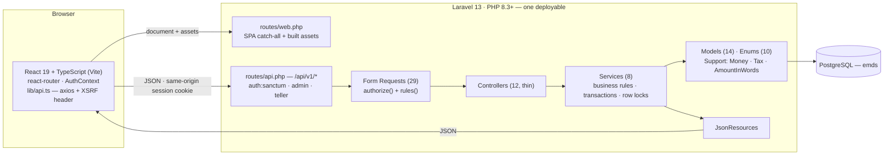
```mermaid
flowchart LR
    subgraph Browser
        SPA["React 19 + TypeScript (Vite)<br/>react-router · AuthContext<br/>lib/api.ts — axios + XSRF header"]
    end

    subgraph App["Laravel 13 · PHP 8.3+ — one deployable"]
        direction TB
        WEB["routes/web.php<br/>SPA catch-all + built assets"]
        API["routes/api.php — /api/v1/*<br/>auth:sanctum · admin · teller"]
        REQ["Form Requests (29)<br/>authorize() + rules()"]
        CTRL["Controllers (12, thin)"]
        SVC["Services (8)<br/>business rules · transactions · row locks"]
        MDL["Models (14) · Enums (10)<br/>Support: Money · Tax · AmountInWords"]
        RES["JsonResources"]
    end

    DB[("PostgreSQL — emds")]

    SPA -->|"document + assets"| WEB
    SPA -->|"JSON · same-origin session cookie"| API
    API --> REQ
    REQ --> CTRL
    CTRL --> SVC
    SVC --> MDL
    MDL --> DB
    SVC --> RES
    RES -->|"JSON"| SPA
```

| Layer | Technology |
|---|---|
| Backend | Laravel 13, PHP 8.3+ (8.5 in development) |
| Auth | Laravel Sanctum — same-origin SPA cookie/session, no tokens |
| Frontend | React 19 + TypeScript, react-router 7, built with Vite, served by Laravel |
| Styling | Tailwind CSS v4 (CSS-based `@theme`) |
| Database | PostgreSQL (`emds`); the test suite runs on in-memory SQLite |

### 2.2 How a write travels

Every endpoint takes the same path, and each layer has exactly one job. The rules that matter —
no number twice, lowest first, only the next valid step — are enforced in the **service**, inside
a transaction, under a row lock: never in the controller, and never only in the UI.

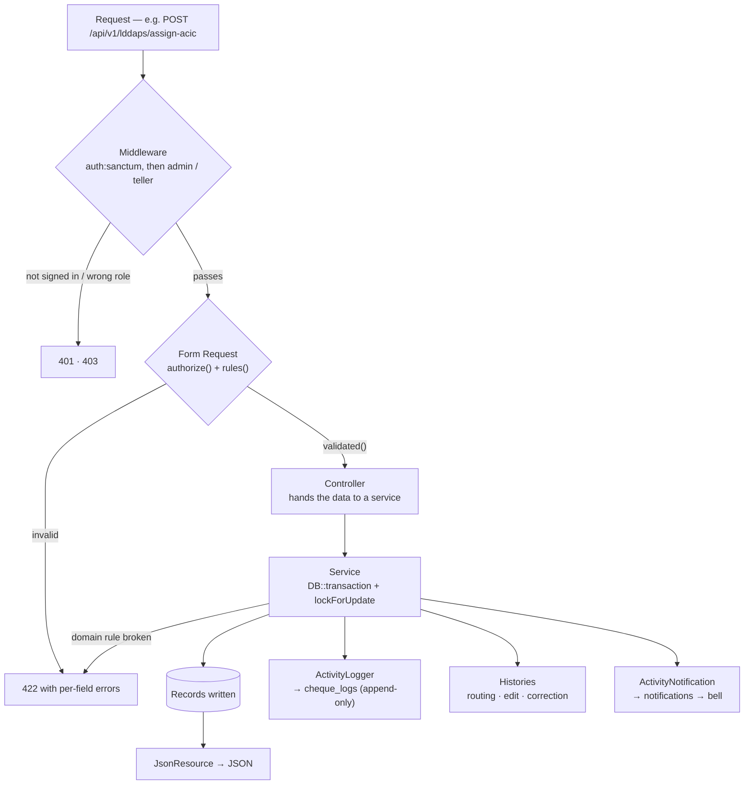
```mermaid
flowchart TD
    R["Request — e.g. POST /api/v1/lddaps/assign-acic"] --> MW{"Middleware<br/>auth:sanctum, then admin / teller"}
    MW -- "not signed in / wrong role" --> E401["401 · 403"]
    MW -- "passes" --> FR{"Form Request<br/>authorize() + rules()"}
    FR -- "invalid" --> E422["422 with per-field errors"]
    FR -- "validated()" --> CTRL["Controller<br/>hands the data to a service"]
    CTRL --> SVC["Service<br/>DB::transaction + lockForUpdate"]
    SVC -- "domain rule broken" --> E422
    SVC --> W[("Records written")]
    SVC --> LOG["ActivityLogger<br/>→ cheque_logs (append-only)"]
    SVC --> HIST["Histories<br/>routing · edit · correction"]
    SVC --> NOTE["ActivityNotification<br/>→ notifications → bell"]
    W --> OUT["JsonResource → JSON"]
```

- **Middleware** answers *may this user reach the route at all* (`EnsureUserIsAdmin`,
  `EnsureUserIsTeller`); finer gates — admin **or** staff — live in the Form Request's
  `authorize()`.
- **Form Requests** hold *all* input validation. Controllers never validate.
- **Services** own the invariants and are the only place a transaction or a lock is opened. They
  throw `ValidationException`, so a broken rule reaches the client as the same 422 shape as a
  bad field.
- **Audit, histories and notifications are side effects of the service call**, inside the same
  transaction — an action and its record of itself cannot come apart.

### 2.3 Services, and what each one owns

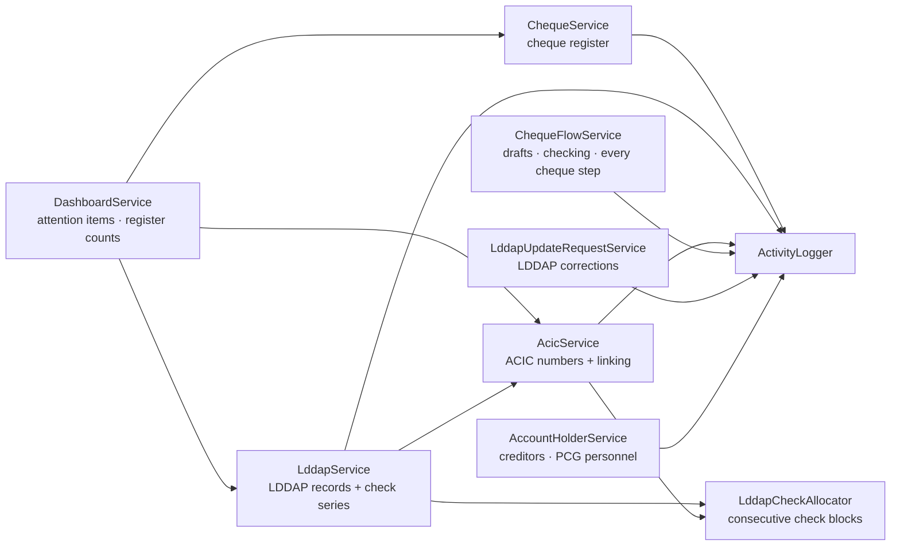
```mermaid
flowchart LR
    DSH["DashboardService<br/>attention items · register counts"]
    CHS["ChequeService<br/>cheque register"]
    LDS["LddapService<br/>LDDAP records + check series"]
    ACS["AcicService<br/>ACIC numbers + linking"]
    ALC["LddapCheckAllocator<br/>consecutive check blocks"]
    CFS["ChequeFlowService<br/>drafts · checking · every cheque step"]
    LUR["LddapUpdateRequestService<br/>LDDAP corrections"]
    AHS["AccountHolderService<br/>creditors · PCG personnel"]
    LOG["ActivityLogger"]

    DSH --> CHS
    DSH --> LDS
    DSH --> ACS
    LDS --> ACS
    LDS --> ALC
    ACS --> ALC
    CHS --> LOG
    LDS --> LOG
    ACS --> LOG
    CFS --> LOG
    LUR --> LOG
    AHS --> LOG
```

**Three independent number series**, each registered in blocks by an admin, each handing out the
**lowest unused** number next, none ever registering a number twice:

| Series | Table · column | Registered by | Issued by |
|---|---|---|---|
| Cheque numbers | `cheques.cheque_number` | `ChequeService::addRange()` | `ChequeService::useNext()` — locks the lowest available row |
| LDDAP check numbers | `lddap_checks.check_no` | `LddapService::addRange()` | `LddapCheckAllocator::claim()` — N consecutive, on ACIC assignment |
| ACIC numbers | `acic_numbers.acic_number` | `AcicService::addRange()` | `AcicService` — the lowest unused, when an ACIC is opened |

They are **unrelated to one another**: using an LDDAP check number consumes no cheque, and an
ACIC number is neither.

### 2.4 The data, grouped

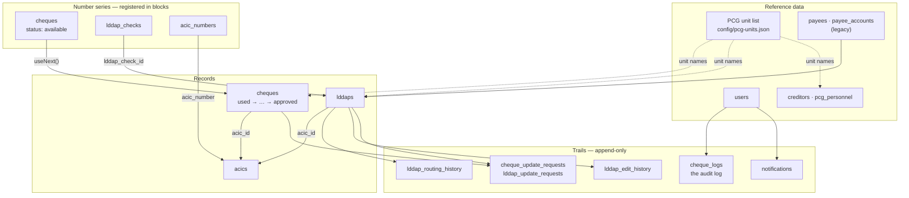
```mermaid
flowchart TB
    subgraph SER["Number series — registered in blocks"]
        S1["cheques<br/>status: available"]
        S2["lddap_checks"]
        S3["acic_numbers"]
    end

    subgraph REC["Records"]
        R1["cheques<br/>used → … → approved"]
        R2["lddaps"]
        R3["acics"]
    end

    subgraph REF["Reference data"]
        F1["users"]
        F2["PCG unit list<br/>config/pcg-units.json"]
        F3["payees · payee_accounts<br/>(legacy)"]
        F4["creditors · pcg_personnel"]
    end

    subgraph TRL["Trails — append-only"]
        T1["cheque_logs<br/>the audit log"]
        T2["lddap_routing_history"]
        T3["lddap_edit_history"]
        T4["cheque_update_requests<br/>lddap_update_requests"]
        T5["notifications"]
    end

    S1 -->|"useNext()"| R1
    S2 -->|"lddap_check_id"| R2
    S3 -->|"acic_number"| R3
    R1 -->|"acic_id"| R3
    R2 -->|"acic_id"| R3
    F2 -.->|"unit names"| R1
    F2 -.->|"unit names"| R2
    F2 -.->|"unit names"| F4
    F3 --> R2
    R1 --> T4
    R2 --> T2
    R2 --> T3
    R2 --> T4
    F1 --> T1
    F1 --> T5
```

`cheques` is one table living two lives: a row is **registered** as part of a book (available),
and becomes a **record** the moment it is used. The other two series keep their numbers in their
own tables, and the record points at the number it took.

Full column-level detail is in [§ 10 Data model](#10-data-model).

**Where the logic lives**

- `app/Enums/` — `UserRole`, `ChequeStatus`, `ChequeAction`, `RequestStatus`, `AcicStatus`,
  `AcicNumberStatus`, `LddapStatus`, `LddapRoutingAction`, `LddapCheckStatus`, `NatureOfPayment`
- `app/Services/ChequeService.php` — sequential usage, row locking, receipt, review, ranges
- `app/Services/LddapService.php` — registration, the edit, the routing, the check series, ACIC linking
- `app/Services/LddapCheckAllocator.php` — claims a run of consecutive check numbers under a lock
- `app/Services/AcicService.php` — the ACIC number series, membership, sign-off and forwarding
- `app/Services/DashboardService.php` — what awaits the signed-in user, and every register's counts
- `app/Services/LddapUpdateRequestService.php` — the LDDAP correction workflow (cheques are edited directly)
- `app/Services/ActivityLogger.php` — the append-only audit log
- `app/Support/` — `Money` (bcmath decimals), `Tax` (the W/TAX–VAT rule), `AmountInWords`
- `app/Http/Controllers/` — thin controllers; validation lives in `app/Http/Requests/`
- `routes/api.php` — all endpoints under `/api/v1`; `routes/web.php` — the SPA catch-all
- `resources/js/` — `pages/` (one per route), `components/` (dialogs + shared UI),
  `auth/AuthContext.tsx` (the session), `lib/api.ts` (every call), `lib/tax.ts` (mirrors `Support\Tax`)

---

## 3. Roles & permissions

The **admins in charge** of cheque drafts are the **Administrators and Super Admins**: either may
approve or return a draft, and both are notified when one is submitted. **Super Admin** has every
admin power (the Admin column below applies to it too), and only a Super Admin can grant, change
or remove the role — the first one is made with `php artisan users:make-super-admin {username}`.

| Capability | Super Admin | Admin | Staff | Teller |
|---|:---:|:---:|:---:|:---:|
| Sign in / view cheques & dashboard | ✓ | ✓ | ✓ | ✓ |
| Use the next cheque | ✓ | ✓ | ✓ | ✓ |
| **Edit** a cheque's details (no status yet, or For Compliance) · **Print Draft** · **Final Print** | ✓ | ✓ | ✓ | |
| **Approve** / **Return** a cheque draft — notified when one is submitted | ✓ | ✓ | | |
| **Assign** · **release** a cheque | ✓ | ✓ | | |
| **Forward an ACIC** to the tellers | ✓ | ✓ | | |
| **Accept** · **deposit** · **return** an ACIC | | | | ✓ *(the one who accepted it)* |
| **Cancel** · mark **spoiled** · **replace** a stale one | ✓ | ✓ | | |
| Edit **own profile** (full name, email) / **change own password** | ✓ | ✓ | ✓ | ✓ |
| Confirm a used cheque as **received** | | | | ✓ |
| Register a cheque book (serial range) | ✓ | ✓ | | |
| Grant / change / remove the **Super Admin** role | ✓ | | | |
| Register the **LDDAP check series** (range) | ✓ | ✓ | | |
| Propose an **LDDAP correction** (with reason) | | | ✓ | |
| Approve / reject LDDAP corrections | ✓ | ✓ | | |
| **Correct an LDDAP directly** (reason required) | ✓ | ✓ | | |
| **Use a check number** for LDDAP records | ✓ | ✓ | ✓ | |
| Confirm an LDDAP as **received** | | | | ✓ |
| **Act** on an LDDAP (approved / RTS / cancel) | ✓ | ✓ | | |
| Assign approved LDDAPs to an ACIC | ✓ | ✓ | ✓ | |
| Open an ACIC / assign cheques to it | ✓ | ✓ | ✓ | |
| **Forward** an ACIC | ✓ | ✓ | | |
| **Complete** a forwarded ACIC | | | | ✓ |
| View / **add** / **batch upload** creditors and PCG personnel | ✓ | ✓ | ✓ | |
| Manage users | ✓ | ✓ | | |
| View the audit log | ✓ | ✓ | | |

Roles are defined in `app/Enums/UserRole.php` and enforced by the `admin` and `teller`
middleware plus per-request authorization (e.g. staff-only requests).

### The user menu

The signed-in user's name in the header is a **dropdown trigger** (avatar initials on a phone,
name and role from `sm` up, a chevron that turns when open). The panel beneath it, aligned to the
right edge, holds a header with the full name and role, then **Profile**, **Change Password**,
and — set apart — **Sign Out**. Clicking the name again, clicking outside, or Esc closes it;
Enter/Space or an arrow key opens it, the arrows move between items, Esc returns focus to the
name, and `aria-expanded` follows the state (`resources/js/components/UserMenu.tsx`).

- **Sign Out** is a form submit that posts `POST /logout` with the XSRF token — not a link; a
  `GET /logout` is a 405. The endpoint is unchanged.
- **Profile** (`/profile`, `PUT /me`, `UpdateProfileRequest`): username and role read-only; the
  user edits their **full name** and **email** (`users.email`, nullable, unique) and saves. The
  header follows the new name at once. Logged as `updated_profile`.
- **Change Password** (`/change-password`, `PUT /me/password`, `ChangePasswordRequest`):
  *Current Password* (checked with the `current_password` rule — a wrong one is refused and
  nothing changes), *New Password* and *Confirm New Password* (`confirmed`, different from the
  current one, and the app's `Password::defaults()` rules — every failing rule is listed under
  the field). The user **stays signed in**: `ProfileController::changePassword()` writes the
  new hash back into the session (`password_hash_web`, the guard's HMAC of it — Sanctum's
  `AuthenticateSession` compares against that on every request), so the same session goes on
  working. Logged as `changed_password`; the page then shows a done view.

---

## 4. Cheque lifecycle

A cheque moves through **one ordered flow**, enforced server-side. `Available` sits outside it:
a number the bank printed and an admin registered as part of a book, waiting to be claimed.

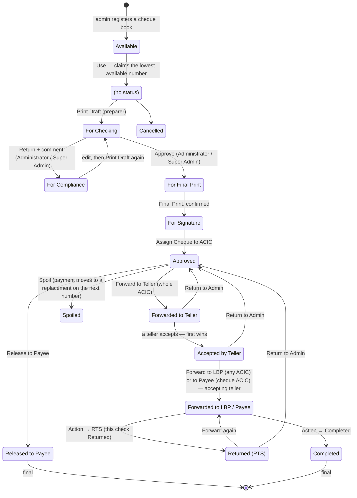
```mermaid
stateDiagram-v2
    state "Available" as AV
    state "(no status)" as U
    state "For Checking" as FC
    state "For Compliance" as CO
    state "For Final Print" as FP
    state "For Signature" as FS
    state "Approved" as AA
    state "Released to Payee" as RP
    state "Forwarded to Teller" as FT
    state "Accepted by Teller" as AT
    state "Forwarded to LBP / Payee" as FO
    state "Returned (RTS)" as RT
    state "Completed" as D

    [*] --> AV: admin registers a cheque book
    AV --> U: Use — claims the lowest available number
    U --> FC: Print Draft (preparer)
    FC --> FP: Approve (Administrator / Super Admin)
    FC --> CO: Return + comment (Administrator / Super Admin)
    CO --> FC: edit, then Print Draft again
    FP --> FS: Final Print, confirmed
    FS --> AA: Assign Cheque to ACIC
    AA --> RP: Release to Payee
    AA --> FT: Forward to Teller (whole ACIC)
    FT --> AT: a teller accepts — first wins
    AT --> FO: Forward to LBP (any ACIC) or to Payee (cheque ACIC) — accepting teller
    FO --> D: Action → Completed
    FO --> RT: Action → RTS (this check Returned)
    RT --> FO: Forward again
    FT --> AA: Return to Admin
    AT --> AA: Return to Admin
    RT --> AA: Return to Admin
    U --> Cancelled
    AA --> Spoiled: Spoil (payment moves to a replacement on the next number)
    RP --> [*]: final
    D --> [*]: final
```

Cancel is open at every status before an ACIC (no status, For Checking, For Compliance, For
Final Print, For Signature); the diagram shows one arrow for it.

**The two branches after Approved.** A cheque goes **either** to the payee **or** to the
bank, never both:

| Branch | Steps | Unit | Who |
|---|---|---|---|
| **A — to the payee** | Approved → **Release to Payee** | one cheque | Admin |
| **B — to the bank** | Approved → **Forward to Teller** → Accepted → **Forward** (to LBP; a cheque ACIC also to the Payee) → **Action** (Completed / RTS) | the **whole ACIC** | Admin, then the accepting teller |

### The steps

1. **Use** — claims the lowest available number (see §5). The cheque then has **no status**
   (stored `registered`; the badge is blank, and the filter tab is *Used*). Its details —
   payee, account no., unit, amount, date — can be **edited** now (`PUT /cheques/{cheque}`).
   A **Print Draft** button shows.
2. **Print Draft** (`POST /cheques/{cheque}/print-draft`, the preparer — staff, admin or Super
   Admin) — the draft prints with a **DRAFT** watermark and the cheque becomes **For
   Checking**. It is submitted to the **admins in charge**: every active **Administrator and
   Super Admin** is notified. Submitting comes first and printing second, so a draft is never printed without
   being submitted.
3. **An admin in charge checks it** (Administrators and Super Admins). **Approve** and **Return**
   on the row both open the **draft itself** — the watermarked face as printed — with a comment
   box and the two buttons beneath it, so the check is made against the cheque, not from
   memory:
   - **Approve** (`POST /cheques/{cheque}/approve-draft`, comment optional) → **For Final
     Print**. The preparer — whoever printed the latest draft — is notified.
   - **Return** (`POST /cheques/{cheque}/return-draft`, **comment required**: what to change) →
     **For Compliance**. The preparer is notified with the comment, which also shows at the top
     of the cheque's detail view. They edit the cheque and **Print Draft** again, back to For
     Checking. This can repeat as often as needed.
4. **Final Print** — the button shows **only when the cheque is For Final Print**. The cheque
   prints clean; the dialog then asks *"Did cheque #N print successfully?"* **Yes**
   (`POST /cheques/{cheque}/final-print`) → **For Signature**; *No — print again* leaves it as it is.
5. **For Signature** — the **only** status *Assign Cheque to ACIC* offers. **Many cheques may
   share one ACIC number**: tick several in one go, or type the same number again later. Assigning sets **Approved**; everything after that is unchanged, and a cheque
   taken off an ACIC goes back to For Signature.
6. **Release to Payee** (`POST /cheques/{cheque}/release`) — *Received by* (payee or authorised
   representative), *Date received*, *Note*. Refused without an ACIC or without a cheque number.
   Final.

**Editing** is allowed **only** with no status yet or while For Compliance, and only by a
preparer. Every save is a timeline entry of its own (`edited`, with each changed field's from and
to). Cheques take **no correction requests** any more — that queue is LDDAP-only.

### Branch B — the ACIC goes to the tellers

The ACIC is the unit here, not the cheque:

- **Forward to Teller** (`POST /acics/{acic}/forward-to-teller`, admin) — refused unless **every**
  cheque on the ACIC is Approved, and refused outright if any has already been released to
  its payee. Every teller is notified; the ACIC shows as **Pending** on the deposit queue.
- **Accept** (`POST /acics/{acic}/accept`, teller) — **the first teller to accept claims it**,
  through a conditional write (`accepted_by` is set only where it is still null), so two tellers
  clicking at the same instant cannot both succeed. The second is told *"Already accepted by
  {name}."* and the ACIC leaves every other teller's Pending list.
- **Forward** (`POST /acics/{acic}/teller-forward`, `to` = `land_bank` | `payee`) — on an
  ACIC the teller has accepted (or RTS'd), separate buttons, each asking for confirmation:
  an **LDDAP ACIC** gets **Forward to LBP** only (the server refuses `payee` for it); a **cheque
  ACIC** gets **Forward to LBP** and **Forward to Payee** (`teller_forward_options` on the row
  says which). The ACIC becomes **Forwarded to LBP** or **Forwarded to Payee**, saving who
  (`teller_forwarded_by`) and when (`teller_forwarded_at`); every check still in play moves with
  it (after an RTS, only those it Returned). The Forward buttons are then replaced by **Action**.
  (Stored values stay `forwarded_to_land_bank`; "LBP" and "Accepted" are the labels.)
- **Forward to LBP opens a confirmation modal first** — nothing is forwarded until the teller
  confirms. It shows, built only from what is already on the ACIC: the **ACIC #** and **ACIC
  date** (the date it was prepared), the **number of items**, a table of them (**LDDAP No. /
  Check No.**, Payee, Amount) and the **total amount**; and **Forwarded to Bank** — now, in
  Philippine time (Asia/Manila), e.g. *Sep 28, 2026 12:45 AM*. Buttons: **Cancel** (closes, no
  change) and **Confirm Forward to LBP**, disabled while it saves.
- On confirm the existing forward runs unchanged. **Forwarded to Bank** is stored in
  `acics.forwarded_to_land_bank_at` from the **server's clock at that moment** (inside the
  locked transaction), not the time the modal showed. A second forward — a double click, another
  tab — is refused under the lock: *"ACIC #N has already been forwarded to LBP."*
- **Forwarded to Bank** shows on the ACIC list (its own column), the admin's View
  (*Forwarding*), the read-only View, and the Deposit Queue's *Forwarded out* column, as
  *Sep 28, 2026 12:45 AM* in Philippine time; ACICs forwarded before it was recorded show "—".
- **Forward to Payee** (cheque ACICs; `POST /acics/{acic}/forward-to-payee`,
  `ForwardChequesToPayeeRequest`, `AcicTellerService::forwardChequesToPayee()`) — the accepting
  teller hands **one, several or all** cheques to their payees. The modal shows the ACIC summary
  (ACIC date, number of cheques, how many are forwarded, total amount) and the cheques (check
  no., payee, amount) with checkboxes and **Select All**; **stale** cheques, and those already
  forwarded, are shown but cannot be ticked. **Received By**, **Date Received** (today in Manila
  by default, never later, not before the ACIC was accepted) and **Unit** (the shared PCG list)
  are required, once for the batch.
  - Each ticked cheque becomes **Forwarded to Payee**, storing Received By / Date Received in
    the release-to-payee columns (`received_by_name`, `date_received`), the unit in
    `payee_unit_name`, and the teller and time in `released_by` / `released_at`; its timeline
    reads *"Received by X (unit) on date."*, and the ACIC history gets one
    `cheques_forwarded_to_payee` row per batch.
  - The row shows progress — *3/5 forwarded to payee* (of the cheques that can go: not stale,
    not settled). When every one has gone, the **ACIC** becomes **Forwarded to Payee**
    (`forwarded_to_payee` in its history) and gets the **Action**; Completed asks for nothing more.
  - Once **any** cheque has gone to its payee, **Forward to LBP** and **Return to Admin** are
    refused (an ACIC is never split between LBP and payees, nor taken back half-delivered).
  - Received By, Date Received and Unit show on the cheque's details (*Forwarded to payee*)
    and on each cheque in the ACIC's details.
  - The whole-ACIC "to payee" forward is retired (`teller-forward` refuses `payee`).
- **Action** — once forwarded, the Forward button is replaced by **Action**, a modal with two
  choices, saving who (`teller_action_by`) and when (`teller_action_at`):
  - **Completed** (`POST /acics/{acic}/teller-complete`) — the ACIC and every check out become
    **Completed**. **Final.** (Who received each cheque forwarded to a payee was recorded at
    Forward to Payee; `payee_received_by` / `payee_received_on` are no longer written.)
  - **RTS** (`POST /acics/{acic}/teller-rts`) — the ACIC becomes **RTS**, with a **required
    Reason** (`rts_reason`) and a **status dropdown per check** (`rts_status`):

    | Option | The check becomes |
    |---|---|
    | **Completed** | Completed — nothing was wrong with it |
    | **Returned** | Returned — to be put right; goes out again with the next Forward |
    | **Cancelled** | Cancelled (LDDAP: Canceled); the number stays used; the reason is kept |
    | **Stale** (cheques only) | Stale — an admin may then Replace it |

    From RTS the teller may **Forward** again or **Return to Admin**.
- **Return to Admin** (`POST /acics/{acic}/return-to-admin`) — reason required, from Accepted or
  RTS (not while it is out, nor once completed). Every check still in play goes back to
  **Approved**, the claim is released and the admin is notified, who can forward it again or
  release the cheques individually. Checks an RTS completed, cancelled or staled stay as they are.

**Only the teller who accepted an ACIC may Forward it or take the Action** — no admin
override (Return to Admin keeps its old rule: that teller, or an admin). Every step is a row in
the ACIC's **history** (`GET /acics/{acic}/history`, with the per-check receipts and RTS
statuses in its details) and a timeline entry on each cheque and LDDAP.

The retired **Confirm and Complete** and **Returned by Bank** steps are gone; an older ACIC
left *Returned by Bank* is listed under RTS and may be forwarded again or returned to the admin.

The teller dashboard is **Deposit Queue** (`/deposit-queue`), shown in the **sidebar for
tellers only** (admins and staff reach it by its address), with the lists **Pending · My
Accepted · Forwarded · RTS · Completed**, and a **Forwarded out** column (To LBP / To Payee and
when). The buttons on each row:

| ACIC | Buttons |
|---|---|
| Pending | **Accept** · **View** — the first teller to accept takes it; it becomes **Accepted** |
| Accepted — LDDAP ACIC | **Forward to LBP** · Return to Admin · **View** |
| Accepted — cheque ACIC | **Forward to LBP** · **Forward to Payee** · Return to Admin · **View** (once any cheque has gone to its payee: Forward to Payee · View only, with *n/m forwarded to payee* under the status) |
| Forwarded (LBP / Payee) | **Action** (Completed / RTS) · **View** |
| RTS | the Forward buttons again · Return to Admin · **View** |
| Completed | **View** |

The **ACIC page** gives a teller the same buttons, in its **Action** column (stacked, beside
**View**): Accept on a Pending ACIC; Forward to LBP (and, for a cheque ACIC, Forward to Payee)
on one they accepted; then Action. Return to Admin stays in the Deposit Queue.

**View** (`AcicViewModal`, on every row, and the teller's View on the ACIC page) is
**read-only**: ACIC number, type (LDDAP / Cheque), status, **total amount**; every LDDAP or
cheque on it — number (with the LDDAP's check number), **DV number** (LDDAPs; "—" for a cheque),
payee, amount; and its **history** — opened and used (from the ACIC), then every teller step
(`GET /acics/{acic}/history`: who, when, note). A teller can read an ACIC and its history only
once it has been forwarded to the tellers.

### The ways out

| Exception | Allowed at | Result |
|---|---|---|
| **Cancel** | before an ACIC — no status · For Checking · For Compliance · For Final Print · For Signature | **Cancelled**, final |
| **Spoil** | **Approved only** — never once a teller has it | **Spoiled**, final; the number stays used and is never reassigned, and the payment moves to a **replacement cheque** |

Each needs a reason, kept on the cheque as `exception_reason`.

**Spoil** (`POST /cheques/{cheque}/spoil`, admin; `ChequeSpoilService`, formerly *Void*). The
dialog asks for a required **Reason**, shows the number the replacement will take, and confirms
once more before saving. In one transaction:

- the cheque becomes **Spoiled** and keeps its number, with the reason, **who** (`spoiled_by`)
  and **when** (`spoiled_at`);
- a **replacement** claims the **next available number** through `ChequeService::useNext()` —
  the lowest available, locked, never reused. The dialog sends the number it showed
  (`replacement_number`); if another user has taken it since, the whole step is refused
  (*"Cheque number N is already used. Please refresh and try again."*) and the dialog shows the
  new next number. With no number left, Spoil is refused;
- the replacement copies the spoiled cheque's details — **payee, account no., unit and amount** — except the
  number, status and cheque date: it is **dated the day it is created** and starts at
  **no status** (a new draft is needed), off any ACIC, with a fresh 90 days;
- the two are linked both ways: the spoiled cheque shows **Replaced by Cheque #N**, the
  replacement **Replaces Cheque #N** (in the table's status cell and the detail view);
- the spoiled cheque **comes off its ACIC** (`acic_id` cleared), so the ACIC is not held up by
  a record that can never be forwarded or printed, and **remembers it** in
  `spoiled_from_acic_id` — shown as *Was on ACIC #N* on the record, and in its timeline note
  (*"… replaced by cheque #N; taken off ACIC #M."*);
- active admins and the user who used the cheque are notified; the page reports the new number.

**The replacement's ACIC.** When the replacement reaches **For Signature**, its row's **Assign to
ACIC** opens `ChequeAssignModal` with two choices first:

1. **Use previous ACIC (#M)** — the replacement takes the spoiled cheque's place on that ACIC
   (`POST /cheques/{cheque}/use-previous-acic`, admin/staff, `ChequeSpoilService::usePreviousAcic()`),
   becoming Approved there. Allowed **only while that ACIC is still with the admin**
   (`Acic::notWithAdminBecause()`): not forwarded to a teller, not accepted, not returned by the
   bank, not completed — an ACIC a teller returned to the admin counts as with the admin again.
   Otherwise the choice is disabled with the reason, e.g. *"ACIC #M is with the teller
   (Pending), so the replacement must go on a new ACIC."*, and the server refuses it the same way.
2. **Assign to a new ACIC** — the usual form (type an ACIC #, tick cheques).

The choice is written to the replacement's timeline on its *assigned* step: *"Used previous ACIC
#M — in place of spoiled cheque #X."* or *"Assigned to a new ACIC #N — spoiled cheque #X was on
ACIC #M[, which is with the teller (…)]."* A cheque that is not a replacement, or whose spoiled
cheque was never on an ACIC, gets the usual form only. The page header's **Assign Cheque to
ACIC** (several cheques at once) offers no choice, but still writes the note. Replacements of
**stale** cheques (admin *Replace*) use the usual form.

No assignment path adds a cheque to an ACIC that is **with a teller** (it keeps its Approved
status while the teller has it, so `assignCheques()` checks `teller_status` too).

A spoiled cheque is not perishable, so the 90-day stale rule and the 10-day alert skip it. Cheques
voided before the rename were relabelled Spoiled (migration
`2026_09_27_000200_rename_voided_cheques_to_spoiled`, with who and when taken from the history)
— no replacement was issued for them.

### The rules behind every step

Everything funnels through `ChequeFlowService::move()`, so no step can forget a check:

- **The order is enforced server-side.** `ChequeStatus::nextStates()` is the whole transition
  table; anything not in it is refused. No skipping forward, no walking back.
- **Optimistic concurrency.** Each step may carry `expected_status` — the status the caller's
  page was showing. If the row has moved since, the step is refused with
  *"This record was updated by another user. Refresh to continue."*
- **Dates.** Never in the future, and never before the previous step's date (released ≥ the
  date the ACIC was assigned, deposited ≥ accepted). The draft steps are stamped with the time
  they are taken.
- **Who checks.** Approve and Return are refused for anyone but an Administrator or Super Admin,
  in the Form Request and again in the service.
- **Every change is written to `cheque_status_history`** — from/to status, the named action, the
  user, the timestamp and the step's own fields. **An ACIC-level action writes one row per
  cheque on that ACIC**, so each cheque's trail is complete on its own. Readable at
  `GET /cheques/{cheque}/status-history`, and shown as the **Timeline** on the record. The
  timeline **opens with the cheque being used** — *Cheque used*, by whom and when, built from
  `used_by` / `used_at` (using a cheque writes no history row), and on a replacement *"Replaces
  cheque #N."*
- **Roles.** Preparers (staff, admin, Super Admin) edit, print drafts and final-print;
  Administrators and Super Admins approve and return drafts; admins assign, release, forward, cancel and spoil; tellers
  accept, deposit and return. Enforced in the Form Requests and re-checked in the services.

### What this replaced

**The draft-checking flow** (migration `2026_09_28_000000_move_cheques_onto_the_draft_checking_flow`)
replaced *Route for Signature → Mark as Received → For ACIC*, RTS, and cheque correction requests.
Cheques that were Out for Signature, Received or For ACIC moved to **For Signature**; their
status history is kept as written, and those three statuses remain only so old timeline rows
still read. The retired `review` route, which pointed at a method no longer in the code, was
removed with them.

Before that:

The old `status` + `disposition` pair is folded into this one field — where a cheque *is* and
how far it has *got* turned out to be the same question once the flow was written down. The
admin **review** flow (Approved / Returned / Disapproved) retires with it: RTS, Cancel and Spoil (then Void)
take its place, and **Mark as Received → For ACIC** is the sign-off. The migration
`2026_09_24_000000_rework_cheque_status_flow` remaps every existing row — a settled disposition
wins over the review beside it, `approved` + an ACIC becomes Approved, `complies` becomes
Registered and `disapproved` becomes Cancelled.

---

## 4b. Cheque validity — the 90-day clock

The 90-day validity runs beside the flow above. A cheque ages from its **cheque date** wherever
it happens to be sitting, and **Stale** overtakes whatever status it was in.

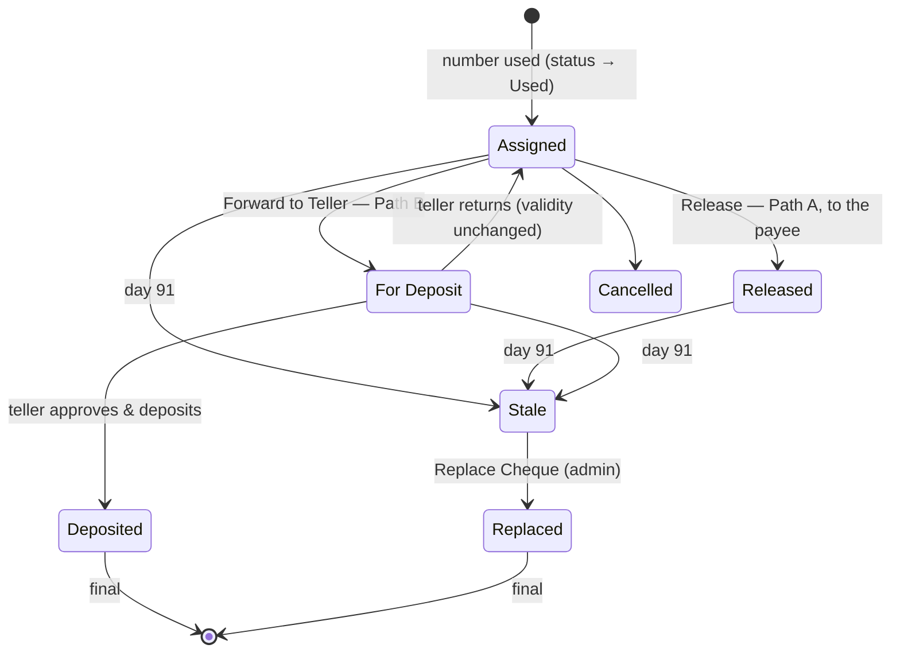
```mermaid
stateDiagram-v2
    state "Assigned" as A
    state "Released" as R
    state "For Deposit" as F
    state "Deposited" as D
    state "Stale" as S
    state "Replaced" as P
    [*] --> A: number used (status → Used)
    A --> R: Release — Path A, to the payee
    A --> F: Forward to Teller — Path B
    F --> D: teller approves & deposits
    F --> A: teller returns (validity unchanged)
    A --> Cancelled
    A --> S: day 91
    R --> S: day 91
    F --> S: day 91
    S --> P: Replace Cheque (admin)
    D --> [*]: final
    P --> [*]: final
```

**The rule.** A cheque is valid for **exactly 90 calendar days from its cheque date**. Day 0 is the
cheque date, day 90 is the last valid day, and from **day 91** it is stale. Counted in whole days
(`App\Support\Validity`), never in months, so leap years and month-ends need no special case, and
always reckoned in **Asia/Manila** whatever the app's timezone — the rule is about the calendar
date on a piece of paper in a Philippine office, not an instant in UTC. `validity_until` is
derived on save: set the cheque date and it follows, change the date and it moves (and the
one-time alert reopens).

**These statuses perish**: no status (used, no draft yet), For Checking, For Compliance, For Final
Print, For Signature, Approved, Forwarded to Teller, Accepted by Teller, Returned by Bank and
Released to Payee. A cheque can go stale while its draft is being checked, while it waits for
signature, sits with a teller, or is held uncashed by the payee. Deposited,
Cancelled, Spoiled, Stale and Replaced are never touched again.

| Path | Steps | Who |
|---|---|---|
| **A — direct to payee** | Assigned → **Release** → Released | Admin/staff |
| **B — deposit via teller** | Assigned → **Forward to Teller** → For Deposit → **Approve & Deposit** → Deposited | Admin/staff, then the teller |

A cheque follows **one path only**: a released cheque is never forwarded, and one with a teller is
never released. `ChequeDisposition::canMoveTo()` is the whole transition table, and every move is
checked three ways in `ChequeDispositionService` — signed off (`status` = Approved), a transition
the enum allows, and still inside validity.

- **Release** (`POST /cheques/{cheque}/release`) — *Received by* (the payee **or the
  representative who collected it**, pre-filled with the payee but editable), *Date received*
  (defaults to today; not in the future, not before the cheque date, not after `validity_until`)
  and an optional note. `released_by` / `released_at` are the signed-in user and now. The dialog
  asks once more before committing, because a release cannot be undone.
- **Forward to Teller** (`POST /cheques/{cheque}/forward`) — pick an active teller; they are
  notified.
- **Approve & Deposit** (`POST /cheques/{cheque}/deposit`) — *Date deposited* (not in the future,
  not after validity), the bank shown read-only as **Land Bank of the Philippines**, an optional
  deposit reference and note. **Every active user is notified** that the cheque was deposited.
- **Return** (`POST /cheques/{cheque}/return`) — the teller hands it back with a required reason.
  It returns to Assigned and **keeps its original `validity_until`**: returning does not restart
  the 90-day clock.
- Only the teller a cheque was forwarded to, or an admin, may deposit or return it.

**An action attempted past validity does not merely fail.** The cheque is marked stale then and
there, and the refusal says so. That marking happens *before* the action's own transaction opens —
doing it inside would work right up until the refusal threw, at which point the rollback would
undo the very fact it had just established.

### Going stale

1. **The nightly sweep** — `cheques:sweep-validity`, scheduled `dailyAt('00:05')` in Asia/Manila
   (`routes/console.php`). It marks every perishable cheque past its last valid day as Stale with
   `stale_at`, and writes *"Auto-marked stale by system — exceeded 90-day validity"* naming the
   stage it expired in: *never signed/released*, *released to {name} on {date}, not encashed*, or
   *with teller, not deposited*. System entries are attributed to `system` in the audit log.
2. **On read** — `Cheque::effectiveStatus()` reports Stale the moment the date turns, sweep or
   no sweep, and `scopeEffectivelyIn()` is the same answer in SQL. Every guard, every badge and
   every tab reads the effective value, so **correctness never depends on the job having run**.
   The sweep only writes down what the model already reports.
3. **Idempotent** — `markStale()` re-reads under a lock and returns early if the cheque is already
   stale, and the alert is stamped on the row. Running the sweep twice changes nothing and
   notifies nobody twice. `--dry-run` reports without writing.

### The 10-day alert

Fires once when a perishable cheque has **10 days or fewer** left (expiry day included), stamped
with `expiry_alert_sent_at` so it never repeats. Changing the cheque date clears the stamp.

The message carries the cheque number, payee, amount, cheque date, `validity_until`, the countdown
and the current status, and opens the Expiring Soon tab. What it says, and who else gets it:

| Status | Message | Extra recipient |
|---|---|---|
| No status · For Checking · For Compliance · For Final Print · For Signature | *Pending signature — this cheque will become stale in N days if not released or forwarded.* | — (admins are the signatories, and are always notified) |
| Released to Payee | *Released to {name} on {date} — … if not encashed. Please follow up with the payee.* | the user who released it |
| Forwarded / Accepted by Teller | *Awaiting teller deposit — … if not deposited to Land Bank of the Philippines.* | the teller holding the ACIC |

Base recipients are the user who assigned the number and the active admins. Delivery is **in-app**
(the header bell); **email is optional and off by default** — `cheques.alert_email`
(`CHEQUE_ALERT_EMAIL=true`) turns it on once a mailer is configured.

### Stale cheques and replacement

Stale is terminal: the cheque cannot be signed, released, forwarded, deposited or edited back to an
active state, and **its number stays consumed** — never reused, exactly as for every other number
in this system.

**Replace Cheque** (`POST /cheques/{cheque}/replace`, **admin only**) issues a new cheque on the
next available number through the existing `useNext()` rules, carrying the payee and amount over,
with a fresh cheque date and a fresh 90 days. The old cheque becomes **Replaced**, and the two are
linked both ways (`replaces_id` / `replaced_by_id`); both keep their full history. A cheque can be
replaced once. If the stale cheque had been **released**, the dialog warns first — *"This cheque
was released to {name}. Make sure the original cheque has been returned before issuing a
replacement."*

### Editing, after the fact

- **The cheque date is edited with the other details**, and only while the cheque has no status
  or is For Compliance (§6). `validity_until` follows it, and a new date reopens the one-time
  alert.
- **Release details cannot be edited by the person who entered them.** Only an admin may correct
  `received_by_name` / `date_received` (`PATCH /cheques/{cheque}/release`), a reason is required,
  and the audit log records `field 'old' → 'new'` alongside it.

### On the cheque page

- **Validity column** — the countdown (*12 days left* · *Expires today* · *Stale — 5 days ago*)
  with the date beneath. Deposited cheques read *Deposited to Land Bank {date}*; Cancelled,
  Spoiled and Replaced read *—*.
- **Received by column** — `received_by_name` and `date_received`, for released cheques.
- **Badges** — one per status: teal *Released to Payee*, purple *Forwarded to Teller*, indigo
  *Accepted by Teller*, blue *Deposited*, red *Stale* / *Cancelled* / *Spoiled*. The Validity
  column adds green (more than 10 days) / amber (10 or fewer, with an *Unsigned* / *With payee*
  / *With teller* tag) / red once stale.
- **Banner** — *"4 cheques will become stale within 10 days (2 pending signature, 1 with payee,
  1 with teller)."* Clicking it filters to those cheques.
- **Filters** — the filter container above the table (see *Filtering the list*, §6), plus a
  **nearest expiry first** sort (`&sort=expiry`). The banner's *Expiring Soon* view shows in
  the Status dropdown while it is on.
- **Row actions** — exactly the one step the cheque is ready for (Route for Signature · Mark as
  Received · Assign to ACIC · Release to Payee), then the ways out (RTS · Cancel · Spoiled) and
  Replace on a stale one. Every button is driven by a `can_*` flag the server computes, so the
  buttons and the endpoints can never disagree. The teller's actions live on the **Deposit
  queue**, not on the cheque row.
- **Detail page** — a **Timeline** of everything that happened: assigned → signed off → released,
  or → forwarded → returned/deposited, then stale or replaced, each with user and timestamp.

### Backfilling

The migration `2026_09_23_000000_add_validity_and_disposition_to_cheques_table` computed
`validity_until` for every existing cheque and marked anything already past it as Stale — **silently**, so a history
of back-dated cheques does not fire a flood of old alerts. Its `backfill()` is public and
idempotent, and the test suite exercises it directly.

---

## 4a. Workflow — registering a cheque book

Before any cheque can be used it must exist. An **admin** registers a newly issued physical cheque
book by entering the **first and last serial printed on it** (e.g. 10001 to 10200); the system
creates one `available` row per serial.

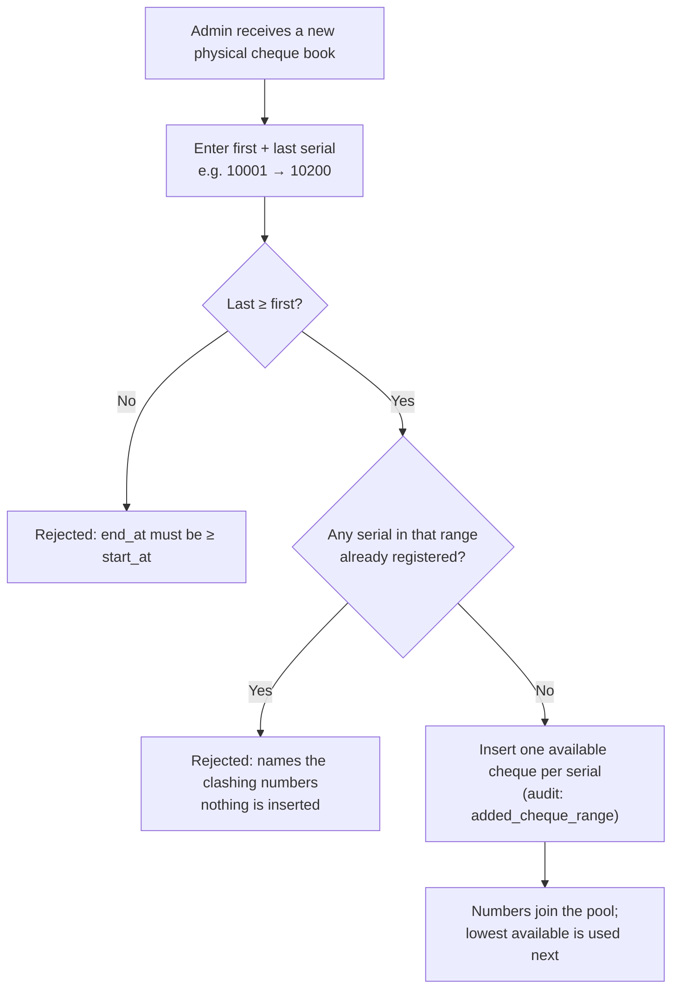
```mermaid
flowchart TD
    A["Admin receives a new physical cheque book"] --> B["Enter first + last serial<br/>e.g. 10001 → 10200"]
    B --> C{"Last ≥ first?"}
    C -->|No| D["Rejected: end_at must be ≥ start_at"]
    C -->|Yes| E{"Any serial in that range<br/>already registered?"}
    E -->|Yes| F["Rejected: names the clashing numbers<br/>nothing is inserted"]
    E -->|No| G["Insert one available cheque per serial<br/>(audit: added_cheque_range)"]
    G --> H["Numbers join the pool;<br/>lowest available is used next"]
```

**Rules enforced server-side** (`ChequeService::addRange()`)

- `end_at` must be **greater than or equal to** `start_at`; a single-cheque book is allowed.
- **Overlap is rejected.** Any serial in the range that already exists fails the whole request —
  the error names the clashing numbers, and nothing is inserted.
- The check and the insert share one **locked transaction**, so two admins registering overlapping
  books at the same time cannot both succeed.
- A range wider than **100,000** serials is rejected as a likely typo.
- Books **need not adjoin**. Registering 10001–10200 when the highest existing number is 500 is
  valid; 501–10000 never existed. Sequential *usage* is unaffected — `useNext()` still issues the
  lowest available number across every registered book.

---

## 5. Workflow — using & receiving a cheque

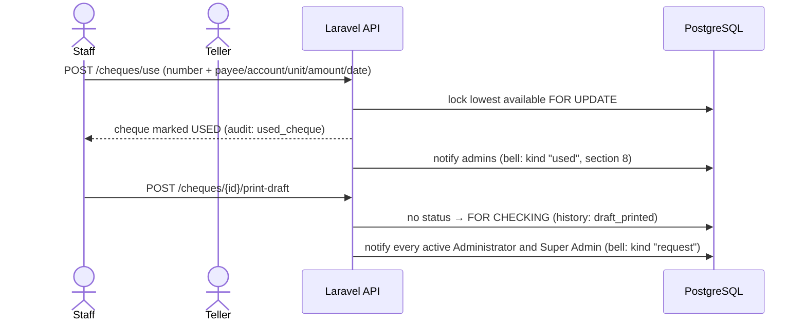
```mermaid
sequenceDiagram
    actor Staff
    actor Teller
    participant API as Laravel API
    participant DB as PostgreSQL

    Staff->>API: POST /cheques/use (number + payee/account/unit/amount/date)
    API->>DB: lock lowest available FOR UPDATE
    API-->>Staff: cheque marked USED (audit: used_cheque)
    API->>DB: notify admins (bell: kind "used", section 8)

    Staff->>API: POST /cheques/{id}/print-draft
    API->>DB: no status → FOR CHECKING (history: draft_printed)
    API->>DB: notify every active Administrator and Super Admin (bell: kind "request")
```

---

## 6. Workflow — editing a cheque's details

A cheque's details — payee, account no., unit, amount, cheque date — are **edited directly**,
and only while it has **no status** (used, no draft yet) or is **For Compliance** (a draft was
returned). **Edit** on the row opens `ChequeEditModal`, pre-filled with what is saved;
`PUT /cheques/{cheque}` (`UpdateChequeDetailsRequest`, preparers only) saves it through
`ChequeFlowService::updateDetails()`, which refuses any other status. The number never changes.

Each save is a **timeline entry** (`edited`) listing every changed field's from → to, plus an
`edited_cheque` audit entry. There is **no correction request and no hold** for cheques any
more: a cheque that needs changing after its draft is checked is **Returned** by the admin in
charge (§4), edited, and drafted again. Staff correction requests remain for **LDDAPs** only
(§6c, *Update Requests*).

**Filtering the list**

A filter container sits above the cheque table. Every filter runs **on the server**
(`GET /cheques`), so results cover all pages, and they all apply **together**:

| Filter | Parameter | Matches |
|---|---|---|
| **Search** | `search` (max 100) | cheque number, **payee** or **account number** — a partial, case-insensitive match; `%` and `_` are taken literally. The ACIC no. is not searched. |
| **Status** | `tab` | *All*, **No Status** (the blank status, stored `registered`), then every status in use: Available, For Checking, For Compliance, For Final Print, For Signature, Approved, Released to Payee, Forwarded to Teller, Accepted by Teller, Returned by Bank, Completed, Cancelled, Spoiled, Stale. Read through the *effective* status, so an overdue cheque is Stale. |
| **Unit** | `unit` | *All*, or one unit from the shared PCG list (`PcgUnits::rule()`; anything else is a 422) against `cheques.unit_name` |
| **Date Start / Date End** | `date_from`, `date_to` (`Y-m-d`) | the **cheque date**, both ends included; either may be empty. Cheques with no date (Available) drop out once a date is set. |

- Search filters as you type, after a 300 ms pause. **Status, Unit, Date Start and Date End apply
  only when Filter is clicked** — changing them alone does nothing to the list. Applying goes
  back to page 1.
- **Date Start after Date End:** the page shows *"Date Start is after Date End, so Filter will
  leave the dates out."*, and Filter applies the other filters without the dates. The server refuses the pair
  anyway (`date_to` must be on or after `date_from`).
- **Filter** (or Enter in any field) applies Status, Unit and the dates, takes the search at
  once without waiting out the pause, and refetches the list. **Clear** resets every filter. A dashboard link's `?tab=`
  pre-selects Status. The two buttons sit together, bottom-right; stacked full-width on phones.
- The line under the container reads *Showing N cheques*, with *· filtered* when a filter is on.
- At phone width the fields stack one per row; at tablet width, two per row.

---

## 6b. ACIC records

An **ACIC** (Advice of Checks Issued & Cancelled) groups approved cheques for onward transmittal.
The ACIC page lists every record with **ACIC No., Status, Used By, Created Date, Forward Date**
and **Received By**.

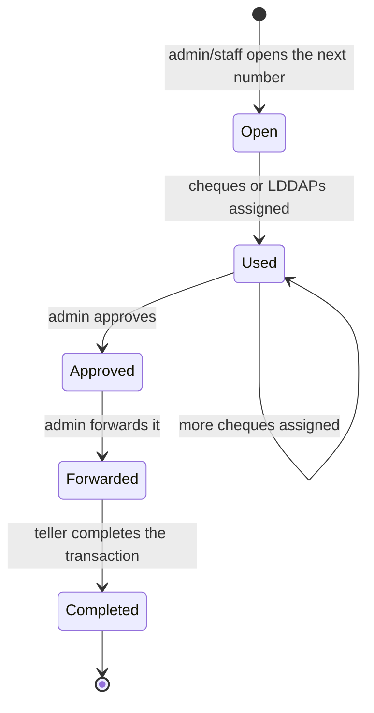
```mermaid
stateDiagram-v2
    [*] --> Open: admin/staff opens the next number
    Open --> Used: cheques or LDDAPs assigned
    Used --> Approved: admin approves
    Used --> Used: more cheques assigned
    Approved --> Forwarded: admin forwards it
    Forwarded --> Completed: teller completes the transaction
    Completed --> [*]
```

**The number sequence**

- ACIC numbers are a **gap-free running sequence generated by the system** — 1, 2, 3… — never
  entered by hand and never skipped.
- `AcicService::create()` reads the current maximum `FOR UPDATE` inside a transaction, so two
  concurrent opens can never take the same number.
- The next number continues from the **highest ever used**, so deleting a record cannot cause a
  later one to reuse its number.

#### The ACIC number series

ACIC numbers are **registered in blocks**, not invented by the system — the office is issued them,
the way it is issued cheque books and LDDAP check numbers. `acic_numbers` holds one row per
number (`available` | `used`); the series is independent of the cheque and LDDAP check registers
and may overlap either without conflict.

- **No number is ever registered twice.** `AcicService::addRange()` rejects any overlap with what
  is already on file — straddling, enclosed or a single number — checked under a lock so a
  concurrent registration cannot slip one in behind it. `POST /acics/add-range`, admin only, from
  **ACIC Series** in the sidebar.
- **An ACIC always takes the lowest unused number.** `create()` claims that row `FOR UPDATE` and
  marks it used, so two concurrent creates can never take the same number.
- **A block registered below numbers already in use is drawn on first.** Register 500–505, open
  #500, then register 10–12, and the next three ACICs are #10, #11, #12 — only then #501. This is
  the whole point of a registered series over a counter.
- **Adjoining blocks continue the run.** Numbers are rows, not "series" objects, so registering
  13–15 after 10–12 simply hands out 10, 11, 12, 13, 14, 15 unbroken — nothing separate is
  created. Blocks that do **not** adjoin leave the numbers between them unregistered, and those
  are never issued.
- When the series is exhausted `GET /acics/next` returns null, the page says so, and opening an
  ACIC is refused until an admin registers more. `GET /acics/series` reports
  registered / available / used.

The ACIC page opens with the next number stated once, then **two panels** under it — **Cheque
ACIC** and **LDDAP ACIC** — one per record type, each carrying its own assign button. They are
entry points, not two sequences: both take the same next number, and whichever is assigned first
claims it. The table's **Category** column then reads back what each ACIC actually holds —
**Cheque ACIC**, **LDDAP ACIC**, **Mixed** when it carries both, or *Empty* when it has been
opened but not filled — with the counts underneath. It is derived from `cheque_count` and
`lddap_count` on `AcicResource`, so it always reflects membership rather than how the ACIC was
opened.

**Filtering the ACIC table.** A filter container sits above it (`IndexAcicsRequest`), in the
Cheque page's style; everything runs **on the server** (`GET /acics`), covers all pages, and
combines:

- **Search** (`search`, max 100) — part of the **ACIC number**, or of the **cheque number**,
  **LDDAP number**, **LDDAP check number** or **DV number** of anything on the ACIC; any case,
  `%` / `_` literal (`Acic::scopeMatching()`). Applies as the user types (300 ms pause).
- **Status** (`status`) — *All*, **Open · Used · Approved · Pending · Accepted by Teller ·
  Forwarded to LBP · Forwarded to Payee · RTS · Completed** (the status the table shows —
  see *What the ACIC tables show as Status*). Applies on
  change. The dashboard's ACIC tiles and items link straight to it (`/acics?status=used`, …);
  older `?tab=forwarded|completed` links still land on the right status.
- **Clear** resets both. The line below reads *Showing N ACICs*, *· filtered* when filtered.

Below it, the tabs pick what the ACIC carries: **All · Cheque ACIC · LDDAP ACIC**
(`?category=cheques|lddaps`, a `has()` on the relation). A **Mixed** ACIC is listed under *both*
category tabs, and an ACIC opened but not yet filled under neither. (The old Forwarded and
Completed tabs became Status options.)

**The teller's table** (Deposit Queue) has the same **Search** and a **Status** of its own axis
— *All*, **Pending · Accepted · Forwarded to LBP · Forwarded to Payee · RTS ·
Completed** — beside its Type and Forwarded from / to filters, with one **Clear** for all
(`GET /acics/teller-queue`, `TellerQueueRequest`). They only **narrow** each list: Pending is
still everyone's, the rest still the viewer's own (an admin sees all), so a teller searching for
another teller's ACIC finds nothing.

**Assign LDDAP to ACIC** (`LddapAssignModal`, on the LDDAP page beside **Add LDDAP**, and on the
ACIC page) lists only approved LDDAPs not already on an ACIC, **multi-select** — many share one
ACIC number. The user types the **ACIC #** (prefilled with the next in the series; it must be an
existing open ACIC or that next number, never invented) and ticks records; a **Check No.**
column previews the number each will take, in tick order. See [6c](#6c-lddap-ada-records) for
the numbering and locking rules.

**Assign cheque to ACIC** is the ACIC page's primary button. It opens `ChequeAssignModal` — the
same dialog as the Cheques page's — where the user types the **ACIC #** (prefilled with the
next in the series) and ticks **any number** of For Signature cheques: **many cheques may share
one ACIC number**. The number must be an existing ACIC that still takes cheques (Open, Used, or
Approved — a cheque ACIC is approved by its first assignment and keeps accepting cheques until
it is forwarded) or the **next** in the series, which is opened only on save, so cancelling out
leaves no empty number behind. Anything else is refused: *"ACIC #N is not open. Enter an
existing ACIC number, or the next one in the series (#M)."* It writes through
`POST /cheques/assign-acic` (`AcicService::assignChequesToNumber()`, one transaction; the
number is resolved by `AcicService::resolveForAssignment()`, which LDDAPs share). The ACIC
record's own **Use ACIC** action is unchanged and still adds cheques to that ACIC.

#### Approval, re-assignment, forwarding and printing

The ACIC table's Action column carries only **View** — plus **Complete** for a teller on a
forwarded ACIC. Every other action moved into the **View ACIC** dialog, below the record it acts
on, and what is offered follows the status:

| Status | Who | Offered in the View dialog |
|---|---|---|
| Open / **Used**, still empty or Mixed | Admin/Staff | **Add cheque**, **Add LDDAP** — more records onto *this* ACIC |
| Open / **Used**, **LDDAP ACIC** | Admin/Staff | **Add LDDAP** only |
| Open / **Used**, **Cheque ACIC** | — | neither Add action |
| Used | Admin | **Approve** — signs the ACIC off (`POST /acics/{acic}/approve`) |
| Used | Admin/Staff | **Re-assign** |
| **Approved** | — | **Print** |
| **Approved** | Admin | **Forward** (the only place it is offered), **Re-assign** |
| Forwarded / Completed | — | nothing; membership is fixed once it has left the office |

- **The category governs what an ACIC may still take on**, derived in the View dialog exactly as
  the table's Category column derives it:

  | Category | Add cheque | Add LDDAP |
  |---|---|---|
  | **Cheque ACIC** (cheques, no LDDAPs) | — | — |
  | **LDDAP ACIC** (LDDAPs, no cheques) | — | ✓ |
  | **Mixed**, or still empty | ✓ | ✓ |

  A Cheque ACIC is closed to further additions — what is on it is what it is for — while an LDDAP
  ACIC keeps taking LDDAPs but never cheques. **Re-assign** and **Approve** are unaffected in
  every case, so membership can still be swapped and the ACIC can still be signed off.
- **Used says nothing about capacity.** It only records that the ACIC already carries something.
  Many cheques and LDDAPs share one ACIC number, so a Used ACIC keeps accepting more — **Add
  cheque** and **Add LDDAP** in the View dialog put them on *that* ACIC rather than opening a new
  number, and everything on it stays grouped in its one table. `AcicStatus::acceptsRecords()`
  (Open or Used) is the gate for **LDDAPs**; for cheques, see the next point.
- **Assigning cheques signs the ACIC off in the same step.** `assignCheques()` sets the ACIC to
  **Approved** as well as linking the cheques, so a cheque ACIC is ready to forward or print at
  once with no separate click. It **keeps accepting cheques** while approved — many share one
  number — so for a cheque ACIC it is **forwarding**, not approval, that closes membership.
  Assigning **LDDAPs** leaves the ACIC `used`, to be approved on its own as before.
- **Approve** (`POST /acics/{acic}/approve`) moves `used → approved` for an ACIC that is still
  Used — in practice an LDDAP one. It refuses an ACIC that carries nothing, and one already
  approved (*"has already been approved"*), which a cheque ACIC will be. **Admin-only**.
- **Forwarding now follows the sign-off.** `AcicService::forward()` refuses an ACIC that has not
  been approved, so what leaves the office is what was approved.
- **Re-assign** (`POST /acics/{acic}/reassign`, admin **and** staff) swaps one record on the ACIC
  for another of the same kind. The record coming off has its `acic_id` cleared and is
  **released back to the pool** — it reappears under `linkable-cheques` / `lddaps/linkable` and
  can go on a later ACIC; the one going on must be approved and not already on another ACIC.
  Both halves run in one locked transaction, so the ACIC is never briefly short of what it
  carries and a released number can never be claimed twice. Allowed while the ACIC is Used or
  Approved, refused once Forwarded.
- **Print** renders the ACIC form to the **pre-agreed sheet the depository bank accepts**, not a
  generic listing. The layout is fixed: a three-column header (bank block · agency block ·
  ACIC NO./ORG CODE/FUNDING SOURCE/AREA CODE/ALLOCATION NO), the centred title **ADVICE OF CHECKS
  ISSUED AND CANCELLED**, the account number, a ruled table with a shaded head (CHECK NO · DATE OF
  ISSUE · PAYEE · AMOUNT · OBJ CODE · REMARKS), the totals and **AMOUNT IN WORDS** line, a clear
  band for the bank's stamp, and the foot — the bordered CANCELLED CHECKS box beside the
  CERTIFIED CORRECT / VERIFIED / RECEIVED / APPROVED / POSTED / DELIVERED signature grid, with the
  transmittal filename and *FOR LBP USE ONLY*. Arial 9.5pt throughout. It lives in the
  `.acic-print` block and the `@media print` rules in `resources/css/app.css`, which hide the rest
  of the page.
  - **One ACIC, one table.** Every record on the ACIC — however many LDDAPs, however many cheques
    — is a row in the single check table, never a table apiece. The View dialog shows the same
    thing on screen (**Records on this ACIC**), so what is read matches what is printed.
  - The form is **portalled to `<body>`** rather than printed from inside the dialog. The dialog
    is a `position: fixed` overlay wrapping an `overflow-y-auto` card, and a fixed, clipped
    ancestor makes browsers clip the sheet to one viewport-sized page and repeat it on the next —
    which split a single ACIC's table into what looked like several. As a top-level element the
    form is in the normal print flow, and `@media print` simply hides `body > *:not(.acic-print)`.
  - Pagination is explicit: the table may break **between rows** (`break-inside: avoid` on `tr`),
    repeats its header (`thead { display: table-header-group }`), and the header block, totals,
    signature foot and filename line are each kept whole.
  - An **LDDAP** row prints its check number, check date, **LDDAP number as the payee** and OBJ
    number — as the reference sheet does. A cheque row prints its number, cheque date and payee,
    and leaves OBJ blank.
  - **AMOUNT IN WORDS** is spelled by `App\Support\AmountInWords`, matching the form's
    conventions: hyphenated compound tens, no "and" between hundreds and tens, and a
    `… PESOS AND … CENTAVOS` tail only when there are centavos.
  - The form's **ACIC NO.** is `YY-MM-SEQ` (e.g. `25-10-248`), derived from the ACIC's creation
    date and its sequence number — not the bare integer shown elsewhere in the UI.
  - Everything that belongs to the office rather than to one ACIC — bank and agency blocks, org /
    funding / area / allocation codes, account number, signatories, filename prefix — lives in
    **`config/acic.php`**, each value overridable from `.env` (see `.env.example`). The defaults
    are the values on the reference sheet.

**Use ACIC — linking cheques** (`AcicService::assignCheques()`)

- Only cheques with status **approved** can be put on an ACIC — the terminal positive review
  outcome, i.e. a fully signed-off cheque.
- A cheque belongs to **at most one ACIC** (`cheques.acic_id`). Assigning one that already sits on
  a different ACIC is rejected, and the error names the offending cheque numbers.
- **Many cheques to one ACIC** is the normal case; the picker is multi-select.
- A batch is **all-or-nothing** — one ineligible cheque fails the whole request, so nothing is ever
  half-assigned. Everything is validated under a row lock.
- Re-assigning a cheque already on *this* ACIC is a harmless no-op.
- The first assignment moves the record Open → **Used** and stamps **Used By** / used at.

**Forward — to the tellers** (`POST /acics/{acic}/forward-to-teller`, admin)

- **One Forward for both kinds.** A **cheque ACIC** and an **LDDAP ACIC** are forwarded the same
  way: the admin clicks **Forward** in the View dialog of an **Approved** ACIC and confirms —
  *"Forward ACIC #N to the tellers? It carries n cheques…"* — **Yes, forward to Teller**. There is
  nobody to pick.
- The ACIC is then **Pending** on every table (its teller status; its own status stays
  Approved underneath). Every teller is notified; each record moves to *Forwarded to Teller*.
- It **stays Pending until a teller accepts it** — from the ACIC page's **Accept** button (under
  the Pending badge) or the Deposit Queue. The first teller to accept takes it (a conditional
  write); the next is told who has it.
- After that it follows the teller flow: **Forward** (to LBP; a cheque ACIC also to the Payee), then **Action**
  (Completed / RTS) — see §4, *Branch B*.
- The Forward button is hidden while the tellers have it, and returns if a teller hands it back
  to the admin. Nothing can be added to or re-assigned on it while the tellers have it.
- **Retired:** the old recipient-pick Forward (`POST /acics/{acic}/forward`, a user or a typed-in
  name → ACIC status *Forwarded*) and the ACIC page's teller **Complete** button
  (`POST /acics/{acic}/complete`), which skipped Pending and Accept. ACICs that went that way
  (#30012, #30013) keep their Forwarded / Completed history (`forwarded_at`, `received_by`,
  `received_name`).

**What the ACIC tables show as Status** (`Acic::displayStatus()`, `display_status` on the
resource): the ACIC's own status — **Open · Used · Approved** — while it is with the admin; from
the moment it is forwarded to the tellers, the teller's — **Pending · Accepted by Teller ·
Forwarded to LBP · Forwarded to Payee · RTS · Completed**. The Status filter offers exactly
those, and filters on the same thing (`Acic::scopeInDisplayStatus()`).

**What a teller sees.** On the ACIC page a teller sees **only ACICs forwarded to the tellers**
(or forwarded before that step existed) — never one still with the admin (`Acic::scopeVisibleTo()`;
opening one by its address is a 404). Admins and staff see every ACIC. The filters only narrow
that.

Cheques carry `acic_id` rather than a free-text ACIC number, so the cheques table's "ACIC no."
column and its search read through the link, and `ChequeResource` also reports `acic_status` so a
cheque row can never disagree with the ACIC it sits on.

---

## 6c. LDDAP-ADA records

An **LDDAP-ADA** (Listing of Due and Demandable Accounts Payable — Advice to Debit Account) is a
disbursement document. The LDDAP page lists every record with **Check No., Status, LDDAP No.,
Amount, OBJ No., Used By, ACIC No.** and **Forward To / Date**.

### The LDDAP check series is independent

The **Check No.** on this page comes from `lddap_checks`, a register that shares **nothing** with
`cheques.cheque_number` or with `acics.acic_number`:

- The three sequences advance separately. LDDAP check #500 and cheque #500 are different things
  and may both exist; using an LDDAP check number consumes **no cheque**, and opening an ACIC
  does not move the LDDAP series.
- An admin registers blocks of the series on **LDDAP Series** (`POST /lddaps/add-range`), the way
  cheque books are registered. **No number is ever registered twice** — an overlapping block is
  rejected inside a locked transaction.
- Blocks need not adjoin; the numbers between two blocks never existed.
- `check_no` is a **big integer**: real LDDAP-ADA numbers run to ten digits (e.g. 9910031148),
  well past the 2,147,483,647 ceiling of a 4-byte integer. Anything above
  `LddapService::MAX_CHECK_NO` is refused in validation rather than at the database.

### How the next number is chosen

- The next number is always the **lowest unused** number in the series — never a random one, and
  never one out of order.
- Numbers are handed out **when records go on an ACIC** — never at registration — as a
  **consecutive block**: N ticked records take the first run of N gap-free unused numbers,
  searching up from the lowest, in the order ticked. Free numbers a longer batch had to skip
  remain for a shorter one.
- **A number is never skipped past for good**, and never issued twice. The caller sends the
  block it previewed (`expected_check_nos`); a client working from a stale preview is rejected
  by name rather than silently renumbered.
- **A block registered later, below numbers already in use, is used first — when the batch
  fits.** Register 500–505, use 500 and 501, then register 1–3: a batch of three takes 1, 2, 3;
  a batch of four cannot, so it takes 502–505 and leaves 1–3 for later.
- Selection happens under a `FOR UPDATE` lock, so two concurrent batches can never claim the same
  numbers, and `lddaps.lddap_check_id` is **unique**, so a number can never be held twice
  whatever happens above it.
- **Registration is one record at a time.** Numbers, by contrast, go out in one locked batch
  per ACIC assignment — however many records were ticked.
- **`lddap_no` is unique**: the same document can never be registered twice — enforced by the
  database index, the form request and a locked re-check in the service.
- The **date of issue is entered** with the record (`check_date`, defaulting to today in the
  dialog); a caller that omits it gets the day of registration.

### What a record is registered with

**Register LDDAP record** (`LddapRegisterModal`) collects one record's fields. There is **no
check number field**: the number is issued when the approved record is put on an ACIC
(`LddapAssignModal`). Every field but one is required (`LddapDetailsRequest` — the one form
request behind both Register and Edit):

| Field | Column | Notes |
|---|---|---|
| LDDAP Number | `lddap_no` | **format `00-00-00000`** (two digits, two digits, five digits — the box inserts the dashes as the digits are typed); anything else is refused with *"LDDAP Number must be in the format 00-00-00000."* — on register, edit, a staff correction and an admin's direct correction (`App\Support\DashedNumber`); unique across the register |
| NCA Code | `nca_no` | **format `0000000`** — exactly 7 digits, digits only (the box keeps only digits, up to 7); stored as text so leading zeros stay; anything else is refused with *"NCA Code must be exactly 7 digits."* |
| OBR Number | `obr_no` | formerly *ORB Number* (column renamed from `orb_no`) |
| DV Number | `dv_no` | **format `00-00-00000`**, like the LDDAP Number (the box inserts the dashes; *"DV Number must be in the format 00-00-00000."*); **unique** — trimmed, then checked on save (*"DV Number already exists."*) by the form request, again under a lock in the service, and by the `lddaps_dv_no_unique` index |
| Nature of Payment | `nature_of_payment` | `NatureOfPayment` enum; offered in caps, e.g. **PAYROLL / PERSONAL CLAIMS**, **LOCAL TRAVEL**, **POL** |
| UACS Object Code | `obj_no` | *optional*; the same column that always held OBJ No. — it is what prints as OBJ CODE on the ACIC |
| Unit Name | `unit_name` | required; the [PCG unit dropdown](#6f-pcg-units), saved as the unit's name |
| Date Issued | `check_date` | `type="date"`, defaults to today |
| Payee | `payee_name` | one search over **Creditors and PCG Personnel** (by name or account number); results show Payee · Account No. · **Type** · Select |
| Payee Type | `payee_type` | read-only — `creditor` / `pcg_personnel` (*Creditor* / *PCG Personnel*), from the list the payee was picked from |
| Account Number | `payee_account_no` | read-only — the payee's account number |
| *(Unit Name)* | `unit_name` | filled from the payee's unit when it is on the PCG list; still a dropdown |
| ACIC # | `acic_ref` | *optional*; the number written on the form — distinct from `acic_id`, the ACIC it is later put on |
| Gross Amount | `gross_amount` | `decimal(14,2)` |
| W/TAX 0.01 · 0.02 · 0.03 · 0.05 | `wtax_1` … `wtax_5` | `decimal(14,2)`, default 0 |
| VAT 0.01 · 0.02 · 0.03 · 0.05 · 0.10 · 0.12 · 0.30 | `vat_1` … `vat_30` | `decimal(14,2)`, default 0 |
| Retention · Liquidated Damages · Advance Payment | `retention` · `liquidated_damages` · `advance_payment` | `decimal(14,2)`, default 0 |
| FWD to LBP · Date Loaded | `fwd_to_lbp_at` · `date_loaded` | *optional* dates |
| Note · Remarks | `note` · `remarks` | *optional* |

The dialog groups these as **Details · Payee · W/TAX · VAT · Deductions · Dates · Notes**, with a
live **Net payable** line between Deductions and Dates.

**Money.** Every amount is a `decimal(14, 2)` column and is handled server-side as a decimal
string through `App\Support\Money` (bcmath) — never a float, so `0.10 + 0.20` is `0.30` and
`2.675` rounds to `2.68`. **`amount` is the net payable**: gross less every W/TAX, VAT and
deduction, derived in `LddapService::register()` and refused if it would not be positive. It
keeps its old meaning downstream — it is what the ACIC prints and totals. Records that predate
the breakdown were backfilled with `gross_amount = amount`.

**The tax rule.** Gross amounts are VAT-inclusive, so each rate button computes
`(gross ÷ 1.12) × rate`, rounded to two decimals — `App\Support\Tax::withheld()` is the tested
reference, mirrored client-side in `resources/js/lib/tax.ts`. Clicking a rate fills its amount
and marks the rate **active**; changing the gross recomputes every active rate in both grids.
Typing in an amount keeps it and drops the rate from the active set, so a manual figure is never
silently overwritten. Amounts default to 0 and stay editable.

- **The payee is chosen from Creditors and PCG Personnel.** `GET /lddaps/payee-options?search=`
  (admin/staff, `LddapPayeeSearchRequest`) lists both tables in one name-ordered list, matched
  by name or account number, each with `type`, `type_label`, `name`, `account_no` and `unit`.
  Selecting one fills **Payee Type**, **Account Number** and **Unit**; picking another refills
  them, clearing empties them. The form sends `payee_type` + `payee_ref` (the record's id); the
  server looks it up (`Rule::exists` on the named table) and **copies** `payee_name`,
  `payee_type` and `payee_account_no` onto the LDDAP. **Nothing links back**: editing the
  Creditor or PCG Personnel entry later never changes a past LDDAP. On an edit that does not
  re-pick the payee, the saved copy is kept. LDDAPs from before this keep their old payee copy
  and a **blank Payee Type**; the old `payees` / `payee_accounts` tables and `payee_id` /
  `payee_account_id` / `payee_bank` columns remain only for them.
- `GET /lddaps/options` serves the nature-of-payment select: every nature (`value` + caps
  `label`). Units are the shared [PCG unit list](#6f-pcg-units), which the app imports.
- Staff **corrections** still cover the original four fields (LDDAP No., UACS code, payee
  name, amount); the new references are set at registration.
- The LDDAP table shows the references stacked in one **References** column (NCA / OBR / DV),
  plus **Nature**, **Unit** and **UACS Code**, with the payee's account number beneath the payee
  name; the list search matches all of them.

### Lifecycle

The LDDAP has **no cheque to inherit a status from**, so it carries its own. Before an ACIC there
is one status, **For Signature**; everything after the ACIC is unchanged.

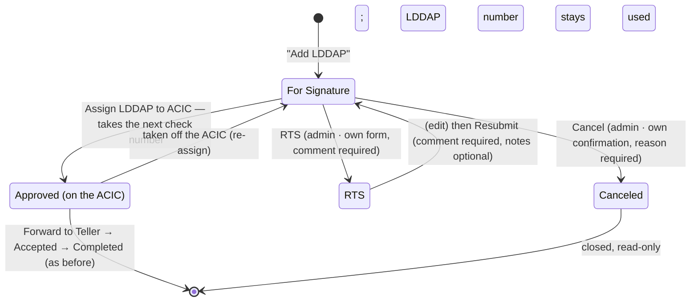
```mermaid
stateDiagram-v2
    ForSignature: For Signature
    ApprovedOnAcic: Approved (on the ACIC)
    [*] --> ForSignature: "Add LDDAP"
    ForSignature --> ApprovedOnAcic: Assign LDDAP to ACIC — takes the next check number
    ForSignature --> RTS: RTS (admin · own form, comment required)
    RTS --> ForSignature: (edit) then Resubmit (comment required, notes optional)
    ForSignature --> Canceled: Cancel (admin · own confirmation, reason required)
    ApprovedOnAcic --> ForSignature: taken off the ACIC (re-assign)
    ApprovedOnAcic --> [*]: Forward to Teller → Accepted → Completed (as before)
    Canceled --> [*]: closed, read-only; LDDAP number stays used
```

- **For Signature** — set by **Add LDDAP** (`POST /lddaps`, admin/staff): **one record per
  submission**, no check number. **No status comes before it.** The LDDAP number is unique
  (`lddaps_lddap_no_unique` at the database, `Rule::unique` in the form request, a locked
  re-check in `LddapService::register()`), and a duplicate is refused by name. A For Signature
  record can be **edited** (Edit LDDAP Record), **assigned to an ACIC**, or — by an admin —
  **RTS**'d or **Canceled**.
- **Assign LDDAP to ACIC** — only For Signature records are offered or accepted. Going on the
  ACIC gives the record its check number and makes it **Approved** — the status now means "on
  an ACIC, not yet with the tellers" — with an `assigned` trail entry. Taken off again by a
  re-assign, it goes back to For Signature (`unassigned`).
- **RTS** (`POST /lddaps/{lddap}/rts`, admin, on a For Signature record) — Return to Sender,
  with an **amber** badge. Taken through its own form, unchanged: *Date Received*, *Received By*,
  *RTS Unit* (PCG unit dropdown), *RTS Date* and a **required Comment**. Not a verdict — nothing
  is stamped as reviewed. An RTS record **can be edited** (Edit LDDAP Record, a staff correction
  or an admin direct edit — details only, the status stays RTS). **Every RTS is its own history
  row** (`received_by_name`, `received_on`, `unit_name`, `acted_on`, `note`); the list carries
  `rts_count`, shown as an **RTS: n** badge, and the record's **RTS History** lists every return.
- **Resubmit** (`POST /lddaps/{lddap}/resubmit`, admin/staff, on an RTS record,
  `ResubmitLddapRequest`) — once corrected, back to **For Signature**, with a **required
  Comment** (what was corrected) and optional **Notes**, both on a `resubmitted` trail entry
  (`note`, `notes`).
- **Cancel** (`POST /lddaps/{lddap}/cancel`, admin, on a For Signature record) — its own
  confirmation, unchanged: *Canceled By* (the signed-in user), *Date Canceled*, a **required
  Reason**, stored on the record (`canceled_by`, `date_canceled`, `cancel_reason`) and in the trail.
  Status **Canceled**, read-only from then on; its LDDAP number stays used.
- **Retired:** *Registered*, *For Out* (Forward), *Returned for ACIC* (Receive) and the Approve
  sign-off — with their buttons, forms, filters and dashboard tiles. Their saved data
  (`forward_to`, `forward_unit_name`, `forwarded_by`, `date_forwarded`, `return_unit_name`,
  `returned_by`, `date_returned`, and the *forwarded* / *received* / *approved* trail rows) stays
  in the database and is **shown on no page**: the API no longer sends those columns and the
  routing trail leaves those rows out. Migration
  `2026_09_28_000200_lddaps_start_at_for_signature` moved any record on a retired status —
  and any Approved record not on an ACIC — to For Signature.
- Every step is a `lddap_routing_history` entry (user, date, note) and an audit-log line.

### Linking to an ACIC

- Only **For Signature** LDDAPs can be linked; the picker offers nothing else and the server
  re-checks under a lock, naming the offending **LDDAP numbers**. Linking makes them **Approved**.
- **Many LDDAPs to one ACIC** is the normal case; the picker is multi-select and can
  open the next ACIC in the sequence without leaving the modal.
- Membership lives on `lddaps.acic_id`. An LDDAP already on **another** ACIC is refused — the
  duplicate guard — while re-assigning to the *same* ACIC is a harmless no-op.
- The LDDAP rows **stay in the LDDAP table**; linking only fills in their ACIC columns.
- An ACIC can carry **cheques, LDDAPs, or both**. Forwarding needs at least one of either, and
  completing it stamps the teller's receipt on every record it carries that lacks one.

### Editing a record — "Edit LDDAP Record"

While a record is **For Signature** (not yet on an ACIC), or **RTS**'d back, it is
edited through **the register form itself**. **Edit**, inside the record's detail dialog (from
View or the LDDAP number), opens the same dialog as *Add LDDAP*, titled **Edit LDDAP Record**, with **every
field pre-filled** from the saved values: LDDAP number, NCA Code, OBR and DV numbers, nature of
payment, unit, date issued, the payee with its type and account number (the copy saved on the
record — kept unless a new payee is picked), UACS
object code, gross amount, every W/TAX and VAT amount, retention, liquidated damages, advance
payment, FWD to LBP, date loaded, note and remarks. The rate buttons recompute from the gross
exactly as when registering. **Check #** and **ACIC #** are shown read-only — the check number
is only ever set by *Assign LDDAP to ACIC* — and the button reads **Save Changes**.

- One form for both: `LddapRegisterModal` (with a `lddap` prop) on the client,
  `LddapDetailsRequest` on the server, and `LddapService::attributes()` building the columns
  for `register()` and `update()` alike — so the two never drift apart.
- `PUT /lddaps/{lddap}` (admin/staff). **For Signature and RTS only** — Approved (on an ACIC)
  and later statuses, and Canceled, are refused (*"cannot be edited"*) and get no Edit button
  (`LddapResource.can_edit`, `LddapStatus::canEdit()`). Refused while a correction request pends.
- **The LDDAP number stays unique**, but the record's own number is not a duplicate of itself
  (`Rule::unique()->ignore()` in the request, and the locked re-check skips the record).
- The **check number, status, routing and registrant are never touched**; extra keys in the
  payload are ignored.
- **Every edit that changes something is kept** in `lddap_edit_history` — who, when, and each
  field's before and after (`changes = {field: {from, to}}`), readable at
  `GET /lddaps/{lddap}/edit-history` and shown as **Edit history** on the record. An edit that
  changes nothing writes no entry. The audit log gets `updated_lddap` naming the fields.

### Correcting the details

Once a record is **on an ACIC** — Approved or later — it is not edited. Staff **propose** a correction with a reason, and an admin reviews and applies it —
the same request/approve flow the cheque register uses (`LddapUpdateRequestService`) — or an
admin applies one directly (*Correct details*, reason required). Neither is offered on a
For Signature or RTS record, where Edit applies instead.

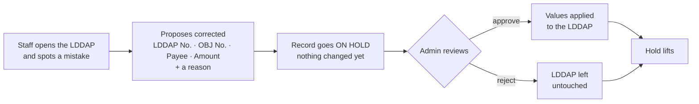
```mermaid
flowchart LR
    A["Staff opens the LDDAP<br/>and spots a mistake"] --> B["Proposes corrected<br/>LDDAP No. · OBJ No. · Payee · Amount<br/>+ a reason"]
    B --> C["Record goes ON HOLD<br/>nothing changed yet"]
    C --> D{"Admin reviews"}
    D -- approve --> E["Values applied<br/>to the LDDAP"]
    D -- reject --> F["LDDAP left<br/>untouched"]
    E --> G["Hold lifts"]
    F --> G
```

- **Correctable fields:** LDDAP No., OBJ No., Payee and Amount. The **check number is never
  among them** — it is assigned by the series, and an approval leaves `lddap_check_id` alone.
- **Staff only** may propose; **admin only** may approve or reject. Anyone authenticated can read
  a record's request history with its outcomes.
- **One pending request per LDDAP.** A proposal identical to the current values is rejected as a
  no-op, and a reason of at least 5 characters is required.
- **`lddap_no` stays unique.** A correction that would collide with another record is refused
  when raised *and* re-checked under a lock at approval time, since another record may have taken
  the number in between. That approval fails and the request stays pending.
#### Corrections and the routing

A correction changes the **details only** — it never moves a record in its routing. Approving
one applies the proposed values and leaves the status exactly where it was. The route back for a
record that came in wrong is the admin's **RTS** action on a For Signature record: it becomes
**RTS**, the staff member **edits** it (Edit LDDAP Record — the full form), and once it is right
it is **resubmitted** to For Signature. The record carries the whole loop in its routing trail —
added, RTS, resubmitted, assigned to ACIC — and each RTS in its RTS History.

A **canceled** record is closed: a correction on it — proposed by staff or applied directly by
an admin — is refused (*"is canceled and can no longer be edited"*), as are every routing step
and any ACIC assignment.

#### Admin direct correction

An admin does not have to send a record back to change it: `PATCH /lddaps/{lddap}` applies the
correction **immediately**. It is reachable from two places, both admin-only: the detail modal
(from the LDDAP number), as **Correct details** on a record that is on an ACIC (Approved or later).

- **The reason is mandatory.** A change with no second pair of eyes has to say why it was made.
- It is written into the **same correction history**, flagged `applied_directly`, so a record has
  one history whether the change came from a staff request or straight from an admin. The audit
  log records the `field 'old' → 'new'` summary alongside the reason.
- The staff member who used the number is **notified** that their record changed.
- It is **refused while a request is pending** — the admin resolves that request rather than
  editing around it.
- The check number is never editable, here or anywhere else.

- **The hold.** While a request is pending the record cannot be confirmed as received by the
  teller or reviewed by the admin — nobody signs off on details still in dispute. The hold lifts
  the moment the request is approved or rejected. The LDDAP table flags held rows, and
  `LddapResource` reports `has_pending_update`.
- The admin's review and **Edit** row actions stay visible on a held record; the server refuses
  them with an explanation naming the pending request, rather than the button silently
  disappearing. Held rows are marked in the **Status** column, not beside the LDDAP number.
- Approving writes a `field 'old' → 'new'` summary to the audit log and notifies the requester;
  raising a request notifies every active admin.

The admin queue lives on **Update Requests**, which has a **Cheques / LDDAP** tab with a pending
count on each.

### Actions by status

The LDDAP table's action column is driven by the record's status, exactly as the cheque table's
is (see [6d](#6d-cheque-table--actions-by-status)) — each row offers only the step that is
actually next.

| Status | Who | Action |
|---|---|---|
| **For Signature** | Admin/Staff | **Assign to ACIC** — this is when it takes its check number (Edit lives in the record dialog) |
| **For Signature** | Admin | **RTS** (opens the RTS form) · **Cancel** (opens the cancel confirmation: Canceled By · Date Canceled · Reason) |
| **RTS** | Admin/Staff | **Resubmit** — once corrected (via Edit in the record dialog): Comment (required) · Notes |
| **Approved** and on (on an ACIC) | — | nothing on the row — the ACIC No. column says where it is; forwarding is the ACIC's own step |
| **Canceled** | — | `Canceled <date>` — read-only; nothing is offered |

- The LDDAP number in the first column is itself the link to the full record, so there is no
  separate View action; the record shows its **Timeline** (the routing trail) and its correction history.
  The Timeline runs from *Added* through *Assigned to ACIC* and on through the ACIC's teller
  steps — **Forwarded to Teller**, **Accepted by Teller**, **Completed**, **Returned by Bank**,
  **Returned to Admin** — each written on every LDDAP on the ACIC when the ACIC takes that step
  (`AcicTellerService`), with who, when and *"ACIC #N"* plus any reason. Older teller rows,
  written with the generic *forwarded* action, are shown named by the status they moved to;
  only the retired For Out / Receive / Approve rows stay hidden.
- The status badge sits in the table's Status column.
- **Filter bar** above the table — *Search*, *Status* (All · For Signature · RTS · Approved ·
  Forwarded to Teller · Accepted by Teller · Completed · Canceled), *Nature of Payment* (All plus the register form's list, from
  `GET /lddaps/options`), *Payee Type* (All · Creditor · PCG Personnel — `lddaps.payee_type`;
  older records with a blank type show only under All), then **Filter** and **Clear**, together
  on a row below the fields. **Search applies as you type** (after a 300 ms pause, from page 1);
  Status, Nature of Payment and Payee Type apply only when Filter is pressed
  (Enter does the same); Clear resets every field and shows all records. The
  filters **combine (AND)** and are applied **server-side** as the query string of `GET /lddaps`
  — `?search=&status=&nature=&payee_type=&page=` — which the page keeps in its own URL, so a filtered view
  survives a refresh and can be bookmarked, the inputs keep their values after filtering, and
  Prev/Next carry the filters (the paginator's links do too). A line above the table reads
  *Showing 12 records* (or *Showing 51–100 of 120 records* when paged), and *No records found*
  when nothing matches. `FilterLddapsRequest` validates the parameters; an unknown status or
  nature is a 422.
  - **Search** is one box that matches any of three things (`Lddap::scopeSearch()`): **part of
    the LDDAP number**, **part of the check number** (compared as text, so `2026` finds
    `120260`), or the **gross amount exactly** when the text reads as an amount — with or
    without the peso sign, thousands separators or centavos: `194032`, `194,032.00` and
    `₱194,032` all find ₱194,032.00 (`Money::parse()`); `LDDAP-0001` is never mistaken for an
    amount.
- **Teller receipt** is confirmed inside the detail modal rather than from the row, once the
  record carries a check number.
- An admin's **direct correction** also lives in the detail modal, reached from the LDDAP number.

### Forwarding

Forwarding happens on the **ACIC**, not on the individual LDDAP — see
[6b · Forward](#6b-acic-records). Every LDDAP on that ACIC shows the same Forward To / Date in
its row, but the action itself is taken only from the ACIC page's **View** dialog, on an
approved ACIC. (The LDDAP's own old Forward / Receive steps are retired; see *Lifecycle*.) The LDDAP table reports where the record sits; it does not act on the ACIC.

---

## 6d. Cheque table — actions by status

The cheque table's action column is driven by server-computed flags (`can_*`), so each row offers
only what is next, and only to whoever may take it.

| Status | Who | Action |
|---|---|---|
| Available (next in line) | Admin/Staff | **Use** — record the details and put the number into use |
| Available (next in line) | Teller | `Use from the panel above` |
| Available (not next) | — | **Locked** — only the lowest available number may be used |
| *(no status)* | Preparers | **Edit** · **Print Draft** · Cancel (admin) |
| **For Checking** | Administrator / Super Admin | **Approve** · **Return** — both open the draft to check |
| For Checking | Everyone else | `With the admin in charge` |
| **For Compliance** | Preparers | **Edit** · **Print Draft** — the detail view leads with what to change |
| **For Final Print** | Preparers | **Final Print** |
| **For Signature** | Admin | **Assign to ACIC** |
| **Approved** and on | any | **Print** — reprint the cheque's face; the Branch A/B steps as before |

The **Status** filter lists every status in flow order, starting with **No Status** (a used cheque
with no draft yet); see *Filtering the list*. Each cheque's **Timeline** in its detail view lists every step in
order with who took it, when, and any comment.

**Use** on an *available* cheque (`ChequeUseModal`) is the row entry point for a cheque that has
just been registered, offered to **admin and staff** — the two roles that put numbers into use:

- It appears only on the **next-in-line** cheque. The lowest-available rule is the point of the
  system, so a row that cannot legally be used next offers **Locked**, not a button that the
  server would refuse. Right after a first range is added, that next-in-line cheque *is* the
  newly added one; when a new book is registered above numbers still available in an older one,
  the older number is used first and gets the button.
- It captures the same details as the next-in-line panel (payee; **Account No.** — optional,
  text so leading zeros are kept; **Unit** — optional, the [PCG unit dropdown](#6f-pcg-units);
  amount; cheque date) and writes
  through the same `POST /cheques/use`, so the number is still re-checked against the real
  next-available row **under a lock**. The dialog is a second way in, never a way around the
  sequence.
- A **teller** gets no button; their next-in-line row still points at the panel above.

**The print view** (`ChequeViewModal`) has four modes, and scrolls within the screen on a phone:

- **Print Draft** — for a cheque with no status or For Compliance. The face carries a **DRAFT**
  watermark (`.cheque-draft-mark`, on screen and paper). The button submits the draft first
  (`POST /cheques/{cheque}/print-draft`) and prints second.
- **Final Print** — for a For Final Print cheque. Prints clean, then asks *"Did cheque #N print
  successfully?"*; **Yes, it printed** calls `POST /cheques/{cheque}/final-print` (→ For
  Signature), *No — print again* stays put.
- **Check Draft** — for an admin in charge on a For Checking cheque (`can_check_draft`), opened
  by the row's **Approve** or **Return**. Shows the watermarked draft, a **Comment** box
  (required to Return — the button stays disabled until there is one — optional to Approve),
  and **Print**, **Return** and **Approve**.
- **Print** — a reprint from the row, for a cheque on an ACIC (`can_print`).

`GET /cheques/{cheque}/print` serves all three: `draft: true` while the cheque has no status,
is For Checking or For Compliance; clean from For Final Print on; refused for a Cancelled,
Spoiled or Stale cheque. The face is laid out to the Landbank cheque at real size: Check No.,
Date, Pay to the Order of, the amount in figures (`₱185,369.86`) and in words (*"One Hundred
Eighty-Five Thousand Three Hundred Sixty-Nine Pesos and 86/100 Only"*, `AmountInWords::cheque()`),
the account it is drawn on (`config('acic.account_no')`), and the ACIC # once there is one.
Printing outputs only the fields at cheque size (`@page cheque { size: 178mm 76mm }`), each at a
fixed millimetre position on `.cheque-face` in `app.css`, tuned in one block after a test print.

**Assign** is the step after Final Print. The row's **Assign to ACIC** button opens
`ChequeAssignModal` with that cheque ticked; the page header's **Assign Cheque to ACIC** button
(admin/staff) opens it with nothing ticked. Either way the user types the **ACIC #** (prefilled
with the next in the series) and may tick **more For Signature cheques — many may share one ACIC
number**. It writes through `POST /cheques/assign-acic`; the rules are in
[6b](#6b-acic-records). Only For Signature cheques not already on an ACIC are listed.

---

## 6e. Creditors & PCG personnel

Two reference lists of the same shape, each with its own page — **Creditors** (`/creditors`,
table `creditors`) and **PCG Personnel** (`/pcg-personnel`, table `pcg_personnel`) — kept by
**admins and staff** (tellers get neither the nav links nor the endpoints). Neither is linked to
cheques or LDDAPs yet.

| Column | Stored as | Set by |
|---|---|---|
| Creditor Name / Personnel Name | `name` — text, required | the user |
| Account No. | `account_no` — **text**, required, so leading zeros are kept | the user |
| Unit | `unit` — optional; the [PCG unit dropdown](#6f-pcg-units), saved as the unit's name | the user |
| Date Created | `created_at` — date and time | the server, on save |
| Added By | `created_by` → `users` (null if that user is later deleted) | the server, on save |

Date Created and Added By are never taken from a request and never change afterwards: the
models (`App\Models\AccountHolder`, the base of `Creditor` and `PcgPersonnel`) leave them out of
mass assignment and restore them on every update.

Each page lists every entry, newest first, 50 to a page, searchable by name, account number or
unit and **filterable by unit** (a PCG unit dropdown whose blank first option is *All units*),
with all five columns. Above the table:

- **Add Creditor / Add Personnel** opens a form with just the name, Account No. and Unit — and
  **Add another** adds a row, so several entries (up to 100) go in one save. Each row can be
  removed. **All or nothing:** if any row is wrong nothing is saved, and each problem is shown
  under its field in its row (the server reports `records.N.field`). One audit entry covers the
  save.
- **Batch Upload** takes one **Excel (.xlsx)** or **CSV** file, 5 MB at most.

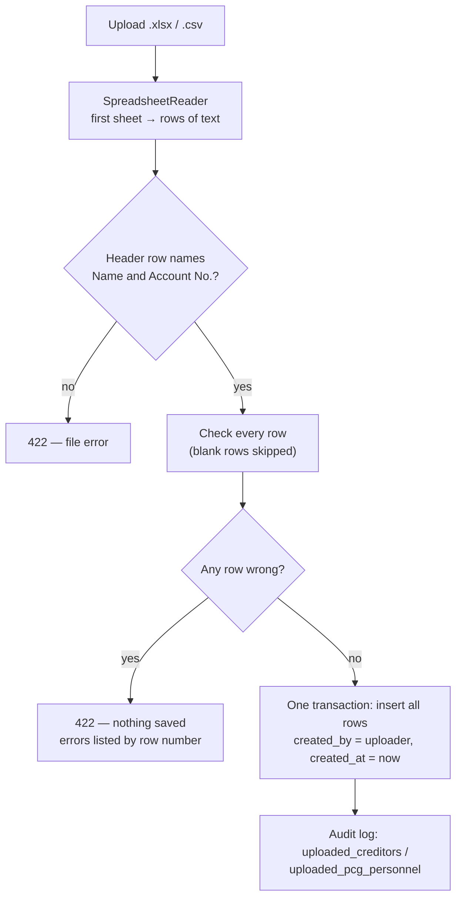
```mermaid
flowchart TD
    F["Upload .xlsx / .csv"] --> R["SpreadsheetReader<br/>first sheet → rows of text"]
    R --> H{"Header row names<br/>Name and Account No.?"}
    H -- no --> E1["422 — file error"]
    H -- yes --> V["Check every row<br/>(blank rows skipped)"]
    V --> OK{"Any row wrong?"}
    OK -- yes --> E2["422 — nothing saved<br/>errors listed by row number"]
    OK -- no --> S["One transaction: insert all rows<br/>created_by = uploader, created_at = now"]
    S --> L["Audit log: uploaded_creditors /<br/>uploaded_pcg_personnel"]
```

**Batch Upload rules** (`AccountHolderService::upload()`):

- The **first row is the header**. Columns are found by name, in any order and case, with
  punctuation ignored: *Name* (or *Creditor Name*, *Personnel Name*), *Account No.* (or *Account
  Number*), *Unit* (optional column). A header without Name and Account No. is refused.
- **Unit** may be blank. If given it must be a unit on the [PCG unit list](#6f-pcg-units),
  matched ignoring capitalization and extra spaces, and the **list's spelling is saved**
  (`  cg-8   COMPTROLLERSHIP ` → `CG-8 Comptrollership`). Anything else is a row error —
  `Row 7: unknown unit 'CG8 Comptroller'` — under the same all-or-nothing rule. CSV is read
  with a real CSV parser, so a quoted unit containing commas stays one value.
- **Each row below it becomes one record**; fully blank rows are skipped. At most 5,000 rows.
- **All or nothing.** Every row is checked first — Name required, Account No. required, each at
  most 255 characters — and if any row fails, **nothing is saved** and each problem comes back
  as `errors["rows.N"]` = `"Row N: …"`, where N is the row number as the spreadsheet shows it
  (header = row 1). The page lists them all.
- **Account No. is read as text.** CSV cells are taken as written (a UTF-8 BOM is stripped;
  Windows-1252 is converted). From .xlsx (read directly with PHP's zip and DOM extensions — no
  spreadsheet library): text cells as written; number cells from their stored digits, with
  scientific notation expanded and a zero-padded number format such as `0000000000` re-applied,
  so `0012345678` survives either way. An account number that arrives already mangled into
  scientific notation (`1.23457E+11`, typical of a CSV re-saved by Excel) is rejected for that
  row, with a hint to format the column as Text.
- Added one at a time or uploaded, each save is written to the audit log: `added_creditor`,
  `uploaded_creditors`, `added_pcg_personnel`, `uploaded_pcg_personnel`.

---

## 6f. PCG units

Every **Unit** field in the system is a dropdown of one shared list of PCG units — 38 units under
four headings (**National Headquarters**, **Technical Services**, **Functional / Operational
Commands**, **Other Major Commands**), in a fixed order and spelling.

- **Defined once**, in `config/pcg-units.json`. The server reads it through
  `config/pcg_units.php` (`App\Support\PcgUnits`); the React app imports the same file
  (`resources/js/lib/pcgUnits.ts`) and renders it with one component, `UnitSelect`. No page or
  template carries its own copy — to change the list, edit that file.
- **The dropdown**: a blank *-- Select unit --* first, then each heading as a non-selectable
  `optgroup` with its units beneath. The unit is saved as its **name, exactly as the list spells
  it**, in a text column (no units table). The longest name is 80 characters; every unit column
  is `varchar(255)`.
- **Validated on the server** too (`PcgUnits::rule()` — an exact `in:` match), so a value the
  dropdown could not have sent is refused even if the page's HTML is edited.
- **Edit forms preselect the saved unit.** A unit saved before the list existed, and not on it,
  shows as a disabled *(not on the unit list — choose another)* option: visible, but it must be
  replaced before the form will save.

| Where | Field | Column | Rule |
|---|---|---|---|
| LDDAP — Register / Edit LDDAP Record | Unit Name | `lddaps.unit_name` | required |
| LDDAP — RTS | RTS Unit | `lddap_routing_history.unit_name` | required |
| Cheque — Route for Signature | Unit name | `cheques.forward_unit_name` | optional |
| Cheque — Mark as Received | From unit name | `cheques.from_unit_name` | optional |
| Cheque — Use (dialog and Next in line panel) | Unit | `cheques.unit_name` | optional |
| Creditors / PCG Personnel — Add | Unit | `creditors.unit`, `pcg_personnel.unit` | optional |
| Creditors / PCG Personnel — Batch Upload | Unit column | same | optional; matched loosely (above) |
| Creditors / PCG Personnel — list | Unit filter | — | *All units* by default |

LDDAP units used to be ids into a `units` table; migration
`2026_09_27_000100_store_lddap_units_as_text` copies each record's unit **name** into the new text
columns unchanged and drops the table. Mapping names from before the list onto it is a separate,
approved step.

---

## 7. Audit log

Every significant action appends an immutable row to `cheque_logs` via `ActivityLogger`. Actions
the system takes unprompted — the nightly validity sweep — are recorded with no user id and the
username `system`.
Actions (`app/Enums/ChequeAction.php`): `login`, `logout`, `updated_profile`, `changed_password`,
`printed_draft`, `approved_draft`, `returned_draft`, `printed_final`, `edited_cheque` (the draft
flow), `routed_for_signature`, `ready_for_acic`, `rts_cheque` (the retired flow's), `voided_cheque` (written before Void became Spoil; read as *Spoiled cheque*), `accepted_by_teller`,
`released_cheque`, `forwarded_cheque_to_teller`, `deposited_cheque`, `returned_cheque_from_teller`,
`cancelled_cheque`, `spoiled_cheque`, `staled_cheque`, `replaced_cheque`, `corrected_release`,
`used_cheque`, `received_cheque`,
`reviewed_cheque`, `requested_update`, `approved_update`, `rejected_update`, `added_cheque_range`,
`created_acic`, `used_acic`, `forwarded_acic`, `completed_acic`, `added_creditor`,
`uploaded_creditors`, `added_pcg_personnel`, `uploaded_pcg_personnel`, `created_user`,
`updated_user`, `deleted_user`.
Admins view and filter the log at `GET /api/v1/logs`.

---

## 7a. Dashboard

`GET /dashboard` (`DashboardController` → `DashboardService::for($user)`) feeds the landing page,
which reads top to bottom: what is waiting on *you*, then every register at a glance. Every tile
is a link into the matching filtered list (`/cheques?status=`, `/lddaps?status=`, `/acics?tab=`).

- **Needs your attention** — by role, only items with a non-zero count (an empty list reads
  *Nothing is waiting on you right now*):

  | Role | Item | Counts | Opens |
  |---|---|---|---|
  | Admin | LDDAPs For Signature | For Signature, no ACIC — assign, RTS or Cancel | `/lddaps?status=for_signature` |
  | Admin | Drafts for checking | cheques For Checking | `/cheques?tab=for_checking` |
  | Admin | Cheques For Compliance | cheques For Compliance | `/cheques?tab=for_compliance` |
  | Admin | Cheques For Final Print | cheques For Final Print | `/cheques?tab=for_final_print` |
  | Admin | Cheques For Signature | For Signature, no ACIC | `/cheques?tab=for_signature` |
  | Admin | Update requests pending | pending LDDAP corrections | `/admin/update-requests` |
  | Admin | ACICs to sign off | ACIC status Used | `/acics?status=used` |
  | Staff | Returned to you (RTS) | RTS LDDAPs **registered by them** — correct, then Resubmit | `/lddaps?status=rts` |
  | Staff | Your cheques For Compliance | theirs, For Compliance | `/cheques?tab=for_compliance` |
  | Staff | Your cheques For Final Print | theirs, For Final Print | `/cheques?tab=for_final_print` |
  | Staff | LDDAPs For Signature | For Signature, no ACIC | `/lddaps?status=for_signature` |
  | Teller | ACICs waiting to be accepted | **Pending** ACICs, cheque and LDDAP | `/acics?status=pending` |
  | Teller | ACICs you are holding | accepted by them — Accepted, Forwarded, RTS | `/deposit-queue` |
  | Teller | LDDAPs to receive | carrying a check number, not received | `/lddaps?status=approved` |

- **Cheques** — the status tiles (`ChequeService::counts()`). The next-in-line cheque is used
  from the **Cheques** page (its panel and the row's **Use** button), not the dashboard.
- **LDDAP-ADA** — a tile per status (For Signature · RTS · Approved · Canceled) and how many
  For Signature records await an ACIC vs. how many sit on one.
- **ACIC** — a tile per status the table shows (Open · Used · Approved · **Pending** · Completed),
  counted over the ACICs the viewer may see, each linking to `/acics?status=…`.
- **Number series** — the cheque book, the LDDAP check numbers and the ACIC numbers: how many are
  **available**, the **next** number each will issue, used-of-registered, and a **Low** flag under
  `DashboardService::LOW_SERIES` (10) free numbers; admins get a *Register more* link to the
  series page.
- **Recent activity** (admin only) — the latest eight audit rows, newest first, linking to the
  full log. Other roles get an empty `recent`.

---

## 8. Notifications

Workflow events raise **in-app notifications**, stored per-user in the `notifications` table
(Laravel database notifications) and surfaced in a **bell dropdown** in the header. Each carries a
`kind` that drives its coloured dot, a title, a message, and an optional deep-link. The bell shows
an unread badge; the SPA polls every 30s. Opening an item marks it read and navigates to its link.

| Event | Raised in | Recipients | `kind` | Links to |
|---|---|---|---|---|
| Cheque used | `ChequeService::useNext` | Active admins (except the actor) | `used` | `/admin/logs` |
| Draft submitted (Print Draft) | `ChequeFlowService::printDraft` | Active **Administrators and Super Admins** (except the actor) | `request` | `/cheques` |
| Draft approved | `ChequeFlowService::approveDraft` | The preparer (who printed the latest draft) | `approved` | `/cheques` |
| Draft returned | `ChequeFlowService::returnDraft` | The preparer, with the comment | `rejected` | `/cheques` |
| Cheque spoiled | `ChequeSpoilService::spoil` | Active admins and the cheque's user (except the actor) | `spoiled` | `/cheques` |

Notifications are a **convenience layer only** — the authoritative record of every action remains
the append-only audit log (section 7). Delivery is best-effort and does not affect the outcome of
the action that raised it.

---

## 9. API reference (`/api/v1`)

| Method & path | Access | Purpose |
|---|---|---|
| `POST /login` | Public | Sign in |
| `POST /logout` | Auth | Sign out |
| `GET /me` | Auth | Current user |
| `PUT /me` | Auth | Profile: the signed-in user's own full name and email (`UpdateProfileRequest`) |
| `PUT /me/password` | Auth | Change own password — current password required, confirmed, session kept (`ChangePasswordRequest`) |
| `GET /cheques` | Auth | List cheques — `search` (number, payee, account no.), `tab` (status, or `expiring`), `unit`, `date_from`/`date_to` (cheque date, inclusive), `sort`; all combine |
| `GET /cheques/summary` | Auth | Cheque counts + next cheque (the cheque page's header) |
| `GET /dashboard` | Auth | The dashboard: attention items by role, every register's counts, the series, admin's recent activity |
| `GET /cheques/next` | Auth | The next usable cheque |
| `POST /cheques/use` | Auth | Use the next cheque: `payee_name`, `amount`, `cheque_date`, optional `account_no` and `unit_name` (a PCG unit) |
| `GET /cheques/validity-summary` | Auth | Banner counts, the viewer's deposit queue, the tellers, the bank |
| `GET /cheques/{cheque}/status-history` | Auth | Every step the cheque has taken, oldest first |
| `PUT /cheques/{cheque}` | Admin/Staff | Edit the details — no status or For Compliance only; each save is an `edited` timeline entry (`UpdateChequeDetailsRequest`) |
| `POST /cheques/{cheque}/print-draft` | Admin/Staff | Print Draft → For Checking; notifies the Administrators and Super Admins (`ChequePrepareRequest`) |
| `POST /cheques/{cheque}/approve-draft` | **Admin / Super Admin** | Approve the draft → For Final Print; `comment` optional (`CheckDraftRequest`) |
| `POST /cheques/{cheque}/return-draft` | **Admin / Super Admin** | Return the draft → For Compliance; `comment` required (`CheckDraftRequest`) |
| `POST /cheques/{cheque}/final-print` | Admin/Staff | The final print came out right → For Signature (`ChequePrepareRequest`) |
| `POST /cheques/{cheque}/release` | **Admin** | Branch A — release to the payee (`ReleaseChequeRequest`) |
| `POST /cheques/{cheque}/cancel` | **Admin** | Cancel before an ACIC, reason required (`ChequeExceptionRequest`) |
| `POST /cheques/{cheque}/use-previous-acic` | **Admin/Staff** | A spoiled cheque's For Signature replacement takes its place on the ACIC it came off — only while that ACIC is with the admin (`expected_status` optional) |
| `POST /cheques/{cheque}/spoil` | **Admin** | Spoil an Approved cheque: `reason` (required), `replacement_number` (the next number the dialog showed); issues the replacement and returns the spoiled cheque with `replaced_by` (`SpoilChequeRequest`) |
| `GET /cheques/next` | Auth | The lowest available cheque, or null |
| `POST /cheques/{cheque}/replace` | **Admin** | Issue a replacement for a stale cheque (`ReplaceChequeRequest`) |
| `POST /acics/{acic}/teller-forward` | **Accepting teller** | Forward: `to` = `land_bank` \| `payee` |
| `POST /acics/{acic}/teller-complete` | **Accepting teller** | Action → Completed |
| `POST /acics/{acic}/forward-to-payee` | **Accepting teller** | Cheque ACICs: `cheque_ids`, `received_by`, `date_received`, `unit` — one, several or all cheques to their payees |
| `POST /acics/{acic}/teller-rts` | **Accepting teller** | Action → RTS: `reason` (required), `outcomes` = {"cheque:ID": completed \| returned \| cancelled \| stale} |
| `POST /acics/{acic}/forward-to-teller` | **Admin** | Branch B — send the whole ACIC to the tellers (an LDDAP ACIC's **Forward** button, after a confirm) |
| `POST /acics/{acic}/accept` | **Teller** | Claim a forwarded ACIC — first one wins |
| `POST /acics/{acic}/return-to-admin` | **Teller** | Hand it back, reason required |
| `GET /acics/teller-queue` | Auth | The deposit queue — Pending · Accepted · Forwarded · RTS · Completed; `type`, `from`, `to`, `search`, `status` (teller status) narrow each list |
| `POST /cheques/add-range` | **Admin** | Register a book by `start_at` / `end_at` serial |
| `GET /lddaps` | Auth | List LDDAP records — the filter bar's `search`, `status`, `nature`, `payee_type` (all · creditor · pcg_personnel), `page`, `per_page` (`FilterLddapsRequest`) |
| `GET /lddaps/next-numbers` | Auth | The next `count` check numbers in the LDDAP series |
| `GET /lddaps/series` | Auth | LDDAP check series counts (registered / unused / used) |
| `GET /lddaps/linkable` | Auth | For Signature LDDAPs not yet on an ACIC |
| `GET /lddaps/options` | any | The natures of payment the register dialog offers (units come from the shared PCG list) |
| `GET /lddaps/payee-options?search=` | Admin/staff | The register form's payee search: Creditors and PCG Personnel in one list — type, name, account no., unit |
| `GET /payees?search=` · `GET /payees/{payee}` | any | Legacy payee register (older LDDAPs only); no longer used by the form |
| `POST /lddaps` | **Admin/Staff** | Add **one** LDDAP, without a check number — status For Signature |
| `PUT /lddaps/{lddap}` | **Admin/Staff** | Edit LDDAP Record — the same form (`LddapDetailsRequest`) on a For Signature or RTS record; own number ignored by the unique rule; check number untouched |
| `GET /lddaps/{lddap}/edit-history` | any | Every edit: user, time, `{field: {from, to}}`, newest first |
| `GET /lddaps/{lddap}/routing-history` | any | The record's routing trail (retired forward/receive/approve rows left out) |
| `POST /lddaps/{lddap}/rts` · `/cancel` | **Admin** | RTS or Cancel a For Signature record (`cancel`: `note` required, `date_canceled` optional) |
| `POST /lddaps/{lddap}/resubmit` | **Admin/Staff** | RTS → For Signature (`comment` required, `notes` optional) |
| `POST /lddaps/assign-acic` | **Admin/Staff** | Put ticked For Signature records on a typed ACIC number; each takes the next check number |
| `POST /lddaps/add-range` | **Admin** | Register a block of the LDDAP check series |
| `POST /lddaps/{lddap}/receive` | **Teller** | Confirm an LDDAP as received |
| `POST /lddaps/{lddap}/update-requests` | **Staff** | Propose a detail correction |
| `PATCH /lddaps/{lddap}` | **Admin** | Correct the details directly (reason required) |
| `GET /lddaps/{lddap}/update-requests` | Auth | An LDDAP's request history + outcomes |
| `GET /lddap-update-requests` | **Admin** | Pending LDDAP correction requests |
| `POST /lddap-update-requests/{id}/approve` | **Admin** | Approve (apply proposed values) |
| `POST /lddap-update-requests/{id}/reject` | **Admin** | Reject (no change) |
| `POST /acics/{acic}/lddaps` | **Admin/Staff** | Assign approved LDDAPs to an ACIC; each takes the next check number (`expected_check_nos` optional) |
| `GET /acics` | Auth | List ACIC records — `search` (ACIC no., or the cheque / LDDAP / check / DV no. of anything on it), `status`, `category`; all combine |
| `GET /acics/next` | Auth | The number the next ACIC will take |
| `GET /acics/linkable-cheques` | Auth | Approved cheques not yet on an ACIC |
| `GET /acics/{acic}` | Auth | One ACIC with its cheques |
| `POST /acics` | **Admin/Staff** | Open the next ACIC |
| `POST /acics/{acic}/cheques` | **Admin/Staff** | Assign For Signature cheques to it |
| `POST /cheques/assign-acic` | **Admin/Staff** | Assign Cheque to ACIC by number: `acic_no` (an existing ACIC still taking cheques, or the next in the series) + `cheque_ids` — many cheques share one number |
| `GET /logs` | **Admin** | Audit log |
| `GET /notifications` | Auth | Current user's feed + unread count |
| `POST /notifications/{id}/read` | Auth | Mark one notification read |
| `POST /notifications/read-all` | Auth | Mark all read |
| `GET /creditors` · `GET /pcg-personnel` | Admin/staff | The list, newest first, 50 a page; `search` matches name, account no. or unit; `unit` filters by one PCG unit |
| `POST /creditors` · `POST /pcg-personnel` | Admin/staff | Add one or more: `records[]` of `{name, account_no, unit?}` (1–100), all or none; errors as `records.N.field` — Date Created / Added By stamped (`StoreAccountHolderRequest`) |
| `POST /creditors/batch-upload` · `POST /pcg-personnel/batch-upload` | Admin/staff | Multipart `file` (.xlsx/.csv, ≤ 5 MB): saves every row or none; row errors as `rows.N` (`UploadAccountHoldersRequest`) |
| `GET/POST/PUT/DELETE /users` | **Admin** | Manage users |

---

## 10. Data model

```mermaid
erDiagram
    USERS ||--o{ CHEQUES : "creates / uses / receives"
    USERS ||--o{ CHEQUE_UPDATE_REQUESTS : "requests / reviews"
    CHEQUES ||--o{ CHEQUE_UPDATE_REQUESTS : "has"
    CHEQUES ||--o{ CHEQUE_LOGS : "audited in"
    ACICS ||--o{ CHEQUES : "carries"
    LDDAP_CHECKS ||--|| LDDAPS : "numbers"
    ACICS ||--o{ LDDAPS : "carries"
    LDDAPS ||--o{ LDDAP_UPDATE_REQUESTS : "has"
    LDDAPS ||--o{ LDDAP_ROUTING_HISTORY : "trail"
    LDDAPS ||--o{ LDDAP_EDIT_HISTORY : "edits"
    USERS ||--o{ LDDAP_EDIT_HISTORY : "made"
    PAYEES ||--o{ LDDAPS : "paid to"
    PAYEES ||--o{ PAYEE_ACCOUNTS : "holds"
    PAYEE_ACCOUNTS ||--o{ LDDAPS : "paid into"
    USERS ||--o{ LDDAPS : "uses / receives / reviews"
    USERS ||--o{ CHEQUE_LOGS : "acts in"
    CHEQUES ||--o{ CHEQUE_STATUS_HISTORY : "trail"
    USERS ||--o{ NOTIFICATIONS : "notified via"
    USERS ||--o{ CREDITORS : "added"
    USERS ||--o{ PCG_PERSONNEL : "added"

    USERS {
        string name
        string username
        string email "nullable, unique — set on the Profile page"
        enum   role "admin | staff | teller"
        bool   is_active
    }
    CHEQUES {
        int    cheque_number "unique, sequential"
        enum   status "available | registered (no status) | for_checking | for_compliance | for_final_print | for_signature | approved | released_to_payee | forwarded_to_teller | accepted_by_teller | deposited | cancelled | spoiled | stale | replaced"
        date   validity_until "cheque_date + 90 days, derived"
        timestamp stale_at
        timestamp expiry_alert_sent_at "the one-time 10-day alert"
        string payee_name
        string account_no "optional, text — keeps leading zeros"
        string unit_name "optional, PCG unit"
        decimal amount
        date   cheque_date
        fk     acic_id "the ACIC it sits on"
        fk     used_by
        fk     received_by "the teller confirming receipt"
        fk     reviewed_by
        timestamp reviewed_at
        text   review_note
        string received_by_name "Path A: who it was RELEASED to"
        date   date_received
        fk     released_by
        timestamp released_at
        text   release_note
        string forward_to_name "step 2: routed for signature"
        string forward_unit_name "PCG unit, optional"
        fk     forwarded_by
        date   date_forwarded
        string received_by_name_in "step 3: signed and back"
        date   date_received_in
        string from_unit_name "PCG unit, optional"
        text   exception_reason "RTS / cancel / spoil"
        fk     spoiled_by "who marked it Spoiled"
        timestamp spoiled_at"
        timestamp rts_at
        fk     replaces_id "the stale or spoiled cheque this one replaces"
        fk     replaced_by_id
        fk     spoiled_from_acic_id "spoiled: the ACIC it came off"
        string payee_received_by "no longer written (was: Completed, to the payee)"
        date   payee_received_on
        string payee_unit_name "Forward to Payee: the receiver's unit"
        string rts_status "completed | returned | cancelled | stale"
    }
    CHEQUE_STATUS_HISTORY {
        fk     cheque_id
        enum   from_status
        enum   to_status
        string action "routed | received | assigned | released | accepted_by_teller | …"
        fk     user_id
        fk     acic_id "set on an ACIC-level step"
        json   details "the step's own fields"
        text   note
        datetime created_at "append-only"
    }
    CHEQUE_UPDATE_REQUESTS {
        fk     cheque_id
        string proposed_payee_name
        decimal proposed_amount
        date   proposed_cheque_date
        text   reason
        enum   status "pending | approved | rejected"
        fk     requested_by
        fk     reviewed_by
        text   review_note
    }
    LDDAP_CHECKS {
        bigint check_no "unique — series independent of cheques and ACICs"
        enum   status "available | used"
        fk     created_by
    }
    PAYEES {
        string name
    }
    PAYEE_ACCOUNTS {
        fk     payee_id
        string account_no
        string bank
    }
    CREDITORS {
        string name
        string account_no "text — keeps leading zeros"
        string unit "nullable, PCG unit name"
        fk     created_by "Added By — set on create, never edited"
        datetime created_at "Date Created — set on create, never edited"
    }
    PCG_PERSONNEL {
        string name
        string account_no "text — keeps leading zeros"
        string unit "nullable, PCG unit name"
        fk     created_by "Added By — set on create, never edited"
        datetime created_at "Date Created — set on create, never edited"
    }
    LDDAPS {
        string payee_received_by "teller Completed, to the payee"
        date   payee_received_on
        string rts_status "completed | returned | cancelled"
        fk     lddap_check_id "unique, nullable — added once back from routing"
        string lddap_no "unique document serial"
        string nca_no "0000000 — exactly 7 digits, text"
        string obr_no "formerly orb_no"
        string dv_no "unique"
        enum   nature_of_payment
        string unit_name "PCG unit, as the list spells it"
        string obj_no "UACS object code — prints as OBJ CODE"
        decimal amount
        fk     payee_id
        fk     payee_account_id
        string payee_name "copied from the Creditor / PCG Personnel entry"
        string payee_type "creditor | pcg_personnel — blank on older records"
        string payee_account_no "copied from the entry"
        string payee_bank "copied from the account at registration"
        string acic_ref "ACIC # written on the form"
        decimal gross_amount
        decimal wtax_1 "… wtax_2, wtax_3, wtax_5"
        decimal vat_1 "… vat_2, vat_3, vat_5, vat_10, vat_12, vat_30"
        decimal retention
        decimal liquidated_damages
        decimal advance_payment
        date   fwd_to_lbp_at
        date   date_loaded
        text   note
        string remarks
        date   check_date "date issued, entered with the record"
        enum   status "for_signature | rts | approved (on an ACIC) | forwarded_to_teller | accepted_by_teller | completed | canceled — registered / for_out / returned_for_acic retired"
        string forward_to
        string forward_unit_name "PCG unit"
        fk     forwarded_by
        date   date_forwarded
        string return_unit_name "PCG unit"
        fk     returned_by
        date   date_returned
        fk     acic_id "the ACIC it sits on"
        fk     used_by
        fk     received_by
        fk     reviewed_by
        text   review_note
        fk     canceled_by
        date   date_canceled
        text   cancel_reason
    }
    LDDAP_EDIT_HISTORY {
        fk     lddap_id
        fk     user_id
        json   changes "{field: {from, to}}"
        datetime created_at "append-only"
    }
    LDDAP_ROUTING_HISTORY {
        fk     lddap_id
        enum   action "registered (Added) | rts | resubmitted | assigned | unassigned | canceled | forwarded_to_teller | accepted_by_teller | completed | returned_by_bank | returned_to_admin — forwarded / received / approved retired (for_out rows hidden)"
        enum   from_status
        enum   to_status
        fk     user_id
        string unit_name "PCG unit — forwarded to / received from / RTS"
        string counterparty "Forward To"
        string received_by_name "RTS: who received it"
        date   received_on "RTS: when"
        date   acted_on "RTS date (older rows: forwarded / received)"
        text   note "comment"
        text   notes "Resubmit: optional notes"
    }
    LDDAP_UPDATE_REQUESTS {
        fk     lddap_id
        string proposed_lddap_no
        string proposed_obj_no
        string proposed_payee_name
        decimal proposed_amount
        text   reason
        enum   status "pending | approved | rejected"
        bool   applied_directly "admin changed it without an approval step"
        fk     requested_by
        fk     reviewed_by
        text   review_note
    }
    ACICS {
        int    acic_number "unique, gap-free sequence"
        enum   status "open | used | forwarded | completed"
        fk     used_by
        timestamp used_at
        timestamp forwarded_at "Forward Date"
        fk     received_by "a system user…"
        string received_name "…or a typed-in name"
        timestamp completed_at
        fk     completed_by
        fk     created_by
        enum   teller_status "pending | accepted_by_teller | forwarded_to_land_bank | forwarded_to_payee | rts | completed (returned_by_bank: older rows)"
        string teller_forwarded_to "land_bank | payee"
        fk     teller_forwarded_by
        timestamp teller_forwarded_at
        fk     teller_action_by "Completed or RTS"
        timestamp teller_action_at
        text   rts_reason
    }
    CHEQUE_LOGS {
        fk     user_id
        string username
        int    cheque_number
        enum   action
        text   description
    }
    NOTIFICATIONS {
        uuid   id
        string type
        string notifiable "morph → users"
        json   data "kind, title, message, url"
        datetime read_at "null until read"
    }
```

---

## Maintaining this document

This document is the human-readable spec of how E-MDS behaves. It is **not generated**
from the code, so it only stays accurate if it is updated alongside changes.

**The rule:** any change to roles, the cheque lifecycle, a workflow, an API route, or the data
model must update the matching section(s) **and flow-chart(s)** here, in the same commit as the
code change. This is part of the project's Definition of Done (see `CLAUDE.md`).

When updated, bump the _"Last reviewed against the code"_ date near the top.
